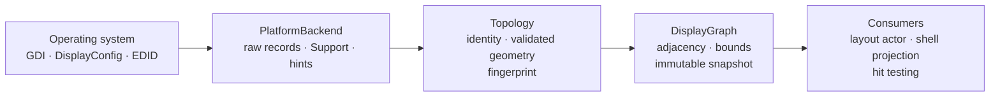

# ADR-0004 — Display Topology Identity and Transaction Model

> **Abstraction Level:** 📙 **Level 2 — Architecture** (per [`governance/ARCHITECTURE_PRINCIPLES.md`](../../governance/ARCHITECTURE_PRINCIPLES.md))
> **Source of Truth:** `docs/` — Specifications (*what the system should do*)

---

## Document Control

| Field | Value |
| --- | --- |
| **ADR ID** | `ADR-0004` |
| **Title** | Display topology identity and transaction model |
| **Status** | `ACCEPTED` |
| **Decision Date** | 2026-08-08 |
| **Effective** | On merge to `main` |
| **Deciders** | Lead Software Architect (owner), Core Engineering, Platform |
| **Implements** | `SYSTEM_ARCHITECTURE.md` DD-009 (layout persisted per topology fingerprint) — this is the ADR DD-009 names |
| **Amends** | `SYSTEM_ARCHITECTURE.md` §9.3 `WD-3` (identity becomes confidence-bearing), §9.5 (new), §19.1 (the `PlatformBackend` sketch), §23 DD-009, §27.3, §28 (glossary) · [`ADR-0001`](./ADR-0001-system-architecture.md) §3.5 `D-10` (ADR number allocation) |
| **Extends** | [`ADR-0001`](./ADR-0001-system-architecture.md) §9 boundary — does not contradict it |
| **Unblocks** | Stage 3 of `SYSTEM_ARCHITECTURE.md` §25.1 — the layout actor consumes this contract |
| **Wave** | 1 — Subsystem |
| **Reversal Cost** | **High from first persistence.** `MonitorId` and `TopologyFingerprint` become on-disk keys the moment a layout is saved (Stage 3). Reversing the identity scheme after that orphans every stored arrangement, which is the failure this ADR exists to prevent. The transaction and graph decisions are cheaper to reverse — they are process-local — but every consumer written against them assumes the invariants in §5. |

### Normative Language

RFC 2119 keywords carry the meanings defined in `SYSTEM_ARCHITECTURE.md` §1.1.

### Ownership Boundary

This ADR owns **how a display is identified, how an arrangement is identified, and how a change to an arrangement is published**.

It does **not** own placement. Which surface belongs on which monitor, under which anchor, at which layer, remains `devdesk-core`'s (`SYSTEM_ARCHITECTURE.md` §9.1). Nothing in this document decides where anything is drawn, and `§4.3` states explicitly what the display subsystem must never acquire.

### Process Note

The decisions here were implemented before this ADR was written, across commits `6a9eca2`…`c2c1902` on `feat/sprint-1-m0-walking-skeleton`. That inverts the lifecycle in [`.ai/IMPLEMENTATION_RULES.md`](../../.ai/IMPLEMENTATION_RULES.md) rule 3, and the inversion is recorded rather than elided. The implementation is the *evidence* for this decision — every claim in §7 is a measurement or a test, not a projection — but it is not the decision. Nothing merges to `main` until this ADR does.

---

## 1. Context

### 1.1 What Already Exists

`SYSTEM_ARCHITECTURE.md` §9 sets the display boundary and six normative rules:

| Rule | States |
| --- | --- |
| `WD-1` | Geometry types are newtype-tagged with their coordinate space |
| `WD-2` | Conversion requires a monitor; a global scale factor does not exist |
| `WD-3` | Monitors are identified by a fingerprint derived from display identity, not enumeration index |
| `WD-4` | Layout is persisted per topology fingerprint |
| `WD-5` | An unknown topology resolves deterministically, with a one-click restore |
| `WD-6` | Hotplug events are debounced (250 ms) and treated as hints; the handler re-queries |

`DD-009` records the decision behind `WD-3`…`WD-5` and names an ADR that had not been written. This is that ADR.

### 1.2 What Implementing §9 Revealed

`WD-3` says "derived from EDID/display-ID data". Implementing it against Win32 established that there is no such singular datum. What a platform reports is a *set* of signals, each independently absent on some real configuration, and each stable against a different set of events:

| Signal | Usually present | Survives a port change | Separates two identical units |
| --- | --- | --- | --- |
| EDID serial | yes | **yes** | **yes** |
| Device path | yes | no | yes |
| Connector + instance | yes | no | no |
| Display adapter | yes | no | no |
| Manufacturer + product code | yes | yes | **no** |

No row is both always present and always stable. A virtual display has no EDID at all; a remote session has no connector; a panel may ship with its serial field zeroed; two identical monitors report identical models by construction.

`WD-3` as written is therefore satisfiable only by choosing one signal and being wrong whenever it is absent, or by concatenating all of them and being wrong whenever any one changes. Both readings fail on ordinary hardware.

### 1.3 Why This Is Load-Bearing

`PS-3` — multi-monitor is broken, surfaces land on the wrong display ([`PRD.md`](../product/PRD.md) §Problem Space) — is an origin failure this project exists to fix, and the one `ADR-0001` §3.1 `QA-8` and `SYSTEM_ARCHITECTURE.md` §9 are built against. `WD-4` binds every stored arrangement to a fingerprint, and the fingerprint is derived from monitor identity. An identity scheme that is wrong on a docking event does not degrade gracefully: it reintroduces `PS-3` at the schema level, by way of the mechanism designed to prevent it.

`AC-DAT-1.1` carries severity `S-3`, the one metric with no acceptable nonzero value: *no supported action changes an arrangement without a user action or a visible notice*. A misidentified display is precisely such a change.

---

## 2. Problem Statement

**The display subsystem must answer "which display is this" and "what is the arrangement now" correctly enough to bind persistent user layouts to — across reboots, docking events, port changes, and identical hardware — while every consumer reads it concurrently and the operating system reports it in bursts of transiently-wrong intermediate states.**

Four specific defects follow from the current specification.

### 2.1 Unstable Monitor Identity

`WD-3` names a datum that does not exist as a single value (§1.2). Three concrete failures:

1. **Absent-signal collision.** Two displays that both report *no* serial compare equal on serial in any naïve implementation, because `None == None`. Every unidentifiable display then binds to the first layout it finds.
2. **Identical-unit ambiguity.** Two of the same monitor on two ports of one adapter are indistinguishable from what they report. Choosing between them binds a layout to the wrong panel roughly half the time.
3. **Signal loss is not device loss.** A display whose EDID becomes unreadable between two enumerations — a driver reload, a KVM switch, a registry permission change — presents as one removal and one addition under exact-key comparison, tearing down surfaces and rebuilding them for a display that never left.

### 2.2 Topology Consistency

Topology is read concurrently by the layout actor, the shell projection, hit testing, and any drag in progress. A change is not one write: it is a new monitor set, a new spatial index, a new fingerprint, and a diff.

If those become visible independently, a consumer can read a graph that disagrees with the topology it indexes, or a generation that does not match the displays beside it. The result is a surface placed against an arrangement that never existed on the user's desk. Nothing in §9 currently forbids this.

### 2.3 Multi-Monitor Resilience

`PS-4` makes mixed DPI the assumed case, and `AP-6` names coordinate-space confusion the largest defect class in this system. `WD-1` and `WD-2` address the *types*, but §9 defines no spatial model at all: no adjacency, no containment, no virtual bounds, no notion of a discontiguous desktop.

Without one, every consumer that needs "which display is this point on" writes its own scan, and each one gets a different answer at a shared edge. Windows permits arrangements with gaps between monitors and with displays mirrored to one origin; a consumer that assumed otherwise computes a navigation order that cannot reach part of the desktop.

### 2.4 Hot-Plug Correctness

`WD-6` requires debouncing and re-query, and stops there. It does not say what happens to the *result*: whether a re-query that finds nothing changed is a change, what a consumer does with an event whose payload it is forbidden to trust, or how a consumer distinguishes "this arrangement is new" from "this arrangement is one I have seen, observed again just now".

Undocking a laptop emits a burst of `WM_DISPLAYCHANGE` over several hundred milliseconds. Windows also emits it for changes that leave the topology untouched. Neither case has a defined outcome today.

---

## 3. Decision

### 3.1 Monitor Identity Is Evidence Plus a Confidence

**`MI-1`.** A monitor's identity **MUST** be modelled as the set of signals the platform reported — device path, display adapter, EDID serial, connector, manufacturer and product code — together with a **fallback digest** computed from whatever arrived. It **MUST NOT** be a single string compared for equality.

**`MI-2`.** Comparing two identities **MUST** yield an ordered `IdentityConfidence`:

| Confidence | Agreed on | Wrong only if |
| --- | --- | --- |
| `Exact` | EDID serial **and** model | Never, for practical purposes — this is one physical unit |
| `Strong` | Device path | The panel was replaced by an identical model on that exact port |
| `Probable` | Model, connector, and adapter | Two identical panels were swapped between sessions |
| `Weak` | The fallback digest only | Frequently — this is "the display that was in the same place" |
| `None` | Nothing | — |

**`MI-3`. An absent signal is never agreement.** Two identities both lacking a signal **MUST NOT** be treated as agreeing on it. This closes §2.1's first defect and is the single most important rule here.

**`MI-4`. A serial alone cannot be `Exact`.** Serial numbers are unique per manufacturer, not globally; `1` is a real serial on more than one panel. `Exact` requires the model to agree as well.

**`MI-5`. An ambiguous match is no match.** Where two known displays tie at the same sub-`Exact` confidence, resolution **MUST** return nothing. Treating the arrangement as new is recoverable; binding a layout to the wrong one of two identical panels is a silent arrangement change, and `AC-DAT-1.1` has no acceptable nonzero rate for that.

**`MI-6`. Reattaching a saved layout without asking requires `Strong` or better.** `Probable` is exactly what two swapped identical panels look like. `WD-5` already requires an unknown topology to resolve deterministically *and* to offer the user a restore; silently reattaching on a probable match makes a wrong guess unnoticeable, which is worse than a visible one.

**`MI-7`.** Every display **MUST** have a derived `MonitorId`, taken from the strongest signal present and prefixed by which signal that was (`unit:`, `port:`, `weak:`). A prefix-free key would let a serial-derived id collide with a path-derived one. A display reporting nothing distinctive still gets a deterministic key, so `WD-5`'s deterministic resolution has something to resolve to.

**`MI-8`.** The fallback digest **MUST NOT** include the display's position. A display dragged to the other side of the desktop is the same display; including position would make every rearrangement look like new hardware.

**`MI-9`.** OS enumeration index **MAY** participate in the fallback digest and **MUST NOT** participate anywhere else. It is the branch where nothing better exists, and `WD-3` forbids it as identity.

### 3.2 Topology Fingerprinting

**`MI-10`.** The topology fingerprint **MUST** be derived from monitor identity, geometry, scale, and primary flag, over monitors sorted by identity. It **MUST NOT** include enumeration order, display name, or refresh rate. Renaming a display or changing its refresh rate must not orphan the layout bound to it (`AC-MON-1.4`).

**`MI-11`. Persisted digests MUST use a pinned, versionless algorithm.** `MonitorId` and `TopologyFingerprint` are on-disk keys under `WD-4`. Rust's `DefaultHasher` documents that its algorithm may change between releases; using it would silently re-fingerprint every saved arrangement on a toolchain bump — `PS-3` delivered by a routine dependency update. FNV-1a is adopted: small, specified, dependency-free. It is not cryptographic and nothing depends on it being so; a fingerprint is a lookup key, never a security boundary.

**`MI-12`.** The digest algorithm **MUST** be pinned by a test asserting a literal value, and one whole fingerprint **MUST** be asserted the same way. A change to either then appears in a diff rather than as a user's lost layout.

### 3.3 `DisplayGraph` Is Immutable

**`DG-1`.** A `DisplayGraph` **MUST** be constructed from one topology snapshot and **MUST NOT** expose any means of mutation — no `&mut self` method, no interior mutability, no post-construction insertion. **Every topology change produces a new graph.**

**`DG-2`.** A graph **MUST** hold its topology by shared reference rather than by copy. Copying it per consumer makes "the current topology" a set of equal-but-separate values that drift apart, which is the same defect class as a hand-written contract mirror (`AP-13`).

**`DG-3`.** Spatial queries answer **where the displays are**, never where a surface should go. Adjacency, containment, nearest, virtual bounds, and contiguity are facts about hardware. A clamp-into-bounds or fit-to-work-area helper on this type would be the first line of layout and is prohibited here (`§4.3`).

**`DG-4`.** Adjacency means edges that **touch**. Overlapping displays — two mirrored to one origin — are not adjacent, because there is no direction to travel between them. A display across a gap is not adjacent either: deciding whether a gap is small enough to step across is navigation policy.

**`DG-5`.** Each adjacency **MUST** carry the length of the shared edge. Two displays stacked flush and two overlapping by one pixel are both "adjacent", and a consumer deciding whether a direction is worth navigating needs to tell them apart.

**`DG-6`.** Containment **MUST** use exclusive upper bounds, and a rectangle straddling two displays **MUST** report as contained by neither. Inclusive bounds put every point on a shared edge on two monitors; returning "whichever was enumerated first" for a straddling rectangle makes the answer depend on enumeration order, which `WD-3` exists to eliminate.

**`DG-7`.** The desktop **MUST NOT** be assumed contiguous. A display island across a gap is a supported arrangement.

### 3.4 Topology Publication Is Transactional

**`TP-1`.** Topology changes **MUST** be published as a `TopologyTransaction` carrying, as one value: the generation, the previous arrangement, the current arrangement, the previous and current graphs, and the computed diff.

**`TP-2`.** Publication **MUST** be atomic. The new topology, its diff, and its graph are computed *outside* any lock; the lock is then taken to swap one fully-built value. A reader observes the whole of what came before or the whole of what comes next, never a composite.

**`TP-3`.** There **MUST** be exactly one publisher per process. A second is a second answer to the same question, and the two disagree the moment a display changes.

**`TP-4`. A re-query that finds nothing changed is not a change.** Publication returns no transaction and the generation does not advance. This is the common case under `WD-6`, not an edge case: the platform emits change notifications for changes that leave the topology alone, and treating one as a change makes every consumer react to a desktop that did not move.

**`TP-5`.** The first publication **MUST** be distinguishable from every later one, and its previous arrangement **MUST** be absent rather than empty. A consumer restoring a saved arrangement at startup does something different from one reacting to every display being unplugged; collapsing the two makes the first indistinguishable from the second.

**`TP-6`.** An arrangement with no displays is a publishable observation, not an error. It is how a consumer learns there are no displays, which it cannot infer from silence.

**`TP-7`. `TopologyGeneration` is monotonic and separate from the fingerprint.** A fingerprint answers *which* arrangement this is, and two visits to the same desk produce the same one — that is what makes it a layout key under `WD-4`. A generation answers *how recent* this is, so a consumer holding stale work can tell that it is stale. Undock and redock returns to a fingerprint already seen; it does not return to a generation already seen. Generation `0` means nothing has been enumerated yet, which is a different fact from an empty arrangement at generation `1`.

**`TP-14`. A generation is process-local and MUST NOT be persisted.** *(Added by Amendment 1.)*

The two identifiers have different lifetimes, and conflating them breaks both:

| | `TopologyFingerprint` | `TopologyGeneration` |
| --- | --- | --- |
| Answers | *Which* arrangement is this | *How recent* is this observation |
| Scope | Across sessions and machines | One process, one run |
| Repeats | Yes — returning to a known desk | Never — strictly increasing |
| Persisted | **Yes.** It is the layout key (`WD-4`) | **No** |

A persisted generation is meaningless on the next launch: it counts publications made by a process that no longer exists. Worse, it would be *comparable* — a stored `7` and a fresh `3` order against each other perfectly happily, and a consumer that reasoned about staleness across the restart would conclude that the arrangement it just enumerated is older than the one it saved, and discard it.

Three consequences follow, and each is a rule:

- **`TP-14a`.** A generation **MUST NOT** appear in any stored arrangement, layout record, or configuration file, and **MUST NOT** be used as a cache key that outlives the process.
- **`TP-14b`.** A generation **MUST NOT** be compared across processes, including between a running instance and a stored value, and including between two DevDesk instances.
- **`TP-14c`.** Every publisher starts at [`TopologyGeneration::INITIAL`]. A new process observing the same desk as the last one reports generation `1` for it, not the generation the previous process left off at. Continuity across a restart is the fingerprint's job, and it already does it.

The general form: **fingerprints identify topology across sessions; generations identify publication order within a process.** Any identifier crossing the process boundary must survive a restart with its meaning intact, and a counter does not.

**`TP-8`.** The diff **MUST** pair displays by identity, not by list position: first on the derived key, then on a **conclusive** (`MI-6`) identity match for whatever remains. The second pass is what stops §2.1's third defect. A merely `Probable` pairing **MUST NOT** be used; the safe reading of that is a removal and an addition.

**`TP-9`.** The diff **MUST** distinguish work-area changes from moves and resizes. A taskbar moving to another edge changes what a surface can anchor to while the hardware does not move at all.

**`TP-10`.** Hotplug hints **MUST** be coalesced with each hint restarting the window, not extending a deadline. A docking event settling over 400 ms would otherwise trigger a re-query in the middle of itself, against an arrangement still changing. The window default remains `WD-6`'s 250 ms.

**`TP-11`.** Debounce logic **MUST** take time as a parameter rather than reading the clock. A test that sleeps through a debounce window is slow on a good day, flaky on a loaded runner, and verifies the scheduler as much as the logic.

### 3.5 The Platform Boundary Returns Raw Records

**`TP-12`.** `PlatformBackend` **MUST** return **raw platform records** — what the system reported, with what it declined to report left absent rather than defaulted — and **MUST NOT** return display domain types.

`ADR-0003` §4.1 makes `devdesk-display` depend on `devdesk-platform`. Returning a `MonitorDescriptor` from the backend inverts that and puts identity resolution, scale validation, and coordinate-space tagging inside the OS shim. The illustrative trait in `SYSTEM_ARCHITECTURE.md` §19.1 shows the inverted form; it predates the ratified dependency order and is amended by this ADR (§8).

A defaulted identity field is worse than a missing one: the layer above cannot tell them apart and will assign a confidence the evidence does not support, which defeats `MI-2` entirely.

**`TP-13`.** Where a display's identity signal is unavailable on a platform, that platform's `supports()` **MUST** report `Partial` with a caveat rather than `Full` (`XP-2`, `XP-3`). A caller that assumed a signal was always present would build identity on something absent only on the configurations nobody tests.

### 3.6 ADR Numbers Are Allocated in Decision Order

This is not a display decision. It is forced by one, and recording it here is cheaper than discovering it twice.

`ADR-0001` `D-10` allocated ADR numbers **by the stage each ADR blocks**, so that the register read as a build sequence, and `D-11` freezes a number once merged. Those two rules are compatible only if ADRs are *written* in stage order.

They are not. This is a Stage 2 decision, and the Stage 0 process-model and data-egress decisions remain unwritten. Under stage ordering, this ADR must take `ADR-0007` and leave `ADR-0004`…`ADR-0006` as permanent gaps until decisions that may never be taken in that form — and the same happens on every subsequent out-of-order decision, which is all of them, because implementation order follows the sprint plan rather than the register.

**`REG-1`.** ADR numbers **MUST** be allocated in decision order — the next unused number, at the moment the decision is taken.

**`REG-2`.** A number pre-assigned to an undecided ADR is **provisional**. It reserves nothing, and citing one is a forward reference rather than a commitment.

**`REG-3`.** The register in `ADR-0001` §3.5 remains authoritative for **what is owed and what it blocks**. `D-10a` keeps every owed ADR a stage gate; only the numeric promise is withdrawn.

This costs the register its readability as a build sequence. That was worth having and is not worth the alternative: a numbering scheme that mis-sorts on its first out-of-order decision and then freezes the mistake.

---

## 4. Architecture

### 4.1 The Pipeline



One direction. Each stage answers a strictly narrower question than the one below it, and nothing flows back up.

| Stage | Answers | Owns | Must not |
| --- | --- | --- | --- |
| `PlatformBackend` | What did the system report? | `#[cfg(target_os)]`, raw records, `Support`, change hints | Interpret. It has no notion of identity, scale validity, or coordinate space |
| `Topology` | Which displays are these, and where? | Identity resolution, scale validation, work area, fingerprint | Index space. It is a list, not a map |
| `DisplayGraph` | Where are they *relative to each other*? | Adjacency, containment, nearest, virtual bounds, contiguity | Decide placement (`DG-3`) |
| Consumers | What should be drawn where? | Layout, anchoring, restore prompts | Reach past the graph to the backend |

**`ARCH-1`.** A consumer **MUST NOT** hold a `PlatformBackend` reference for display purposes. Enumeration is the publisher's, and a consumer re-querying independently reintroduces exactly the divergence `TP-2` eliminates.

### 4.2 The Transaction Pipeline

```mermaid
sequenceDiagram
    participant OS as Operating system
    participant W as Watcher thread
    participant D as Debouncer
    participant P as Publisher
    participant C as Consumers

    OS->>W: change notification (burst)
    W->>D: hint (payload discarded, WD-6)
    OS->>W: change notification
    W->>D: hint — window restarts (TP-10)
    Note over D: 250 ms with no further hint
    D->>P: settled — re-query
    P->>OS: enumerate (authoritative)
    Note over P: build topology · diff · graph<br/>all outside the lock (TP-2)
    P->>P: swap one value under the write lock
    P-->>C: TopologyTransaction {generation, previous, current, diff, graphs}
    Note over C: readers before the swap see the old<br/>arrangement whole; readers after see<br/>the new one whole. Never a composite.
```

The event payload is discarded on purpose. By the time a burst is read the arrangement may have changed again, and a subscriber that trusted the payload would hold a topology that never existed — which is `WD-6`'s "hints, not truth" made concrete.

### 4.3 What the Display Subsystem Must Never Acquire

Stated as a list because the boundary erodes one convenience helper at a time:

- Clamping a rectangle into a display's bounds or work area
- Choosing a display for a surface that has none
- Snapping, magnetism, or edge attraction
- Z-order, layering, or click-through
- Any notion of a surface, widget, window, or wallpaper

Each is layout or window management, owned by `devdesk-core` and the widget runtime (`SYSTEM_ARCHITECTURE.md` §9.1, §12). The display subsystem answers what displays exist and where; nothing about what should be drawn on them.

### 4.4 Consumer Model

**`ARCH-2`.** Consumers read the current graph, or subscribe to transactions, or both:

| Access | For | Cost |
| --- | --- | --- |
| Read the published graph | Hit testing, a drag in progress, anything mid-frame | A read lock held long enough to clone one shared pointer |
| Receive a transaction | Layout rebinding, arrangement migration, restore prompts | Delivered per change; the diff is precomputed |

**`ARCH-3`.** A consumer holding a graph **MAY** hold it across arbitrary work. It is immutable (`DG-1`), so it stays internally consistent for as long as it is held, even while newer arrangements are published. This is what makes a drag safe across a hotplug: the drag completes against the desktop it started on, and the transaction that arrived meanwhile is applied after.

**`ARCH-4`.** A consumer **MUST NOT** remember the previous topology in order to compute what changed. The diff is computed once by the publisher (`TP-1`); remembered state is what drifts out of step with the thing it describes, and N consumers each implementing a diff produce N answers to "did that display move or is it a new display".

---

## 5. Invariants

Five, each with the mechanism that makes it hold and the test that proves it.

| # | Invariant | Held by | Proven by |
| --- | --- | --- | --- |
| **INV-1** | **A consumer never observes partial topology state.** No moment exists where the graph disagrees with its own topology, or a generation does not match the displays beside it. | `TP-2` — everything built outside the lock, one assignment inside it | A reader thread spinning against 400 alternating publications, asserting on every observation that the display count is one that existed, that the graph's fingerprint matches its own topology's, and that graph and snapshot are the same value |
| **INV-2** | **`DisplayGraph` is immutable.** A graph, once built, describes one arrangement for its whole lifetime. | `DG-1` — no `&mut self`, no interior mutability, private fields | An older graph retaining its displays and its fingerprint after a newer, smaller graph is built |
| **INV-3** | **Monitor identity is stable across enumeration-order change.** Reordering, replugging, renaming, or changing a refresh rate does not change identity or fingerprint. | `MI-10` — sort by identity before hashing; exclude order, name, and refresh | Fingerprint equality across reordering, rename, and refresh change; inequality across scale change and display removal |
| **INV-4** | **Topology publication is atomic.** A publication is all of it or none of it, and it either advances the generation or does not occur. | `TP-2`, `TP-4` | An unchanged republication returning no transaction and leaving the generation untouched |
| **INV-5** | **Absent evidence never becomes agreement.** No two displays are treated as the same because neither could report a signal. | `MI-3` | Two displays with no serial refusing to match at `Exact`; two identical panels refusing to resolve at all |

**`INV-6` (derived).** Because `MI-5` and `TP-8` refuse ambiguous pairings, the worst outcome of an unidentifiable display is that its arrangement is treated as new — which `WD-5` already requires to resolve deterministically with a user-visible restore. There is no path from an ambiguous identity to a silently misplaced surface.

---

## 6. Rejected Alternatives

### 6.1 Mutable Graph

**Rejected.** Update the existing graph in place on each topology change: fewer allocations, one long-lived object, familiar.

It defeats the purpose. Spatial queries are asked in the middle of other work — a drag, a layout solve, a hit test on a click. A graph that can change under a caller lets a sequence of queries answer against two different desktops, and the result is a surface positioned by two monitors that never coexisted. Locking each query instead moves the problem: consistency *between* queries is what the caller needs, and a per-query lock does not provide it.

The cost of the alternative is one allocation per topology change, which happens on hotplug and never in a frame. Measured at roughly 3 µs against a 400 ms budget (§7.1). There is no performance case for the mutable form, and there is a correctness case against it.

### 6.2 Exact-String Monitor Identity

**Rejected.** Concatenate the identity signals into one string and compare for equality — the literal reading of `WD-3`.

Three independent failures, all on ordinary hardware:

- Any absent signal makes two different displays compare equal, or one display compare unequal to itself.
- A signal that becomes unavailable between enumerations — driver reload, KVM switch, permission change — presents as removal plus addition, tearing down surfaces for a display that never left.
- It cannot express *how sure* the system is, so a caller cannot choose a different action for "definitely this panel" than for "probably this panel". `MI-6` requires exactly that choice.

The string form also silently privileges whichever signal happens to be first in the concatenation, which is a decision nobody made.

### 6.3 Polling-Based Updates

**Rejected.** Re-enumerate on a timer — 250 ms or so — and publish when the result differs. Portable, simple, no platform event plumbing, no message-only window, no watcher thread.

Rejected on three grounds:

- **Idle cost.** `B-4`/`QA-1` require near-zero idle CPU. Enumeration costs roughly 0.3 ms and touches the registry once per display (§7.1); four times a second, forever, on a desktop that changes a few times a day, is work performed to discover that nothing happened.
- **Latency floor.** The poll interval adds to `PB-G7` unconditionally. An event-driven path pays the debounce only when something actually changed.
- **It hides the platform gap.** Polling works identically on a platform with no change notification at all, so `supports(DisplayChangeEvents)` would report `Full` everywhere and `XP-3` would have nothing to report. That is `AP-15` — a platform difference made invisible.

Polling remains available as a *fallback* where a platform has no notification mechanism, reported as `Partial` with a caveat, per `TP-13`.

### 6.4 Immediate Event Propagation

**Rejected.** Publish on each platform event as it arrives, without debouncing, and let consumers coalesce.

Undocking emits a burst over several hundred milliseconds as each output is torn down. Each intermediate state is a real enumeration of an arrangement that existed for tens of milliseconds and that nobody asked to be laid out for. Propagating them means the user watches their desktop rearrange two or three times, and only the last one is correct.

Pushing coalescing to consumers is worse than not coalescing: each consumer picks its own window, they settle at different times, and the desktop becomes inconsistent *between* subsystems rather than merely transiently wrong. `WD-6` already made this decision; this ADR only names what happens to the result.

### 6.5 Also Considered

| Alternative | Why not |
| --- | --- |
| Trust the event payload rather than re-querying | `WD-6`. The payload describes a state that may already be superseded when the message is read |
| Fingerprint including refresh rate | Changing a refresh rate would orphan the layout (`AC-MON-1.4`) |
| Fingerprint including display name | A user renaming a display would lose their arrangement |
| Identity by enumeration index | `WD-3`. It is `PS-3` |
| Skip the EDID serial as too expensive | Measured at 0.07% of `PB-G7` (§7.1), and it is the only signal surviving a port change |
| One combined `DisplaySupport` capability instead of per-signal | A backend that enumerates correctly but cannot read serials would report either more or less than the truth |

---

## 7. Consequences

### 7.1 Performance

Measured on a developer machine and therefore **informational** under `ADR-0002` `D-2`/`MM-1`; the numbers are recorded in [`knowledge/performance/2026-08-08-display-topology.md`](../../knowledge/performance/2026-08-08-display-topology.md) and are not restated here beyond what the decision rests on.

- `PB-G7` budgets topology change → layout reapplied → all surfaces repainted at 400 ms p95. The whole of this subsystem's share — re-query, diff, graph rebuild, and every query a layout pass will make — sums to roughly **0.3 ms**, essentially all of it the platform enumeration. `PB-G7` will be spent on layout solving and repaint, neither of which exists yet.
- Graph rebuild is roughly **3 µs**. `DG-1`'s immutability is therefore free in any sense that matters, which is what §6.1 rests on.
- The per-display EDID registry read is roughly **0.07%** of `PB-G7`, and runs only after the `WD-6` debounce. §6.5's "too expensive" objection is closed by measurement rather than by argument.
- The consumer read path is a read lock plus one pointer clone, so `ARCH-2`'s hot path does not scale with display count.

**Regression exposure.** These are guarded by a harness whose assertions sit far above the measured values — they catch a query that starts cloning the topology or a rebuild that becomes quadratic, not wall-clock drift. Gating on wall-clock remains the reference runner's job (`ADR-0002` §8.5).

### 7.2 Memory

- Each transaction retains the previous topology and previous graph until every consumer drops it. Bounded by display count and transaction fan-out, both small; the previous arrangement is retained deliberately, because migrating a layout needs to ask where a surface *was*.
- Rebuilding rather than mutating means a brief period where two graphs exist. For a realistic desktop this is a few hundred bytes.
- Identity carries the reported signal strings rather than a digest of them. This is a deliberate trade: it costs a few hundred bytes per display and is what makes `MI-2` able to explain *why* two displays matched, which a digest cannot.
- **`B-3`/`B-4` are unaffected.** Nothing here allocates while idle; the whole subsystem is quiescent between topology changes.

### 7.3 Testing

- `INV-1` is tested by inducing the race, not by reasoning about the lock: a reader thread spinning against alternating publications. `SYSTEM_ARCHITECTURE.md` §21.4 requires determinism, and this test is deterministic in its assertions even though its interleavings are not.
- `TP-11` makes hotplug behaviour testable without sleeping. A burst is described, not waited for.
- `MI-11`/`MI-12` are enforced by literal-value assertions, so a change to a persisted digest is a failing test in a diff rather than a support ticket about lost layouts.
- Platform parity (`XP-5`) is asserted per-signal: every feature has an explicit `Support` answer and every non-`Full` answer carries a non-empty reason.
- **Gap:** the `TS-5` virtual topology harness that `Appendix C` names for `QA-8` does not exist yet. Identity and diff behaviour are currently proven against constructed records rather than against a simulated docking event end to end. Owed at Stage 3, when there is a layout to observe surviving one.

### 7.4 Cross-Platform Behaviour

- `TP-12` means each backend converts its own platform's vocabulary into raw records, and the identity model above is written once. macOS and Linux backends implement enumeration and signal extraction; they do not implement identity.
- Signals map cleanly: device path ← `IOKit` registry path / DRM connector path; serial ← EDID on all three; connector ← `DISPLAYCONFIG_VIDEO_OUTPUT_TECHNOLOGY` / `IODisplayConnect` / DRM connector type.
- Where a signal is unavailable, `TP-13` requires `Partial` with a caveat, so identity degrades to a lower confidence rather than to a wrong answer. A platform reporting nothing distinctive yields `Weak` identity and a deterministic key — the desktop still works, and `MI-6` simply means the user is asked before a layout is reattached.
- **`XP-6` interaction:** X11 and Wayland differ in what they expose. Wayland's `wl_output` provides make, model, and name but not an EDID serial without a compositor-specific protocol, so Linux/Wayland is expected to sit at `Strong` rather than `Exact`. This is a known and acceptable degradation, and `OQ-3` already tracks the related layering gap.
- **`Unsupported` remains a value, not a panic.** A platform with no display implementation returns a typed refusal with a reason rather than an empty display list, because an empty list means a machine with no displays — a state a caller may legitimately handle — and this is a machine whose displays cannot be seen (`AP-15`).

### 7.5 What This Costs

- Three concepts a reader must learn — confidence, generation, transaction — where a naïve design has one. Justified by §2, and each is the smallest thing that solves its defect.
- Consumers cannot ask "is this the same display" and get a yes or no. They must choose a confidence floor. This is the point, and `MI-6` supplies the default.
- The display subsystem's public surface is larger than a bare enumeration API. It is still smaller than the sum of the ad-hoc diffing and spatial code every consumer would otherwise write (`ARCH-4`).

---

## 8. Amendments to `SYSTEM_ARCHITECTURE.md`

Recorded here as the authoritative list; the edits land in the same PR.

| Section | Change | Reason |
| --- | --- | --- |
| §9.3 `WD-3` | Identity becomes a signal set with a confidence, pointing here | §1.2 — the rule as written names a datum that does not exist |
| §9.5 (new) | `WD-10`…`WD-12`: consistency, immutability, atomicity | §9 defined no spatial or consistency model |
| §19.1 | The illustrative `PlatformBackend` returns raw records | It inverted the `ADR-0003` §4.1 dependency order (`TP-12`) |
| §23 `DD-009` | Target ADR corrected to this one; decision line notes confidence | `DD-009` named an ADR that had not been written |
| §27.3 | ADR numbers are allocated in decision order, not by `DD` number | The table has already diverged from reality since `ADR-0002` |
| §28 | Glossary: identity confidence, display graph, topology generation, topology transaction | Four load-bearing terms with no definition |

No other section changes. `WD-1`, `WD-2`, `WD-4`, `WD-5`, `WD-6`, and all of §9.4 stand unmodified — this ADR implements them rather than amending them.

---

## 9. Risks

| ID | Risk | Impact | Early signal | Mitigation |
| --- | --- | --- | --- | --- |
| **R-1** | **Confidence thresholds prove wrong in the field.** `MI-6`'s `Strong` floor may prompt too often on hardware whose device path is unstable. | Medium — user friction, not data loss | Restore prompts on a desk nobody rearranged | The floor is one constant and one rule; `T-2` re-opens it. Erring toward prompting is the recoverable direction |
| **R-2** | **A platform cannot supply any conclusive signal.** Some Wayland compositors and remote sessions may reach only `Probable`. | Medium — layouts need confirmation on every reconnect | A backend reporting `Unsupported` for both device path and serial | `enumerate::supports_stable_identity` lets the UI say so up front rather than discovering it at restore time (`XP-2`) |
| **R-3** | **Transaction fan-out grows.** Every consumer receiving every transaction may become a broadcast bottleneck at Stage 3. | Low — topology changes are rare | A transaction handler appearing in a startup or interaction profile | `BP-1`/`BP-2` bounded subscriptions already govern the event bus this will ride on |
| **R-4** | **The pinned digest needs to change.** A future signal — an EDID extension, a new connector class — may need to enter the fingerprint. | High if unmanaged — every saved layout orphaned | An `MI-12` literal-assertion test failing | The failing test *is* the mitigation: it forces a migration to be written rather than discovered. Any change ships with a fingerprint migration |
| **R-5** | **`DG-3` erodes.** A clamp helper on `DisplayGraph` is a small, reasonable-looking pull request. | Medium — the boundary this ADR draws stops meaning anything | A `DisplayGraph` method taking a surface, a size, or an anchor | §4.3 lists the prohibited additions by name so review has something to point at |
| **R-6** | **`TS-5` harness slips.** §7.3's gap persists into Stage 3 and docking is first exercised by a user. | Medium — `QA-8` unverified | Stage 3 exit without a simulated dock cycle | `IG-1` — a stage lands with its harness. Owed at Stage 3 |

---

## 10. Review Triggers

| ID | Trigger | Re-opens |
| --- | --- | --- |
| **T-1** | A new identity signal becomes available on any platform | `MI-1`, `MI-2`, `MI-10`, and the `R-4` migration path |
| **T-2** | Field reports of restore prompts on an unchanged desk, or of a layout attaching to the wrong panel | `MI-2` thresholds and `MI-6`'s floor |
| **T-3** | A platform backend cannot supply any signal above `Probable` | `MI-6`, `TP-13`, `R-2` — and whether `WD-5`'s restore flow suffices |
| **T-4** | A consumer requires a spatial query that `DisplayGraph` does not answer | `DG-3` and §4.3 — the question is whether it is a fact or a policy |
| **T-5** | `PB-G7` is measured on the reference machine and the display share exceeds 5% of it | §7.1, and whether enumeration needs caching |
| **T-6** | The persisted digest algorithm or the fingerprint inputs must change | `MI-10`, `MI-11`, `MI-12`, and `WD-4` layout migration |
| **T-7** | A second topology publisher is proposed, for a second window or a test harness | `TP-3` |
| **T-8** | Layout binding is implemented and needs a confidence other than `MI-6`'s | `MI-6`, `WD-5` |
| **T-9** | `WD-6`'s 250 ms window proves wrong on real docking hardware | `TP-10`, `WD-6` |
| **T-9a** | Anything asks to persist a generation, or to compare one across processes | `TP-14` — the requirement is real, the mechanism is wrong; it needs a fingerprint or a stored revision, not a counter |
| **T-10** | A display-related type is proposed for the IPC contract | `SYSTEM_ARCHITECTURE.md` §7.3 versioning and §18.8 information disclosure — a serial number is hardware-identifying, and whether identity signals cross the trust boundary at all is a separate decision from whether topology does |
| **T-11** | `docs/architecture/WINDOW_AND_DISPLAY.md` is written | This ADR becomes its input; §3 rules move there only if the document supersedes them explicitly |

---

## 11. Related Documents

| Document | Relationship |
| --- | --- |
| [`ADR-0001-system-architecture.md`](./ADR-0001-system-architecture.md) | Parent. This ADR extends its §9 boundary and is recorded in its amendment list |
| [`ADR-0002-performance-budgets.md`](./ADR-0002-performance-budgets.md) | Governs `PB-G7` and the §8.5 method §7.1's measurements follow; owns the reference machine they are *not* taken on |
| [`ADR-0003-repository-layout.md`](./ADR-0003-repository-layout.md) | §4.1's crate dependency order is what forces `TP-12`; `DR-6` confines the platform-specific half of §4.1 to one crate |
| [`docs/architecture/SYSTEM_ARCHITECTURE.md`](../architecture/SYSTEM_ARCHITECTURE.md) | §9 is the boundary this refines; §8 amends it in the six places listed |
| `docs/architecture/WINDOW_AND_DISPLAY.md` (planned) | Will refine §9 in full. This ADR is its ratified input, not its replacement |
| [`knowledge/performance/2026-08-08-display-topology.md`](../../knowledge/performance/2026-08-08-display-topology.md) | The measurements §7.1 rests on. Measurement data lives there, never here (`PROJECT_CONSTITUTION` §2) |
| [`docs/product/PRD.md`](../product/PRD.md) | Owns `AC-MON-1.4`, `AC-MON-8.3`, `AC-DAT-1.1`, which `MI-5`, `MI-6`, and `MI-10` serve |
| [`planning/SPRINT_1.md`](../../planning/SPRINT_1.md) | Day 3 sequences the implementation this ratifies |

---

## 12. Amendment History

| # | Date | Change | Rules |
| --- | --- | --- | --- |
| 1 | 2026-08-08 | Generation lifetime made explicit before the window subsystem consumed it. `TP-7` established that generation and fingerprint answer different questions but did not state that they have different *lifetimes*, which left "persist the generation alongside the fingerprint" available to a reader who had understood everything else correctly. | `TP-14`, `TP-14a`…`TP-14c`, `T-9a`; `SYSTEM_ARCHITECTURE.md` `WD-12` |

---

**Decision recorded 2026-08-08. Effective on merge to `main`.**

*Amendment requires an amendment PR to this ADR and an `ARCHITECTURE_CHANGE` issue, per [`governance/PROJECT_CONSTITUTION.md`](../../governance/PROJECT_CONSTITUTION.md) §4.*
