# DevDesk — System Architecture

> **Abstraction Level:** 📙 **Level 2 — Architecture** (per [`governance/ARCHITECTURE_PRINCIPLES.md`](../../governance/ARCHITECTURE_PRINCIPLES.md))
> **Source of Truth:** `docs/` — Specifications (*what the system should do*)

---

## 1. Document Control

| Field | Value |
| --- | --- |
| **Document ID** | `ARCH-0001` |
| **Title** | DevDesk System Architecture |
| **Status** | `PROPOSED` — becomes `ACCEPTED` on merge of ADR-0001 |
| **Version** | `1.0.0` |
| **Abstraction Level** | Level 2 (Architecture) |
| **Owner** | Lead Software Architect |
| **Reviewers** | Core Engineering, Security, Platform |
| **Supersedes** | — |
| **Superseded by** | — |
| **Change Policy** | Any modification requires an ADR under `docs/adr/` and an `ARCHITECTURE_CHANGE` issue |

### 1.1 Normative Language

This document uses [RFC 2119](https://www.rfc-editor.org/rfc/rfc2119) keywords.

- **MUST** / **MUST NOT** — a hard constraint. Violation blocks merge; CI enforces it where mechanically possible.
- **SHOULD** / **SHOULD NOT** — a strong default. Deviation requires a written justification in the PR description.
- **MAY** — genuinely optional.

### 1.2 What This Document Is Not

Per the Three Levels of Abstraction rule, this document **MUST NOT** contain:

- Product vision, positioning, or roadmap narrative → belongs to `governance/PROJECT_CONSTITUTION.md` and `planning/future.md` (Level 1).
- Function bodies, component implementations, config file contents, or test code → belongs to `apps/`, `packages/`, `crates/`, `configs/` (Level 3).
- Benchmark results, spike write-ups, or vendor evaluations → belongs to `knowledge/` (Research source of truth).

Code appearing in this document is **illustrative contract shape**, not shipping code. It exists to remove ambiguity about interface boundaries. Where a snippet and the actual source disagree, the source is wrong until an ADR says otherwise.

---

## 2. Purpose, Scope, and Non-Goals

### 2.1 Purpose

DevDesk is a **desktop customization platform**: a native host that composes user-authored and third-party surfaces — panels, docks, overlays, wallpapers, HUDs, launchers, status readouts — across an arbitrary multi-monitor desktop, with a plugin-first and theme-first extension model.

This document defines the **system decomposition, subsystem contracts, trust boundaries, and cross-cutting policies** that every subsystem specification and every line of implementation must conform to. It is the parent document of the architecture set; subsystem documents refine it and MUST NOT contradict it.

### 2.2 In Scope

- Process, thread, and concurrency topology.
- Subsystem decomposition and the acyclic dependency contract between crates and packages.
- The IPC contract between the Rust core and the TypeScript shell, including transport selection, versioning, and backpressure.
- State ownership and the data flow protocol.
- Boundary definitions (not full designs) for the Display, Theme, Plugin, Widget, and Persistence subsystems.
- Lifecycle: cold start, steady state, degradation, shutdown, crash recovery.
- Cross-cutting policy: performance budgets, security model, cross-platform abstraction, observability, testing, release.

### 2.3 Explicitly Out of Scope

| Concern | Owning Document |
| --- | --- |
| Monitor topology algorithms, DPI math, desktop-layer attachment, window z-order | `docs/architecture/WINDOW_AND_DISPLAY.md` |
| Plugin manifest schema, sandbox internals, capability grant UX, host API surface | `docs/architecture/PLUGIN_ARCHITECTURE.md` |
| Token pipeline, theme manifest schema, glass compositing recipes | `docs/architecture/THEME_ARCHITECTURE.md` |
| Widget authoring model, layout engine, drag/resize semantics | `docs/architecture/WIDGET_RUNTIME.md` |
| Public SDK reference and stability tiers | `docs/sdk/PLUGIN_SDK.md` |
| Wire-level command/event catalogue | `docs/api/IPC_CONTRACT.md` |

### 2.4 Non-Goals

DevDesk **is not** a widget application. The following are deliberate non-goals and MUST NOT be designed for:

1. **A fixed catalogue of first-party widgets.** First-party surfaces are reference implementations of the plugin contract, not privileged citizens. If a first-party surface needs a capability the plugin model cannot express, the plugin model is deficient — fix the model, do not add a back door.
2. **A web application that happens to ship in a shell.** Network-dependent rendering paths, remote-hosted UI, and runtime code download are prohibited by the security model (§18).
3. **A general-purpose scripting host.** Plugins execute in a capability-gated sandbox with a declared, auditable permission set. Arbitrary native code execution is not a supported extension mechanism in v1.
4. **Feature parity with any existing customization tool.** Compatibility layers, if ever built, are plugins (§26.4), never core.
5. **Server-side or multi-user operation.** DevDesk is single-user, local-first. Sync, if introduced, is an opt-in plugin over an explicit boundary (§26.6).

---

## 3. Architectural Drivers

### 3.1 Quality Attribute Scenarios

Architecture is justified by scenarios, not adjectives. Each scenario below is testable and traceable to a section of this document.

| ID | Attribute | Scenario | Response Measure | Satisfied By |
| --- | --- | --- | --- | --- |
| QA-1 | Performance | User has 12 surfaces across 3 monitors, idle desktop, no interaction for 60s | Aggregate DevDesk CPU < 1.0% of one core; zero webview repaints on idle surfaces | §17.3, §8.2 |
| QA-2 | Performance | User drags a surface across a 144 Hz monitor | Drag maintains ≥ 120 fps; no frame exceeds 8.3 ms on the compositor thread | §17.4, §9 |
| QA-3 | Performance | Cold launch on a mid-range 2020 laptop, SSD, 16 GB RAM | First surface painted ≤ 800 ms; fully interactive ≤ 1200 ms | §14.1 |
| QA-4 | Extensibility | Third-party author adds a new surface type touching no core code | Zero core file changes; plugin loads from `plugins/` and appears without restart | §11, §26 |
| QA-5 | Extensibility | Theme author restyles the entire desktop including glass parameters | Zero JS authored; token file only; applies in ≤ 120 ms without reload | §10, §17.5 |
| QA-6 | Security | Malicious plugin attempts filesystem read outside its grant | Denied at the Rust capability gate, logged, surfaced to user, plugin quarantined | §18.4, §18.6 |
| QA-7 | Reliability | Plugin panics or hangs its worker | Host survives; only that surface degrades; supervisor restarts with backoff | §15.3, §11.4 |
| QA-8 | Reliability | Monitor unplugged while surfaces are placed on it | Surfaces reflow to a deterministic fallback; no orphaned windows; layout restored on replug | §9.3, §14.4 |
| QA-9 | Portability | Feature added on Windows | Compiles on macOS/Linux; unsupported paths return typed `Unsupported`, never panic | §19 |
| QA-10 | Maintainability | New engineer implements a subsystem | No cross-layer import required; dependency lint passes without exemption | §6.3, §25 |
| QA-11 | Observability | User reports "it stutters sometimes" | Local trace ring buffer reconstructs frame timing without a rebuild | §20.3 |
| QA-12 | Upgradability | Core ships a breaking IPC change | Old plugins refuse to load with a precise version diagnostic; no silent corruption | §7.3, §11.5 |

### 3.2 Constraints

| ID | Constraint | Type | Consequence |
| --- | --- | --- | --- |
| C-1 | Tauri v2 + Rust for the native host | Given | Webview engine differs per OS (§19.2); no bundled Chromium |
| C-2 | React 18+ / TypeScript strict for all UI | Given | Concurrent rendering semantics apply; external-store discipline required (§8.3) |
| C-3 | Local-first, offline-capable | Given | No network on any critical path; network is a capability, not an assumption |
| C-4 | Windows is the primary target; macOS and Linux are first-class targets | Given | Platform trait must be authored before Windows-specific work, not after (§19.1) |
| C-5 | AI-assisted development is a first-class workflow | Given | Contracts must be machine-readable and generated, not prose-only (§7.4, §25.6) |
| C-6 | Single-user, single-machine | Scope | No auth, no tenancy, no server components in core |
| C-7 | Small core team, long horizon | Organizational | Bias to fewer, stronger boundaries over many thin abstractions |

### 3.3 Normative System Budgets

These are **contractual**, not aspirational. Each is measured by a named harness in `tests/` and gated in CI. A PR that regresses a budget MUST either fix the regression or land an ADR amending the budget.

| ID | Budget | Threshold | Measured By | CI Gate |
| --- | --- | --- | --- | --- |
| B-1 | Cold start → first surface painted | ≤ 800 ms (p50), ≤ 1200 ms (p95) | `tests/perf/coldstart.bench.ts` | Blocking |
| B-2 | Cold start → interactive | ≤ 1200 ms (p50) | `tests/perf/coldstart.bench.ts` | Blocking |
| B-3 | Idle CPU, 12 surfaces, 3 monitors | ≤ 1.0% of one core (60 s mean) | `tests/perf/idle.bench.rs` | Blocking |
| B-4 | Idle RSS, 12 surfaces | ≤ 320 MB total across all processes | `tests/perf/idle.bench.rs` | Blocking |
| B-5 | IPC round trip, payload ≤ 4 KB | ≤ 1.5 ms (p50), ≤ 4 ms (p99) | `tests/perf/ipc.bench.rs` | Blocking |
| B-6 | Event fan-out, core → 12 surfaces | ≤ 3 ms wall clock (p99) | `tests/perf/ipc.bench.rs` | Blocking |
| B-7 | Theme switch, full desktop | ≤ 120 ms to last painted surface | `tests/perf/theme.bench.ts` | Blocking |
| B-8 | Interaction frame budget @60 Hz / @120 Hz | ≤ 16.6 ms / ≤ 8.3 ms (p99) | `tests/perf/interaction.bench.ts` | Blocking |
| B-9 | Plugin cold activation | ≤ 250 ms (p95) | `tests/perf/plugin.bench.rs` | Warn |
| B-10 | Core binary size (stripped, release) | ≤ 18 MB | `scripts/size-report.mjs` | Warn |
| B-11 | Shell JS bundle, initial route | ≤ 220 KB gzipped | `scripts/size-report.mjs` | Warn |
| B-12 | Shutdown → process exit | ≤ 400 ms | `tests/perf/shutdown.bench.rs` | Blocking |

**Budget interpretation rule.** Budgets are measured on the *reference machine profile* defined in `tests/perf/README.md`. Absolute numbers on developer machines are informational; **CI numbers are normative**.

---

## 4. System Context

### 4.1 Context Diagram

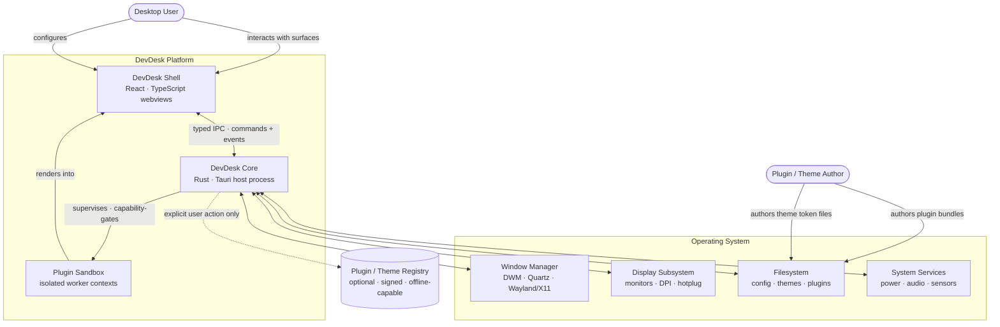

### 4.2 Actors and External Systems

| Actor / System | Interaction | Trust |
| --- | --- | --- |
| **Desktop User** | Direct manipulation of surfaces; configuration; capability grants | Trusted; the ultimate authority |
| **Plugin / Theme Author** | Ships declarative bundles onto the local filesystem | **Untrusted** — see §18.2 |
| **Window Manager** | Window creation, placement, layering, focus | Trusted, but behaviour diverges per OS (§19.2) |
| **Display Subsystem** | Monitor enumeration, DPI, hotplug notification | Trusted; unreliable timing — treat events as hints, re-query for truth |
| **Filesystem** | Config, theme, plugin, cache storage | Trusted for core paths; **untrusted for content** under `plugins/` and `themes/` |
| **System Services** | Power, audio, sensors, network state | Trusted; access is capability-gated for plugins |
| **Registry** | Optional discovery/update of signed bundles | **Untrusted**; never on a critical path; never contacted without user action |

---

## 5. Runtime Topology

### 5.1 Process and Thread Model

DevDesk runs as **one host process** plus **N webview processes** (count and grouping determined by the OS webview runtime, not by DevDesk) and **M plugin sandbox contexts**.

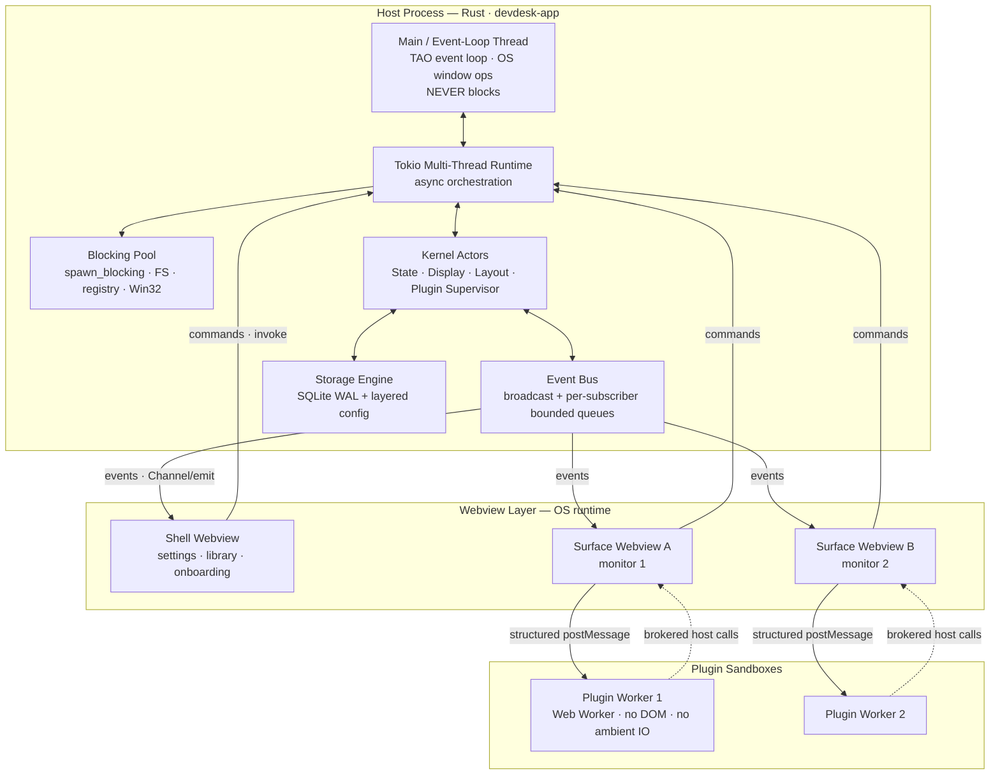

### 5.2 Thread Contract

| Thread / Pool | Owns | MUST | MUST NOT |
| --- | --- | --- | --- |
| **Main / event loop** | OS window handles, TAO event loop | Execute all OS window mutations; return in < 1 ms | Perform IO, acquire contended locks, `block_on`, allocate large buffers |
| **Tokio worker pool** | Async orchestration, actor mailboxes, IPC dispatch | Stay non-blocking; use `.await` for all IO | Call synchronous FS, registry, or Win32 APIs directly |
| **Blocking pool** | Filesystem, SQLite, Win32/AppKit sync calls | Wrap every sync syscall in `spawn_blocking` | Hold an `.await` point; send `!Send` values across |
| **Webview main thread** | DOM, React reconciliation, style/layout/paint | Stay under the frame budget (B-8) | Run heavy compute, parse large payloads, synchronously deserialize > 64 KB |
| **Plugin worker** | Plugin logic and data transformation | Communicate only via structured messages | Touch DOM, `fetch` without grant, access `window.__TAURI__` |

**Rationale.** Conflating the OS event-loop thread with async work is the single most common source of desktop-shell jank: an OS window operation queued behind an IO future produces a visible stall that no amount of frontend optimisation can recover. The separation above is therefore a **MUST**, enforced by `#[deny(clippy::await_holding_lock)]` and a custom lint pass (§25.5).

### 5.3 Why One Host Process

| Option | Isolation | IPC cost | Complexity | Verdict |
| --- | --- | --- | --- | --- |
| Single host process (chosen) | Plugins isolated in-webview; core faults are fatal | Lowest — in-process actor messaging | Low | **Chosen** |
| Process-per-surface | Strong | High — serialization per surface | High — supervision, handle passing, DPI sync | Rejected for v1; revisit per §26.2 |
| Process-per-plugin | Strongest | Highest | Highest — 20+ processes at typical config | Rejected; violates B-3/B-4 |

The single-host model accepts that a core panic is fatal to the session, and mitigates it with a hard rule: **the core MUST NOT panic on untrusted input** (§15.2). Plugin isolation is achieved at the sandbox layer instead (§11.3), which is where the actual threat lives.

---

## 6. Logical Architecture

### 6.1 Subsystem Map

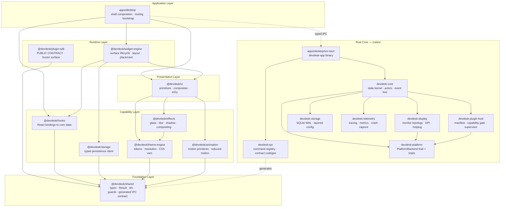

### 6.2 Subsystem Responsibilities

#### 6.2.1 Rust Crates (`crates/`)

| Crate | Owns | Explicitly Does Not Own |
| --- | --- | --- |
| `devdesk-core` | The authoritative application state graph; actor supervision; the event bus; transaction/journal semantics | Any OS API call; any serialization format; any UI concept |
| `devdesk-ipc` | Command registry, argument validation, error envelope, contract version negotiation, TypeScript codegen | Business logic — commands are thin adapters onto `devdesk-core` |
| `devdesk-platform` | The `PlatformBackend` trait and its per-OS implementations; the *only* crate permitted `#[cfg(target_os)]` at API granularity | Policy decisions — it exposes capability, it does not decide when to use it |
| `devdesk-display` | Monitor enumeration, coordinate spaces, DPI resolution, hotplug debouncing, topology identity/fingerprinting | Window placement policy (that is layout, in `devdesk-core`) |
| `devdesk-plugin-host` | Manifest parse/validate, signature verification, capability gate, sandbox supervision, lifecycle FSM | Plugin *rendering* — surfaces render in the webview layer |
| `devdesk-storage` | SQLite schema/migrations, layered config resolution, atomic writes, backup/restore | Domain semantics of what is stored |
| `devdesk-telemetry` | `tracing` subscriber wiring, span taxonomy, metric registry, ring buffer, crash capture | Network transmission of any kind (§18.9) |
| `devdesk-app` (binary) | Tauri builder wiring, capability files, window creation, startup sequence | Anything testable — logic here MUST be delegated to a library crate |

#### 6.2.2 TypeScript Packages (`packages/`)

| Package | Owns | Explicitly Does Not Own |
| --- | --- | --- |
| `@devdesk/shared` | Branded ID types, `Result`, type guards, **generated** IPC contract types, zero-runtime-dependency utilities | React, DOM, or Tauri imports — this package MUST be environment-agnostic |
| `@devdesk/storage` | Typed client over storage commands; optimistic cache; schema-versioned accessors | Direct `invoke` calls from feature code — all persistence funnels here |
| `@devdesk/theme-engine` | Token graph resolution, cascade, CSS custom property emission, theme switching | Component styling decisions; visual opinions live in themes, not the engine |
| `@devdesk/effects` | Glass/blur/shadow/noise compositing primitives; GPU cost accounting; automatic degradation | Layout; effects decorate, they never position |
| `@devdesk/animation` | Motion primitives, spring/easing catalogue, `prefers-reduced-motion` enforcement | Ad-hoc `setInterval` animation; RAF ownership is centralized here |
| `@devdesk/hooks` | React bindings to core state via `useSyncExternalStore`; subscription lifecycle; suspense integration | Business logic; hooks project state, they do not compute it |
| `@devdesk/ui` | Accessible primitives and composites, fully token-driven | Domain knowledge — no component may know what a "plugin" is |
| `@devdesk/widget-engine` | Surface lifecycle, layout solving, placement, drag/resize orchestration, z-management | Plugin trust decisions (core-side) or visual identity (theme-side) |
| `@devdesk/plugin-sdk` | The **public, frozen** author-facing contract; host API proxy; typed manifest helpers | Any dependency on `ui`, `widget-engine`, or app internals |

### 6.3 Dependency Rules

**DR-1.** The dependency graph **MUST** be acyclic. Cycles fail CI.

**DR-2.** Dependencies **MUST** flow strictly downward through layers L5 → L4 → L3 → L2 → L1. Upward and sideways-within-layer imports are prohibited.

**DR-3.** `@devdesk/shared` **MUST** have zero runtime dependencies and zero React/DOM/Tauri imports.

**DR-4.** `@devdesk/plugin-sdk` **MUST** depend only on `@devdesk/shared`. It is the public API surface; a dependency added here is a permanent compatibility obligation.

**DR-5.** No package may import from another package's internal path. Only the published entry points of `package.json#exports` are importable.

**DR-6.** Rust: only `devdesk-platform` may use `#[cfg(target_os = ...)]` to select *implementations*. Other crates MAY use `cfg` only for test gating.

**DR-7.** `devdesk-app` (the binary crate) **MUST** remain a thin composition root. Any function longer than ~30 lines belongs in a library crate where it can be unit-tested.

**DR-8.** Plugins **MUST NOT** import any `@devdesk/*` package other than `@devdesk/plugin-sdk`. Enforced at bundle validation time (§11.2), not merely by lint.

#### Enforcement

```jsonc
// configs/dependency-cruiser/.dependency-cruiser.json — illustrative shape
{
  "forbidden": [
    {
      "name": "no-upward-layer-imports",
      "severity": "error",
      "comment": "DR-2: dependencies flow downward only",
      "from": { "path": "^packages/(shared|theme-engine|storage|animation)/" },
      "to":   { "path": "^packages/(ui|widget-engine)/" }
    },
    {
      "name": "shared-is-pure",
      "severity": "error",
      "comment": "DR-3: shared has no environment coupling",
      "from": { "path": "^packages/shared/" },
      "to":   { "dependencyTypes": ["npm"], "pathNot": "^(type-fest)$" }
    },
    {
      "name": "sdk-surface-is-minimal",
      "severity": "error",
      "comment": "DR-4: plugin-sdk depends only on shared",
      "from": { "path": "^packages/plugin-sdk/" },
      "to":   { "path": "^packages/(?!shared|plugin-sdk)" }
    },
    { "name": "no-cycles", "severity": "error", "from": {}, "to": { "circular": true } }
  ]
}
```

| Rule | Mechanism | Stage |
| --- | --- | --- |
| DR-1, DR-2, DR-3, DR-4, DR-5 | `dependency-cruiser` + `eslint-plugin-import/no-restricted-paths` | Pre-commit + CI |
| DR-6 | `scripts/lint-cfg-usage.mjs` over `crates/` | CI |
| DR-7 | `scripts/lint-binary-crate-size.mjs` | CI (warn), review (block) |
| DR-8 | `devdesk-plugin-host` bundle validator | Runtime + `devdesk plugin validate` |

---

## 7. The IPC Contract

The IPC boundary is the **most important contract in the system**. It is the seam between a trusted Rust core and a semi-trusted webview, the performance chokepoint for every interaction, and the versioning surface that determines whether old plugins keep working. It is specified here in full; the wire catalogue lives in `docs/api/IPC_CONTRACT.md`.

### 7.1 Transport Selection Matrix

Tauri offers several transports. Choosing wrongly is the single largest avoidable performance defect in this class of application.

| Transport | Direction | Use When | Never Use For | Cost Profile |
| --- | --- | --- | --- | --- |
| **Command** (`invoke`) | Shell → Core, request/response | Discrete, user-initiated, needs a result | Anything periodic or per-frame | ~0.3–1.5 ms round trip; JSON serialize both ways |
| **Event** (`emit` / `listen`) | Core → Shell, broadcast | Low-frequency state deltas, ≤ 20 Hz aggregate | High-frequency streams; large payloads | Fan-out cost scales with listener count |
| **Channel** (`ipc::Channel<T>`) | Core → Shell, per-subscriber stream | High-frequency or per-surface streams; ordered delivery required | Broadcast to all surfaces | Lower overhead than events; no fan-out amplification |
| **Raw response** (`ipc::Response`) | Core → Shell, binary | Payloads > 64 KB; images, buffers, snapshots | Small structured data | Avoids JSON + base64; returns `ArrayBuffer` |
| **Custom protocol** (`asset:`) | Shell pull, scoped | Static theme/plugin assets loaded by the webview | Dynamic or sensitive data | Zero IPC; scope-gated by capability |

**TR-1.** Any data source producing more than **20 messages/second** **MUST** use a Channel, not an event.
**TR-2.** Any payload exceeding **64 KB** **MUST** use `ipc::Response` raw bytes, not a JSON command result.
**TR-3.** The shell **MUST NOT** call `invoke` from inside `requestAnimationFrame`, a `useEffect` without dependencies, or any per-frame code path. Enforced by `scripts/lint-ipc-hotpath.mjs`.

#### Illustrative: a high-frequency stream done correctly

```rust
// crates/devdesk-core/src/telemetry_stream.rs — illustrative
#[derive(Clone, serde::Serialize, specta::Type)]
pub struct FrameSample {
    pub t_ms: u64,
    pub cpu_pct: f32,
    pub gpu_pct: Option<f32>,
}

#[tauri::command]
#[specta::specta]
pub async fn subscribe_frame_samples(
    state: tauri::State<'_, Kernel>,
    sink: tauri::ipc::Channel<FrameSample>,
) -> Result<SubscriptionId, IpcError> {
    // The kernel owns cadence and coalescing; the webview never polls.
    state.metrics().attach(sink).await
}
```

```ts
// packages/hooks/src/useFrameSamples.ts — illustrative
const sink = new Channel<FrameSample>();
sink.onmessage = (sample) => store.push(sample); // no React render per sample
const id = await commands.subscribeFrameSamples(sink);
```

### 7.2 Naming and Shape

| Element | Convention | Example |
| --- | --- | --- |
| Command | `snake_case`, `domain_verb_object` | `display_list_monitors`, `surface_set_bounds` |
| Event | `kebab-case`, `domain:past-tense` | `display:topology-changed`, `plugin:activation-failed` |
| Channel factory | `domain_subscribe_noun` | `metrics_subscribe_frames` |
| DTO type | `PascalCase`, suffix by role | `MonitorDescriptor`, `SurfaceBoundsPatch` |

**IPC-1.** Commands **MUST** be verbs with an explicit object. `get_data` is prohibited; `storage_read_surface_state` is required.
**IPC-2.** Commands **MUST** be idempotent or explicitly documented as not. Non-idempotent commands **MUST** accept a client-supplied `request_id` for deduplication.
**IPC-3.** Every command **MUST** return `Result<T, IpcError>`. Returning bare `T` is prohibited — it forecloses error evolution.
**IPC-4.** DTOs **MUST** be flat, additive-only structures. Removing or retyping a field is a breaking change (§7.3).

### 7.3 Versioning and Compatibility

The contract carries a **semantic version independent of the application version**.

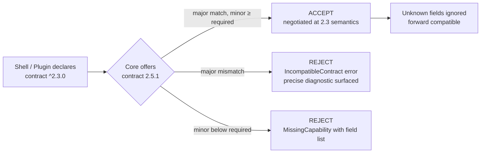

| Change | Version Impact | Allowed Without ADR |
| --- | --- | --- |
| Add a new command | MINOR | Yes |
| Add an optional field to a DTO | MINOR | Yes |
| Add a new event or channel | MINOR | Yes |
| Add a required field | **MAJOR** | No |
| Rename or remove anything | **MAJOR** | No |
| Change a field's type or units | **MAJOR** | No |
| Tighten a validation rule | **MAJOR** (behaviourally breaking) | No |
| Loosen a validation rule | MINOR | Yes |

**VER-1.** Contract MAJOR bumps require an ADR and a deprecation window of **two MINOR releases** with runtime warnings.
**VER-2.** Deserialization **MUST** ignore unknown fields (`#[serde(deny_unknown_fields)]` is prohibited on IPC DTOs) so older cores tolerate newer shells during rollback.
**VER-3.** The negotiated contract version **MUST** be recorded in every telemetry span and crash report.

### 7.4 Contract Generation Pipeline

Hand-written TypeScript mirrors of Rust types are prohibited (§24, AP-13). The contract is **generated**, and the generated file is committed so that reviewers and AI agents can diff the true API surface.

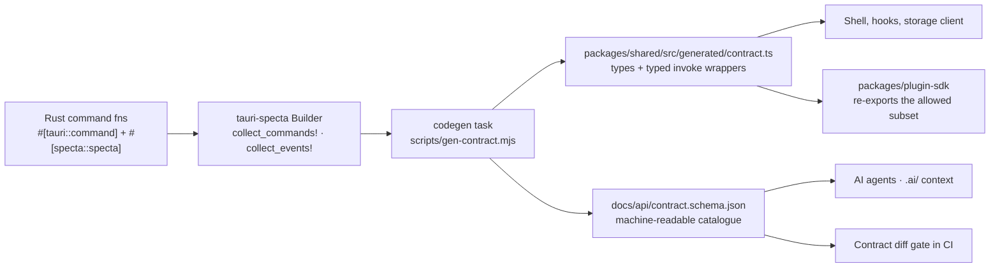

**GEN-1.** `packages/shared/src/generated/**` is **generated output**. Editing it by hand is prohibited; CI regenerates and fails on diff.
**GEN-2.** Every CI run **MUST** produce a contract diff against the previous release and fail if the diff implies a MAJOR change without a version bump.
**GEN-3.** `docs/api/contract.schema.json` is the machine-readable artifact consumed by AI-assisted workflows (C-5). It **MUST** be regenerated in the same task, never separately.

### 7.5 Error Envelope

```rust
// crates/devdesk-ipc/src/error.rs — illustrative contract shape
#[derive(Debug, serde::Serialize, specta::Type, thiserror::Error)]
#[serde(tag = "kind", content = "detail", rename_all = "kebab-case")]
pub enum IpcError {
    #[error("invalid argument: {field}")]
    InvalidArgument { field: String, expected: String },

    #[error("capability denied: {capability}")]
    CapabilityDenied { capability: String, subject: SubjectId },

    #[error("resource not found: {kind}/{id}")]
    NotFound { kind: String, id: String },

    #[error("precondition failed: {reason}")]
    PreconditionFailed { reason: String },

    #[error("operation not supported on {platform}")]
    Unsupported { platform: Platform, feature: String },

    #[error("transient failure; retry after {retry_after_ms}ms")]
    Transient { retry_after_ms: u32, cause: String },

    #[error("internal error: {trace_id}")]
    Internal { trace_id: TraceId }, // message deliberately opaque — see §18.8
}
```

**ERR-1.** `Internal` **MUST NOT** carry a message, path, or backtrace to the webview. It carries a `trace_id` that correlates to the local log. This prevents information disclosure across the trust boundary (§18.8).
**ERR-2.** Every error variant **MUST** be actionable by the caller: either retryable, fixable, or a definite terminal state. A variant that tells the caller nothing is a design defect.
**ERR-3.** `Transient` **MUST** carry a `retry_after_ms`; clients **MUST** honour it with jittered backoff and **MUST NOT** implement their own retry cadence.

### 7.6 Backpressure and Coalescing

The webview main thread is the scarcest resource in the system. The core is responsible for protecting it.

**BP-1.** Every event subscription **MUST** have a bounded queue. Default depth: 64.
**BP-2.** On queue overflow the core **MUST** apply the subscription's declared overflow policy — never block the producer:

| Policy | Semantics | Use For |
| --- | --- | --- |
| `LatestWins` | Drop all but the newest | State snapshots, sensor readings, layout hints |
| `DropNewest` | Preserve history, refuse new | Audit-like ordered streams |
| `Coalesce(key)` | Merge by key, keep newest per key | Per-surface bounds updates |
| `Disconnect` | Terminate the subscription and surface an error | Correctness-critical streams that must not gap |

**BP-3.** Bounds, opacity, and other continuously varying values **MUST** be coalesced to at most one message per display refresh interval, aligned to the monitor's refresh rate.
**BP-4.** Drops **MUST** be counted per subscription and exposed as a metric. Silent drops are prohibited.

```rust
// crates/devdesk-core/src/bus.rs — illustrative
pub struct Subscription<T> {
    queue: ArrayQueue<T>,        // bounded, lock-free
    policy: OverflowPolicy,
    dropped: AtomicU64,          // BP-4: always observable
    cadence: RefreshAligned,     // BP-3: aligned to the target monitor
}
```

---

## 8. State Architecture and Data Flow

### 8.1 Ownership Rules

**ST-1.** **The Rust core is the single source of truth for all durable and shared state.** The shell holds a *projection*, never an authority.
**ST-2.** The shell MAY own **ephemeral view state** only: hover, focus ring, transient drag offsets, uncommitted input buffers, and animation interpolation.
**ST-3.** A value that survives a reload, is visible to more than one surface, or is observable by a plugin **MUST** live in the core.
**ST-4.** Mutations **MUST** flow through commands. The shell **MUST NOT** locally mutate projected state except as an explicitly reconciled optimistic update (§8.4).

**Rationale for ST-1.** The alternative — a rich frontend store synchronized with the backend — creates two authorities and therefore an unbounded class of divergence bugs, each of which reproduces only under specific timing. With multiple surfaces across multiple monitors plus plugin observers, the number of potential divergence pairs grows quadratically. Single ownership makes the class impossible rather than rare.

### 8.2 Snapshot + Delta Protocol

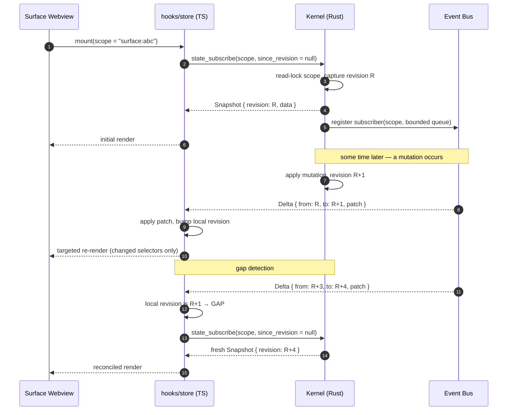

**ST-5.** Every scope **MUST** carry a monotonic `revision` (`u64`). Deltas **MUST** declare `from` and `to`.
**ST-6.** Clients **MUST** detect gaps (`delta.from != local.revision`) and recover by re-snapshotting. Clients **MUST NOT** attempt to apply out-of-order deltas.
**ST-7.** Snapshots are scoped, never global. A surface subscribes to what it renders and nothing else — this is what makes QA-1 (zero idle repaints) achievable.

### 8.3 Frontend Store Binding

**ST-8.** React binds to the projection through `useSyncExternalStore` with **selector-level subscriptions**. Context-provider fan-out for high-churn state is prohibited (§24, AP-2).

```ts
// packages/hooks/src/useCoreState.ts — illustrative
export function useCoreState<S, T>(scope: Scope<S>, selector: (s: S) => T): T {
  const store = getScopeStore(scope);           // per-scope, ref-counted, deduped
  return useSyncExternalStore(
    store.subscribeSelector(selector),           // fires only when selector output changes
    () => selector(store.getSnapshot()),
    () => selector(store.getServerSnapshot())    // SSR-safe; also used for tests
  );
}
```

**ST-9.** Selector results **MUST** be compared with a structural equality appropriate to the type. Returning a fresh object from a selector on every call is a defect (it defeats the subscription and re-renders every frame).
**ST-10.** Scope stores are **ref-counted**. The last unmounting consumer unsubscribes from the core, which then stops producing for that scope. Producing state nobody observes violates B-3.

### 8.4 Optimistic Mutation

Direct manipulation (dragging a surface) cannot wait for a round trip. Optimism is permitted under a strict protocol.

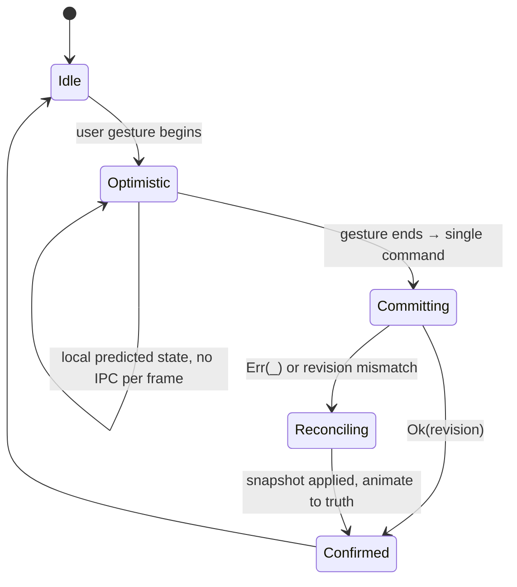

**ST-11.** Optimistic state **MUST** be held in a distinct overlay, never merged into the projection. Reconciliation is then a discard, not a diff.
**ST-12.** A gesture **MUST** produce **at most one** mutating command, issued at gesture end. Per-frame commands during a drag are prohibited (TR-3).
**ST-13.** Live visual feedback during a gesture **MUST** be driven by the native window layer where the platform supports it (§9), not by IPC echo.
**ST-14.** Reconciliation **MUST** be visible — the surface animates to the authoritative position rather than snapping — so that divergence is legible to the user instead of appearing as a glitch.

---

## 9. Window and Display Subsystem — Boundary

> Full specification: [`docs/architecture/WINDOW_AND_DISPLAY.md`](./WINDOW_AND_DISPLAY.md)

### 9.1 Responsibilities at the System Boundary

`devdesk-display` + the layout actor in `devdesk-core` own:

- Monitor enumeration and a **stable topology fingerprint** that survives replug and reorder.
- The three coordinate spaces and conversions between them.
- Debounced hotplug handling with re-query-for-truth semantics.
- Placement policy: which surface belongs on which monitor, at which layer, under which anchor.

### 9.2 Coordinate Spaces

Confusing these is the most common defect class in multi-monitor code (§24, AP-6).

| Space | Unit | Origin | Used By |
| --- | --- | --- | --- |
| **Physical** | Device pixels | Primary monitor top-left, OS-defined | OS APIs, `Monitor::size()`, `Monitor::position()` |
| **Logical** | DIPs (physical ÷ `scale_factor`) | Same as physical | Tauri window APIs, layout solving |
| **Surface-local** | CSS pixels | Surface top-left | Everything inside a webview |

**WD-1.** Every geometry type **MUST** be newtype-tagged with its space. Bare `(i32, i32)` for a position is prohibited.

```rust
// crates/devdesk-display/src/geometry.rs — illustrative
#[derive(Clone, Copy, serde::Serialize, specta::Type)]
pub struct PhysicalPoint { pub x: i32, pub y: i32 }

#[derive(Clone, Copy, serde::Serialize, specta::Type)]
pub struct LogicalPoint { pub x: f64, pub y: f64 }

impl PhysicalPoint {
    /// Conversion REQUIRES a monitor: scale factor is per-monitor, never global.
    pub fn to_logical(self, m: &MonitorDescriptor) -> LogicalPoint { /* … */ }
}
```

**WD-2.** Conversion functions **MUST** take a `&MonitorDescriptor`. A global scale factor does not exist on a mixed-DPI desktop; any API implying one is a defect.

### 9.3 Topology Identity

**WD-3.** Monitors **MUST** be identified by display-reported identity, not by OS enumeration index. Indices reorder across reboots and docking events, silently relocating every surface.

> **Amended by [`ADR-0004`](../adr/ADR-0004-display-topology-identity-and-transaction-model.md) §3.1.** No single reported signal — EDID serial, device path, connector, adapter, model — is both always present and always stable, so identity is a **set of signals plus a confidence**, never one string compared for equality. Two identities that both lack a signal have not agreed on it, and an ambiguous match resolves to nothing. ADR-0004 owns the confidence ladder, the resolution strategy, and the fingerprint inputs.
**WD-4.** Layout is persisted **per topology fingerprint**. Docking, undocking, and returning to a known arrangement restore the arrangement the user configured for it.
**WD-5.** An unknown topology **MUST** resolve deterministically: surfaces bind to the primary monitor with anchors preserved, and the user is offered a one-click restore. Losing user layout silently is prohibited.
**WD-6.** Hotplug events **MUST** be debounced (default 250 ms) and treated as *hints* — the handler re-queries the OS for authoritative topology rather than trusting the event payload.

### 9.4 Surface Layers

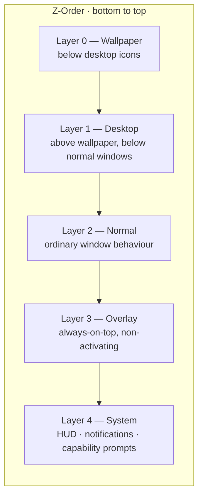

**WD-7.** Layer assignment is **declared in the plugin manifest** and **granted by the core**. A surface cannot promote its own layer at runtime.
**WD-8.** Layers 0, 3, and 4 require platform-specific attachment (Win32 `WorkerW` reparenting; AppKit window levels and collection behaviour; `wlr-layer-shell` on supporting Wayland compositors). Each is a `PlatformBackend` method that **MUST** return `Unsupported` rather than degrade silently where unavailable (§19.3).
**WD-9.** Layer 4 is **reserved to the core**. Plugins **MUST NOT** be granted it — it is where capability prompts render, and a plugin able to draw there could spoof them (§18.7).

### 9.5 Topology Consistency

> Added by [`ADR-0004`](../adr/ADR-0004-display-topology-identity-and-transaction-model.md), which owns the full rules. These three are the boundary obligations every consumer of the display subsystem depends on.

**WD-10.** Topology changes **MUST** be published as a **transaction** carrying the generation, both arrangements, and the computed difference, applied atomically. A consumer **MUST NOT** be able to observe an intermediate state — a spatial index that disagrees with the arrangement it indexes, or a generation that does not match the displays beside it. Undocking emits a burst of platform events, and a consumer reading topology per event places surfaces against arrangements that existed for milliseconds.

**WD-11.** The spatial index over an arrangement **MUST** be immutable, and every topology change **MUST** produce a new one. Spatial queries are asked in the middle of other work — a drag, a layout solve, a hit test — and an index that can change under a caller lets a sequence of queries answer against two different desktops.

**WD-12.** Recency and arrangement identity are **separate values**. The fingerprint (WD-3) answers *which* arrangement this is and repeats when the user returns to a known desk, which is what makes it a layout key under WD-4. A monotonic **generation** answers *how recent* this is. A consumer holding stale work cannot detect it from a fingerprint alone.

---

## 10. Theme Subsystem — Boundary

> Full specification: [`docs/architecture/THEME_ARCHITECTURE.md`](./THEME_ARCHITECTURE.md)

### 10.1 The Central Invariant

**TH-1. A theme is data. A theme is never code.** No theme artifact may contain or reference executable JavaScript, WASM, or shell commands. This is a **security** invariant (themes are the lowest-friction distribution vector on the platform and therefore the highest-value attack surface) before it is an architectural one. Enforced by the theme validator at load time, not by convention.

### 10.2 Token Pipeline

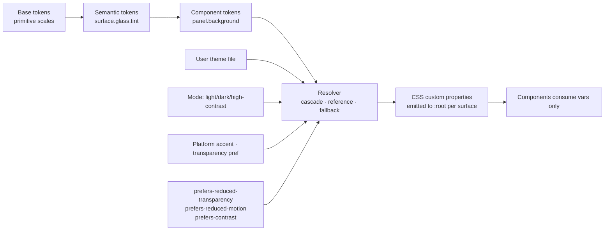

**TH-2.** Components **MUST** consume CSS custom properties. Hardcoded colours, radii, blur radii, shadow values, and durations in component source are prohibited (§24, AP-8).
**TH-3.** Token resolution **MUST** be total: every reference resolves to a concrete value or a declared fallback. Unresolved tokens fail validation at load, not at paint.
**TH-4.** Theme switching **MUST** be achieved by re-emitting custom properties on the root — never by remounting the component tree. This is what makes B-7 (≤ 120 ms) reachable.
**TH-5.** Accessibility preferences **override** theme values unconditionally. A theme cannot opt out of `prefers-reduced-motion` or `prefers-reduced-transparency`.

### 10.3 Glassmorphism as a Governed Effect

Glass is the platform's visual signature and its most expensive rendering primitive. It is therefore **budgeted**, not free.

**TH-6.** `backdrop-filter` **MUST** be applied only through `@devdesk/effects`. Direct use in component or plugin CSS is prohibited (§24, AP-3).
**TH-7.** `@devdesk/effects` **MUST** maintain a per-surface GPU cost account and degrade automatically when the budget is exceeded, in this order:
1. Reduce blur radius toward the token's declared floor.
2. Substitute a pre-rendered/static backdrop for the live one.
3. Fall back to an opaque tinted surface.

**TH-8.** Degradation **MUST** be observable (a metric and a developer-tools indicator). Silent visual downgrade is prohibited — it produces unreproducible "looks different on my machine" reports.
**TH-9.** Animated `backdrop-filter` is prohibited. Animate `opacity` and `transform` on a composited layer instead; both stay off the main thread, `backdrop-filter` does not.

---

## 11. Plugin Subsystem — Boundary

> Full specification: [`docs/architecture/PLUGIN_ARCHITECTURE.md`](./PLUGIN_ARCHITECTURE.md)

### 11.1 Plugin-First Means First-Party Is Not Privileged

**PL-1.** First-party surfaces **MUST** be built on the same plugin contract as third-party ones, with no privileged escape hatch. If a first-party surface requires something the contract cannot express, the contract is amended by ADR — for everyone.

**Rationale.** A privileged first-party path is the mechanism by which "plugin-first" platforms decay: the internal path stays convenient, the public path stays underpowered, and third-party authors are permanently second-class. Removing the escape hatch at the start makes the contract's deficiencies visible immediately, while they are cheap to fix.

### 11.2 Bundle Structure and Validation

```text
plugins/<publisher>.<name>/
├── manifest.json          # declarative; the entire trust surface
├── dist/
│   ├── worker.js          # plugin logic — runs in the sandbox, no DOM
│   └── surface.js         # optional render module — runs in the surface webview
├── assets/                # static, scope-restricted
├── themes/                # optional bundled tokens (data only)
└── SIGNATURE              # detached signature over a canonical bundle digest
```

Validation is a gate, executed in this order, with the first failure terminal:

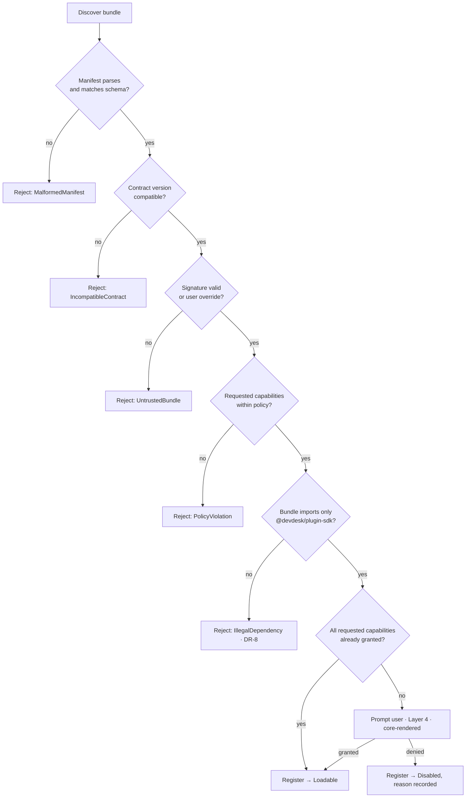

**PL-2.** Validation is performed **in Rust**, in `devdesk-plugin-host`. It **MUST NOT** be performed in the webview — validation in the same trust domain as the code being validated is not validation.

### 11.3 Sandbox Model

| Boundary | Mechanism | Prevents |
| --- | --- | --- |
| Plugin logic ↔ DOM | Web Worker: no `document`, no `window` | DOM injection, event spoofing, cross-surface reads |
| Plugin ↔ host API | Structured-clone message broker; no object identity crosses | Prototype pollution, capability leakage by reference |
| Plugin ↔ filesystem | No ambient access; scoped, core-mediated commands only | Path traversal, exfiltration |
| Plugin ↔ network | Denied by default; capability-gated, allow-listed origins | Beaconing, unauthorized telemetry |
| Plugin ↔ plugin | No shared realm, no shared storage namespace | Lateral movement, data harvesting |
| Plugin ↔ Tauri IPC | `window.__TAURI__` unavailable in the sandbox realm | Direct invocation bypassing the capability gate |

**PL-3.** The host API exposed to a plugin **MUST** be a generated proxy derived from its **granted** capability set — not a full API with runtime checks. A capability the plugin was not granted is not present as a callable at all. This converts a class of authorization bugs into `undefined is not a function` at the plugin's own boundary.
**PL-4.** All plugin→host messages **MUST** be validated against the contract schema on the Rust side, regardless of any validation performed in the webview.

### 11.4 Lifecycle

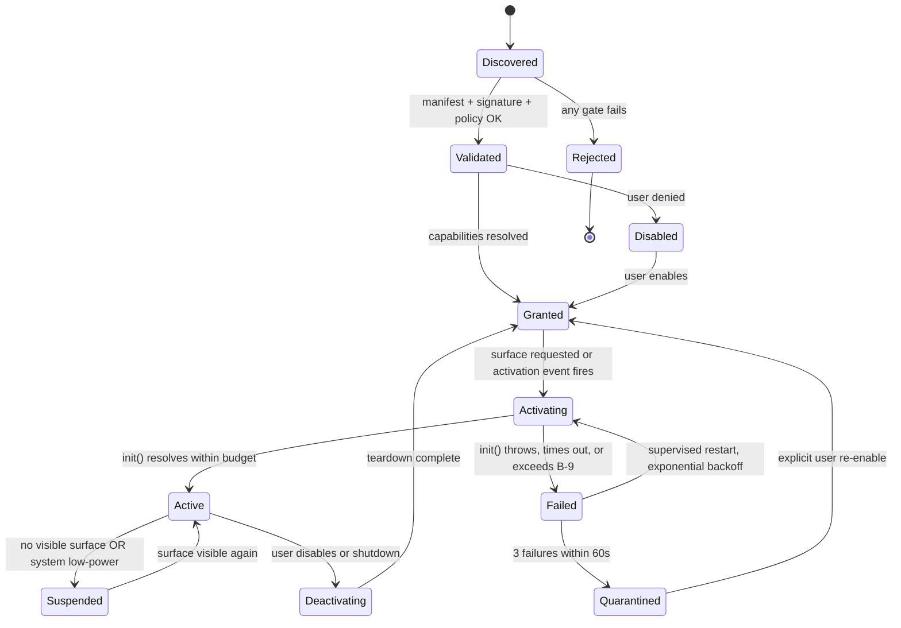

**PL-5.** A plugin **MUST NOT** be able to prevent its own deactivation. Teardown has a hard timeout (default 2 s), after which the worker is terminated.
**PL-6.** `Suspended` **MUST** release the worker's timers and subscriptions. A suspended plugin that keeps a timer alive violates B-3 and is a supervisor bug, not a plugin bug.
**PL-7.** Quarantine **MUST** be sticky across restarts and **MUST** record the failure reason for user display.

### 11.5 Capability Model

Capabilities are declared, granted per plugin, persisted, revocable, and auditable.

```jsonc
// plugins/acme.system-monitor/manifest.json — illustrative
{
  "id": "acme.system-monitor",
  "contract": "^2.3.0",
  "surfaces": [
    { "id": "cpu-panel", "layer": "desktop", "defaultSize": { "w": 320, "h": 180 } }
  ],
  "capabilities": [
    { "id": "system.metrics.read", "reason": "Display CPU and memory utilization" },
    { "id": "storage.private", "reason": "Remember which cores are pinned" }
  ],
  "activation": ["onSurfaceVisible:cpu-panel"]
}
```

**PL-8.** Every capability request **MUST** carry a human-readable `reason`, shown verbatim in the grant prompt. A manifest without reasons fails validation.
**PL-9.** Capabilities **MUST** be granted at the narrowest available scope. A filesystem capability names a directory; it never names a drive.
**PL-10.** Grants **MUST** be revocable at any time from the shell, with revocation taking effect without restart.
**PL-11.** Activation **MUST** be event-driven. `"activation": ["onStartup"]` is permitted only for capability-free plugins, because eager activation is charged directly against B-1.

---

## 12. Widget Runtime — Boundary

> Full specification: [`docs/architecture/WIDGET_RUNTIME.md`](./WIDGET_RUNTIME.md)

A **surface** is the platform's unit of composition: a bounded, positioned, themed region backed by a plugin. "Widget" is retained as user-facing vocabulary only; internal identifiers use *surface*.

**WR-1.** `@devdesk/widget-engine` owns lifecycle, layout solving, placement, drag/resize orchestration, and z-management **within a monitor**. Cross-monitor placement is the core's layout actor (§9).
**WR-2.** Surfaces **MUST** be isolated: no surface may query, style, or traverse another surface's DOM. Enforced by per-surface shadow roots and scoped custom-property emission.
**WR-3.** Layout solving **MUST** be pure and synchronous given a topology and constraint set — the same inputs always produce the same arrangement. Non-determinism here surfaces as surfaces that "wander" between sessions.
**WR-4.** The engine **MUST** support both anchored (edge/corner-relative, DPI-stable) and free (absolute logical coordinates) placement. Anchored is the default because it survives resolution changes.
**WR-5.** A surface that fails to render **MUST** degrade to an error placeholder in its own bounds, never to a blank region or a collapsed layout (§15.4).

---

## 13. Persistence and Configuration

### 13.1 Storage Tiers

| Tier | Medium | Content | Durability | Migration |
| --- | --- | --- | --- | --- |
| **Config** | TOML, human-editable | User preferences, layout definitions, grants | Atomic write via temp + rename | Versioned, forward-migrating |
| **State** | SQLite (WAL) | Surface state, plugin private state, topology history | Transactional | Numbered SQL migrations |
| **Cache** | SQLite (separate file) | Rendered thumbnails, resolved token graphs, metric history | **Disposable** — deleting it MUST be harmless | None; schema mismatch drops the file |
| **Secrets** | OS keychain (DPAPI / Keychain / Secret Service) | Plugin-held credentials | OS-managed | N/A |

**PR-1.** Config files **MUST** remain hand-editable and hand-recoverable. A user who breaks their config in an editor must be able to fix it in an editor.
**PR-2.** Cache **MUST** be reconstructible from Config + State alone. Any datum that is not reconstructible does not belong in Cache.
**PR-3.** Secrets **MUST NOT** be written to Config, State, Cache, or logs. `devdesk-storage` exposes no API capable of it.
**PR-4.** All writes **MUST** be atomic (temp file + `fsync` + rename). A power loss mid-write must never yield a truncated config.

### 13.2 Layered Configuration

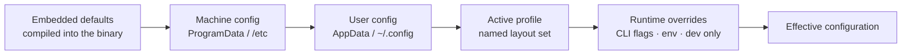

**PR-5.** Later layers override earlier ones per-key, never per-file. A user overriding one key does not inherit responsibility for the whole document.
**PR-6.** The effective configuration **MUST** be introspectable with provenance — for any key, the shell can show which layer supplied the value. This eliminates the largest category of "why is this setting not applying" support burden.
**PR-7.** Unknown keys **MUST** be preserved on rewrite, not dropped. A user downgrading and re-upgrading does not lose settings.

### 13.3 State Schema Shape

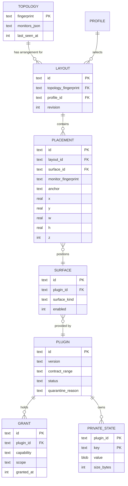

**PR-8.** `PRIVATE_STATE` **MUST** be quota-enforced per plugin (default 5 MB). Exceeding the quota is a typed error to the plugin, never a silent truncation.
**PR-9.** Migrations **MUST** be forward-only, numbered, and transactional. A failed migration rolls back and starts the previous schema version in read-only mode with a user-visible diagnostic — it never leaves a half-migrated database.
**PR-10.** A pre-migration backup **MUST** be taken and retained for the last three migrations.

---

## 14. Lifecycle

### 14.1 Cold Start

Startup is budget-critical (B-1, B-2). The sequence is designed so that the **first paint does not wait on plugins**.

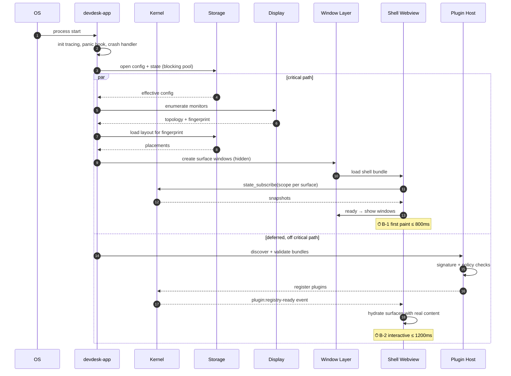

**LC-1.** Plugin discovery, signature verification, and activation **MUST NOT** block first paint. Surfaces paint their themed chrome and a skeleton first; content hydrates after.
**LC-2.** Storage open, display enumeration, and layout resolution are the **only** operations permitted on the critical path.
**LC-3.** Windows are created hidden and shown only when their first frame is ready. Showing an unpainted window produces a visible white flash — prohibited.
**LC-4.** Startup phases **MUST** be individually traced (`startup.storage`, `startup.display`, `startup.window`, `startup.shell`, `startup.plugins`) so that a B-1 regression is attributable without bisecting.

### 14.2 Steady State

**LC-5.** In steady state with no user interaction, the system **MUST** issue no timers faster than 1 Hz in the core and **zero** repaints in the shell (QA-1). Any component requiring a faster idle tick must justify it in review against B-3.
**LC-6.** Idle surfaces **MUST** unsubscribe from state scopes they no longer render (ST-10).

### 14.3 Shutdown

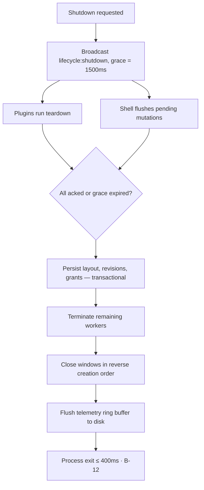

**LC-7.** Shutdown **MUST** be bounded. A plugin that does not ack within the grace period is terminated; it cannot delay exit.
**LC-8.** Persistence **MUST** complete before window teardown. Losing the last layout change on quit is a data-loss defect.

### 14.4 Crash and Recovery

| Failure | Detection | Recovery | User Impact |
| --- | --- | --- | --- |
| Plugin worker crash | Worker `error` / supervisor heartbeat | Restart with exponential backoff; quarantine after 3 failures in 60 s | One surface shows an error placeholder |
| Surface webview crash | Tauri window event | Recreate window, re-subscribe, restore from last persisted revision | Surface blinks and returns |
| Storage corruption | SQLite integrity check at open | Restore latest backup; if none, start empty with an explicit prompt | Layout restored or reset with warning |
| Config parse failure | TOML parse at open | Use the previous good copy; write the bad file to `config.invalid.<ts>.toml` | Warning banner; nothing silently lost |
| Display driver reset | Topology event + fingerprint change | Debounce, re-query, reapply layout for the fingerprint | Brief reflow |
| Core panic | Panic hook | Write crash report to the local store; restart once; on repeat, start in Safe Mode | Session restart |

**LC-9.** A **Safe Mode** boot path **MUST** exist: default theme, no plugins, minimal surfaces. It is the guaranteed escape from a plugin or theme that makes the desktop unusable. It **MUST** be reachable both automatically (after repeat crashes) and manually (`devdesk --safe-mode`).

---

## 15. Error, Failure, and Degradation Model

**EM-1.** Errors are values. `unwrap()`, `expect()`, and `panic!` in non-test Rust code are prohibited outside the composition root's startup assertions. Enforced by `#[deny(clippy::unwrap_used, clippy::expect_used, clippy::panic)]`.

**EM-2.** The core **MUST NOT** panic on any input originating outside itself — plugin manifests, theme files, config, IPC payloads, OS API returns. Every such boundary parses into a validated domain type or returns a typed error.

**EM-3. Failure is local by construction.** Every failure has a declared blast radius:

| Failing Component | Maximum Blast Radius |
| --- | --- |
| One plugin | Its own surfaces only |
| One surface | That surface's bounds only |
| One theme token | That token falls back; the theme still applies |
| One monitor's layout | That monitor only |
| Storage cache | Nothing — cache is disposable (PR-2) |
| Core kernel | Session (mitigated by EM-2 + Safe Mode) |

**EM-4.** Degradation **MUST** be explicit and observable. Three tiers:

| Tier | Meaning | Example | User Signal |
| --- | --- | --- | --- |
| **Full** | All features at target quality | Live glass at full radius | None |
| **Reduced** | Degraded quality, full function | Static backdrop substitute | Subtle indicator in developer tools |
| **Minimal** | Function preserved, effects off | Opaque surfaces, no animation | Visible notice with cause and remedy |

**EM-5.** Silent degradation is prohibited. Every transition between tiers emits a metric and a `tracing` event carrying the triggering measurement.

**EM-6.** User-facing error text **MUST** state what failed, why, and the next action. `"An error occurred"` fails review.

---

## 16. Concurrency Model

**CM-1.** Shared mutable state in the core is owned by **actors** — single-owner tasks reached only by message. A global `Arc<Mutex<AppState>>` is prohibited (§24, AP-7).

```rust
// crates/devdesk-core/src/kernel.rs — illustrative topology
pub struct Kernel {
    display: ActorHandle<DisplayMsg>,   // owns topology
    layout:  ActorHandle<LayoutMsg>,    // owns placements
    plugins: ActorHandle<PluginMsg>,    // owns lifecycle FSM
    storage: ActorHandle<StorageMsg>,   // owns connection pool
    bus:     Arc<EventBus>,             // internally sharded, lock-free hot path
}
```

**CM-2.** Actor mailboxes **MUST** be bounded. An unbounded mailbox converts a downstream slowdown into unbounded memory growth (a B-4 violation that presents as "a leak").

**CM-3.** Locks **MUST NOT** be held across `.await`. Enforced by `clippy::await_holding_lock` at deny level.

**CM-4.** Read-mostly state (topology, resolved theme graph) **SHOULD** use `arc-swap` or an equivalent copy-on-write handle so readers never block writers.

**CM-5.** Lock ordering, where multiple locks are unavoidable, **MUST** follow the documented global order: `display → layout → plugins → storage`. Acquiring against this order is a deadlock waiting for a topology change to trigger it.

**CM-6.** Every blocking syscall **MUST** be wrapped:

```rust
// ✅ correct — the async runtime is never blocked
let manifest = tokio::task::spawn_blocking(move || std::fs::read_to_string(path))
    .await
    .map_err(|_| IpcError::Internal { trace_id })??;

// ❌ prohibited — starves the runtime; presents as unrelated IPC latency spikes
let manifest = std::fs::read_to_string(path)?;
```

**CM-7.** Cancellation **MUST** be supported. Long-running operations accept a `CancellationToken` and terminate promptly; a subscription dropped by the shell stops its producer.

---

## 17. Performance Architecture

### 17.1 Principles

**PF-1. The critical resource is the webview main thread.** Every architectural decision that moves work off it is worth real complexity; every decision that adds to it requires justification.

**PF-2. Prefer eliminating work to optimizing it.** Scoped subscriptions (ST-7) eliminate updates entirely; memoizing a component that should not have re-rendered merely makes a mistake cheaper.

**PF-3. Budgets are gates, not goals** (§3.3). An unenforced target is a preference.

### 17.2 Work Placement

| Work | Placement | Rationale |
| --- | --- | --- |
| File IO, parsing, hashing, signature verification | Rust blocking pool | Never touches a UI thread |
| Layout solving | Rust core | Deterministic, cacheable, shared across surfaces |
| Token resolution | TS, cached, invalidated by theme revision | Output is CSS vars; resolution is rare |
| Compositing, blur, shadow | GPU via CSS | Never on the main thread |
| Animation | Compositor-only properties (`transform`, `opacity`) | Off main thread by construction |
| Data transformation for display | Plugin worker | Off the surface's main thread |
| Serialization of large payloads | Rust, as raw bytes | Avoids JSON + base64 (TR-2) |

### 17.3 Idle Cost Elimination

The dominant cost in a persistent desktop application is not peak throughput — it is the cost of doing nothing, multiplied by all day.

**PF-4.** No polling. State changes are pushed (§8.2).
**PF-5.** Timers coalesce to a single core-side scheduler that batches wakeups. Twelve plugins with 1 Hz timers **MUST** produce one wakeup per second, not twelve.
**PF-6.** Occluded and off-screen surfaces are suspended: rendering stops, subscriptions drop, plugin workers suspend (PL-6).
**PF-7.** On system low-power or battery-saver signals, the platform enters Reduced tier (EM-4) automatically.

### 17.4 Interaction Path

The drag path is the system's most latency-sensitive interaction and is specified explicitly.

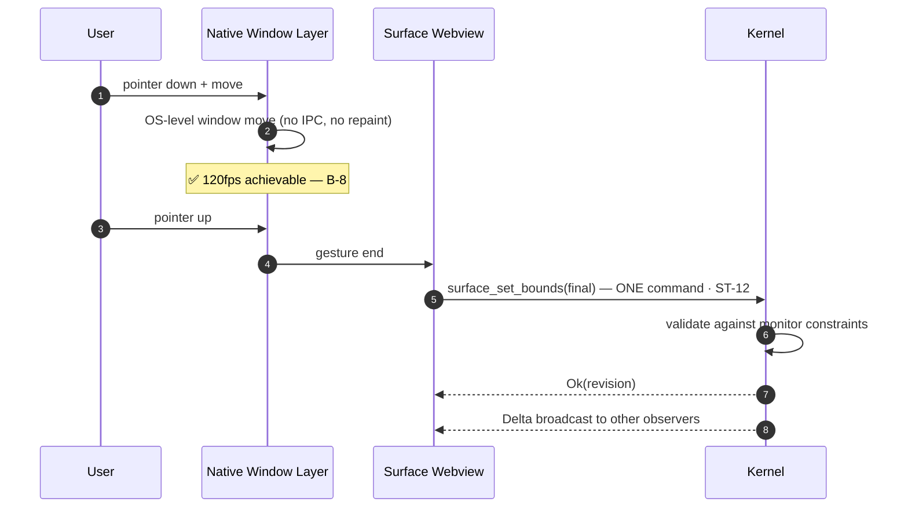

**PF-8.** Continuous gestures **MUST** be handled by the native window layer where supported. Round-tripping pointer movement through IPC and React makes B-8 unreachable at 120 Hz.

### 17.5 Rendering Discipline

**PF-9.** Animate only `transform` and `opacity`. Animating `width`, `height`, `top`, `left`, `filter`, or `backdrop-filter` forces layout or paint per frame and is prohibited.
**PF-10.** `will-change` **MUST** be applied for the duration of an animation and removed after. Permanent `will-change` permanently allocates a compositor layer, which is a memory cost charged against B-4.
**PF-11.** Glass surfaces **MUST** be composited as a bounded number of layers per monitor (default cap: 6). Beyond the cap, `@devdesk/effects` degrades per TH-7.
**PF-12.** Every list of unbounded length **MUST** be virtualized.
**PF-13.** React `key` **MUST** be a stable domain identity. Index keys on reorderable collections are prohibited — they cause full subtree remounts during drag reordering.

### 17.6 Measurement

**PF-14.** Every budget in §3.3 has a named harness in `tests/` and runs on every PR against the reference profile.
**PF-15.** Performance work **MUST** be preceded by a recorded measurement in `knowledge/performance/`. Speculative optimization without a baseline fails review.
**PF-16.** CI publishes a trend series; a regression exceeding 10% on any blocking budget fails the build even if the absolute threshold is still met — this catches slow erosion, which is how budgets are actually lost.

---

## 18. Security Architecture

### 18.1 Threat Context

DevDesk runs continuously, with the user's full desktop privileges, executing third-party bundles that users install casually because they are "just a theme" or "just a widget." That combination — high privilege, low install friction, persistent execution — is the entire security problem, and it is why the capability model is not optional infrastructure.

### 18.2 Trust Boundaries

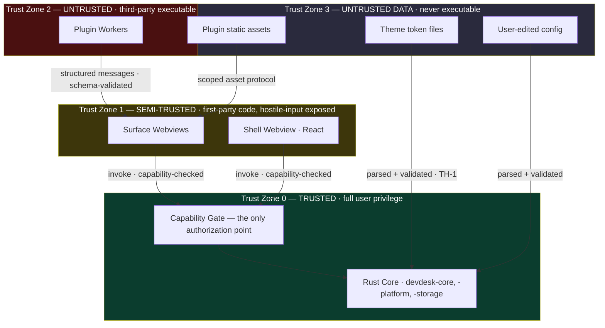

**SEC-1.** **The capability gate in Rust is the only authorization point in the system.** Checks performed in a webview are UX affordances, not security controls, and **MUST** be duplicated in Rust.

**SEC-2.** Data crossing a boundary inward **MUST** be parsed into a validated domain type. Validation-then-pass-the-raw-value is prohibited — it permits time-of-check/time-of-use divergence.

### 18.3 Threat Model

| ID | Threat | Vector | Mitigation | Residual Risk |
| --- | --- | --- | --- | --- |
| T-1 | Malicious plugin exfiltrates files | Ambient FS access | No ambient access; scoped, core-mediated, capability-gated (PL-9) | User grants a broad scope; mitigated by reason text (PL-8) and narrowest-scope UI |
| T-2 | Plugin beacons user data | `fetch` from worker | Network denied by default; allow-listed origins under grant | Allowed origin is itself hostile; mitigated by domain display in the prompt |
| T-3 | Theme achieves code execution | JS/WASM in theme bundle | TH-1: themes are data; validator rejects executable content | Parser vulnerability; mitigated by fuzzing (§21.5) |
| T-4 | Plugin spoofs a capability prompt | Draws a fake dialog | Layer 4 reserved to core (WD-9); prompts carry a per-session visual nonce | Sophisticated visual mimicry at lower layers; mitigated by layer dimming |
| T-5 | Plugin reads another plugin's data | Shared storage namespace | Per-plugin namespace enforced in Rust; no shared realm | None known |
| T-6 | Supply-chain compromise of a dependency | npm/crates.io | Lockfile pinning, `cargo-deny`, `cargo-audit`, provenance checks, SBOM | Zero-day in a pinned dependency |
| T-7 | Malicious update | Tampered update payload | Signed updates, pinned public key, signature verified before write | Signing key compromise; mitigated by key rotation policy |
| T-8 | Path traversal via manifest | `../` in declared asset paths | Canonicalize + prefix check in Rust after resolution | None known; covered by property tests |
| T-9 | Prototype pollution across the message broker | Crafted structured-clone payload | `null`-prototype objects at the broker; schema validation | None known |
| T-10 | Local information disclosure via errors | Paths/backtraces in IPC errors | ERR-1: opaque `Internal` with `trace_id` only | None |
| T-11 | Denial of service by a plugin | Infinite loop, memory growth | Worker CPU/memory watchdog; terminate + quarantine (PL-7) | Brief stall before the watchdog fires |
| T-12 | Config file tampering by other local software | Writable config path | Integrity check on grants; grants also mirrored in the state DB and cross-checked | Attacker with equal privilege can also modify the DB — out of scope for a local-first single-user model |

### 18.4 Capability Enforcement

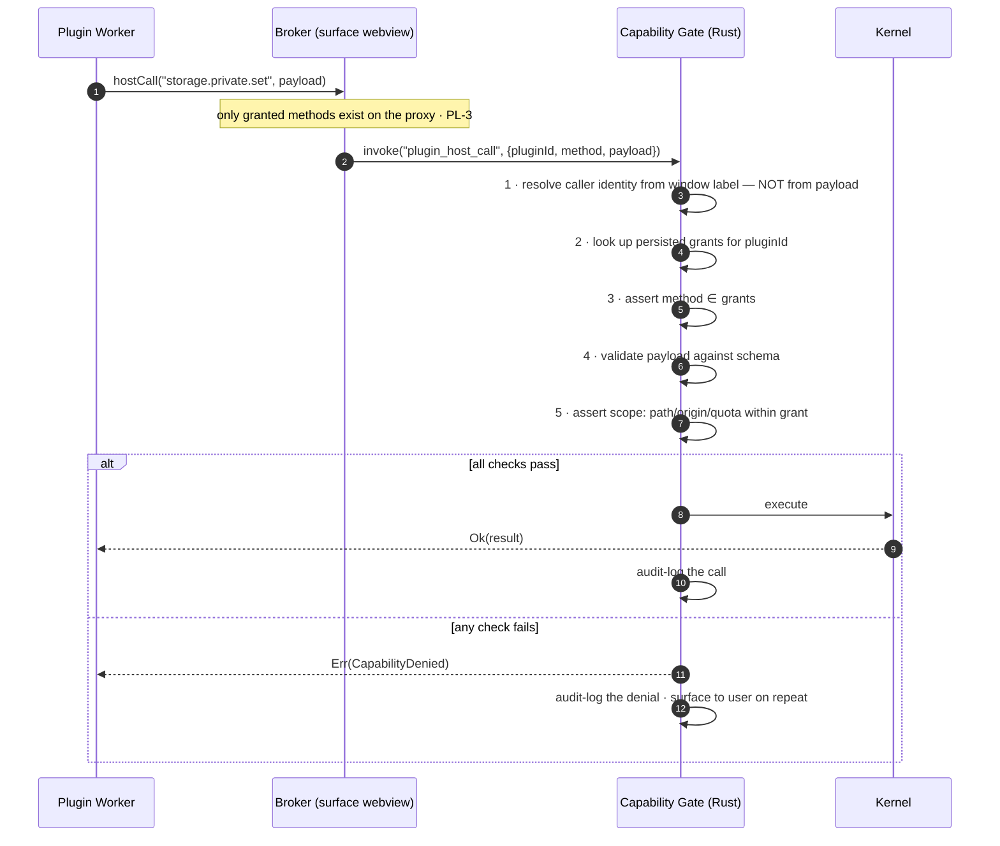

**SEC-3.** The caller's identity **MUST** be derived from the trusted window/worker label held by the core, **never** from a field in the payload. A self-declared identity is not an identity.
**SEC-4.** Denials **MUST** be audit-logged. Repeated denials from one plugin **MUST** be surfaced to the user — a plugin persistently probing for capabilities it was refused is the strongest available behavioural signal.

### 18.5 Content Security Policy

```jsonc
// apps/desktop/src-tauri/tauri.conf.json — illustrative
{
  "app": {
    "security": {
      "csp": "default-src 'none'; script-src 'self'; style-src 'self' 'nonce-{NONCE}'; img-src 'self' asset: http://asset.localhost data:; font-src 'self'; connect-src ipc: http://ipc.localhost; frame-src 'none'; object-src 'none'; base-uri 'none'; form-action 'none'",
      "dangerousDisableAssetCspModification": false,
      "pattern": { "use": "isolation", "options": { "dir": "../dist-isolation" } },
      "assetProtocol": {
        "enable": true,
        "scope": { "allow": ["$APPDATA/themes/**", "$APPDATA/plugins/*/assets/**"], "deny": ["$APPDATA/plugins/*/dist/**"] }
      }
    }
  }
}
```

**SEC-5.** `unsafe-inline` and `unsafe-eval` are prohibited in `script-src` under all circumstances, including development. A development-only exception becomes a production exception the first time someone copies the config.
**SEC-6.** The **isolation pattern MUST** be enabled. It interposes a sandboxed frame between the surface and the IPC bridge, which is the last line of defence if a surface is ever compromised by injected content.
**SEC-7.** `assetProtocol.scope` **MUST** be least-privilege and **MUST** explicitly deny plugin `dist/` directories — plugin code is loaded by the sandbox loader, never fetched as an asset.

### 18.6 Tauri Capability Files

```jsonc
// apps/desktop/src-tauri/capabilities/surface.json — illustrative
{
  "$schema": "../gen/schemas/desktop-schema.json",
  "identifier": "surface-window",
  "description": "Minimum permissions for a plugin-backed surface window.",
  "windows": ["surface-*"],
  "platforms": ["windows", "macOS", "linux"],
  "permissions": [
    "core:event:allow-listen",
    "core:event:allow-unlisten",
    "core:window:allow-start-dragging"
  ]
}
```

**SEC-8.** Capabilities **MUST** be split per window class. A single blanket capability applied to all windows grants surface windows the shell's authority and is prohibited.
**SEC-9.** `core:default` **MUST NOT** be applied to surface windows — it is broader than a surface needs.
**SEC-10.** Adding a permission to any capability file requires **security review sign-off** on the PR. `configs/` and `capabilities/` are CODEOWNERS-protected.

### 18.7 Prompt Integrity

**SEC-11.** Capability prompts render in Layer 4, which plugins cannot reach (WD-9).
**SEC-12.** Prompts **MUST** dim and block input to all lower layers while shown.
**SEC-13.** Prompts **MUST** display the plugin's verified identity — publisher, signature status, version — not its self-declared display name.
**SEC-14.** Prompts **MUST NOT** have a default-affirmative action, and **MUST NOT** be dismissible by an accidental keypress into "granted."

### 18.8 Information Disclosure

**SEC-15.** Filesystem paths, usernames, hostnames, and backtraces **MUST NOT** cross into a webview (ERR-1).
**SEC-16.** Log files **MUST** redact user paths to `<APPDATA>`-style placeholders before writing.
**SEC-17.** Crash reports are written locally and **never transmitted** (§18.9).

### 18.9 Data Handling

**SEC-18.** DevDesk core **MUST NOT** transmit any data off the machine without explicit, per-action user consent. There is no background telemetry, no usage analytics, and no crash-report upload.
**SEC-19.** Network capability is granted per plugin, per origin, and is displayed in the shell as an always-visible list. The user can always answer "what is talking to the network, and to where."

### 18.10 Supply Chain

| Control | Tool | Gate |
| --- | --- | --- |
| Lockfile integrity | `pnpm --frozen-lockfile`, `Cargo.lock` committed | Blocking |
| Known vulnerabilities | `cargo audit`, `pnpm audit` | Blocking on high/critical |
| License policy | `cargo deny check licenses` | Blocking |
| Dependency additions | CODEOWNERS review on manifest files | Blocking |
| SBOM | CycloneDX generated per release | Blocking |
| Update signing | Tauri updater, minisign, pinned pubkey | Blocking |
| Build reproducibility | Pinned toolchain via `rust-toolchain.toml` + `.nvmrc` | Warn |

**SEC-20.** New runtime dependencies require justification in the PR: what it does, why it cannot be written in-house in reasonable time, its maintenance status, and its transitive weight. Dependency count is a permanent liability on a long-horizon project (C-7).

---

## 19. Cross-Platform Architecture

### 19.1 The Platform Trait

**XP-1.** All OS-specific behaviour **MUST** be expressed through `PlatformBackend`. `#[cfg(target_os)]` outside `devdesk-platform` is prohibited (DR-6).

```rust
// crates/devdesk-platform/src/lib.rs — illustrative contract
pub trait PlatformBackend: Send + Sync + 'static {
    fn id(&self) -> Platform;

    // Display — raw records, never display domain types (ADR-0004 TP-12)
    fn enumerate_monitors(&self) -> Result<Vec<RawMonitorInfo>, PlatformError>;
    fn subscribe_display_changes(&self, sink: DisplayEventSink) -> Result<SubscriptionId, PlatformError>;

    // Window layering
    fn attach_to_layer(&self, w: WindowHandle, layer: SurfaceLayer) -> Result<(), PlatformError>;
    fn set_click_through(&self, w: WindowHandle, enabled: bool) -> Result<(), PlatformError>;
    fn exclude_from_capture(&self, w: WindowHandle, excluded: bool) -> Result<(), PlatformError>;

    // System integration
    fn accent_color(&self) -> Result<Option<Rgba>, PlatformError>;
    fn transparency_enabled(&self) -> Result<bool, PlatformError>;
    fn power_state(&self) -> Result<PowerState, PlatformError>;
    fn register_autostart(&self, enabled: bool) -> Result<(), PlatformError>;

    // Capability introspection — callers ask, never assume
    fn supports(&self, feature: PlatformFeature) -> Support;
}

pub enum Support {
    Full,
    Partial { note: &'static str },
    Unsupported { reason: &'static str },
}
```

**XP-2.** Callers **MUST** consult `supports()` before offering a feature in the UI. Offering an action that cannot succeed on the current platform is a defect.

> **`enumerate_monitors` returns raw records, amended by [`ADR-0004`](../adr/ADR-0004-display-topology-identity-and-transaction-model.md) `TP-12`.** `ADR-0003` §4.1 makes `devdesk-display` depend on `devdesk-platform`; returning a `MonitorDescriptor` here would invert that and put identity resolution, scale validation, and coordinate-space tagging inside the OS shim. This crate reports what the system said, with what it declined to say left **absent rather than defaulted** — a defaulted identity field is worse than a missing one, because the layer above cannot tell them apart and would assign a confidence the evidence does not support.
**XP-3.** Unsupported operations **MUST** return `Unsupported` with a reason. Silent no-ops are prohibited — they produce bug reports that reproduce on one OS only and appear as "nothing happens."

### 19.2 Platform Divergence

| Concern | Windows | macOS | Linux |
| --- | --- | --- | --- |
| Webview | WebView2 (Chromium) | WKWebView (Safari/WebKit) | WebKitGTK |
| Practical CSS baseline | Newest | Trails Chromium | Trails both; varies by distro |
| Wallpaper layer | `WorkerW` reparenting | Desktop window level | `wlr-layer-shell` (unsupported on GNOME Wayland) |
| Click-through | `WS_EX_TRANSPARENT` | `ignoresMouseEvents` | Input region (X11); compositor-dependent (Wayland) |
| Per-monitor DPI | Per-Monitor V2 | Backing scale factor | Fractional scaling varies by compositor |
| Transparency | DWM composition | Native | Compositor-dependent; may be absent |
| Autostart | Registry `Run` key | `SMAppService` | XDG autostart desktop entry |

**XP-4.** The CSS feature baseline is **the intersection across all three webviews**, not Chromium's. Chromium-only features require a documented fallback and a `@supports` guard.
**XP-5.** Every `PlatformBackend` method **MUST** have a contract test asserting identical *semantics* across implementations — including that unsupported paths return `Unsupported` rather than erroring differently per OS.
**XP-6.** Linux **MUST** distinguish X11 from Wayland at runtime and report support accordingly. Treating "Linux" as one platform for window layering is incorrect and will produce surfaces that silently fail to attach.

### 19.3 Feature Degradation Ladder

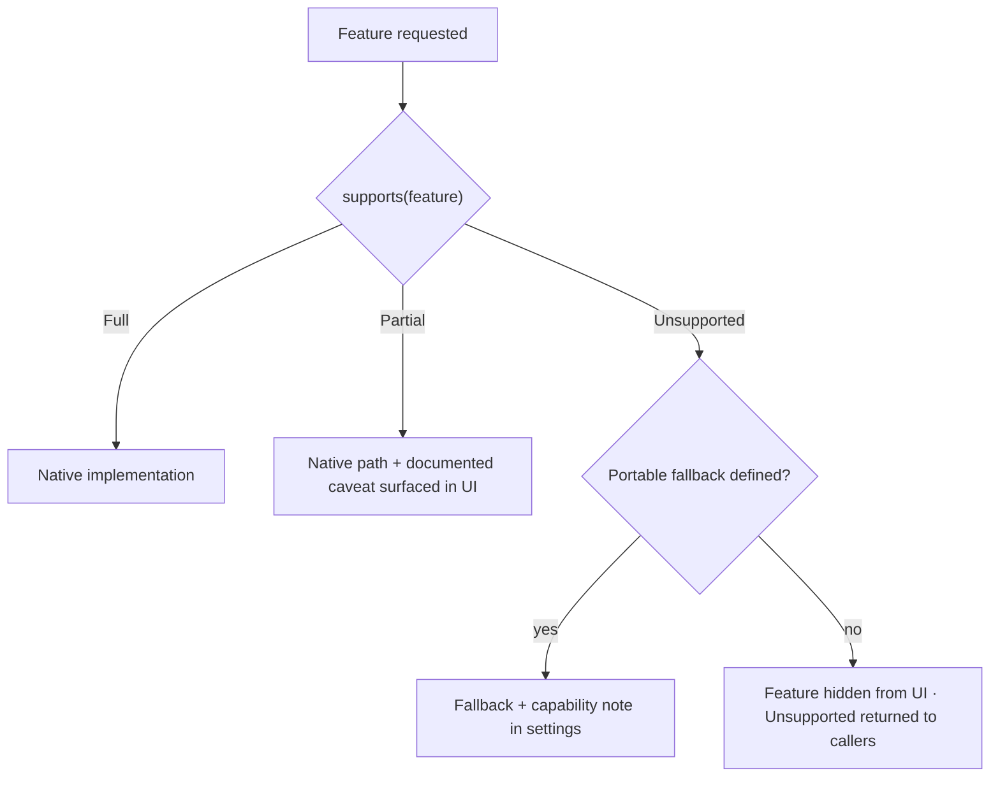

---

## 20. Observability

### 20.1 Structured Tracing

**OB-1.** All Rust code uses `tracing` with structured fields. `println!` and unstructured `log::info!("{}", x)` are prohibited.
**OB-2.** Every IPC command is a span carrying `command`, `caller` (window label), `plugin_id` (when applicable), `contract_version`, `duration_ms`, and `outcome`.
**OB-3.** `trace_id` propagates across the IPC boundary so a shell-observed failure correlates to a core-side span (ERR-1).

### 20.2 Span Taxonomy

| Span | Emitted By | Key Fields |
| --- | --- | --- |
| `startup.<phase>` | `devdesk-app` | `phase`, `duration_ms` |
| `ipc.command` | `devdesk-ipc` | `command`, `caller`, `duration_ms`, `outcome` |
| `ipc.event` | `devdesk-core` | `event`, `subscribers`, `dropped` |
| `plugin.lifecycle` | `devdesk-plugin-host` | `plugin_id`, `from_state`, `to_state`, `reason` |
| `capability.check` | `devdesk-plugin-host` | `plugin_id`, `capability`, `decision` |
| `display.topology` | `devdesk-display` | `fingerprint`, `monitor_count`, `change_kind` |
| `render.degrade` | `@devdesk/effects` | `surface_id`, `from_tier`, `to_tier`, `measurement` |
| `storage.migration` | `devdesk-storage` | `from_version`, `to_version`, `duration_ms` |

### 20.3 Local Diagnostics

**OB-4.** A bounded in-memory ring buffer (default 10 MB) retains recent spans and is dumpable on demand or on crash. This is what makes QA-11 achievable without asking a user to reproduce with a debug build.
**OB-5.** A developer overlay (Layer 4, dev builds and opt-in in release) shows frame timing, IPC rate, event drop counts, active subscriptions, and effect degradation tiers.
**OB-6.** All diagnostics are **local**. Nothing is transmitted (SEC-18).

### 20.4 Metrics

**OB-7.** Metric names follow `devdesk_<subsystem>_<measure>_<unit>` (e.g. `devdesk_ipc_command_duration_ms`).
**OB-8.** Every §3.3 budget has a corresponding runtime metric, so production behaviour is measured against the same definition CI gates on.

---

## 21. Testing and Verification

### 21.1 Test Pyramid

| Level | Scope | Location | Runs On |
| --- | --- | --- | --- |
| Unit (Rust) | Pure functions, state transitions, parsers | `crates/*/src/**/#[cfg(test)]` | Every commit |
| Unit (TS) | Hooks, resolvers, selectors, reducers | `packages/*/src/**/*.test.ts` | Every commit |
| Contract | IPC schema conformance both directions | `tests/contract/` | Every commit |
| Platform contract | `PlatformBackend` semantic parity | `tests/platform/` | Every commit, per OS |
| Integration | Core + storage + plugin host, no UI | `tests/integration/` | Every PR |
| Component | React components against token fixtures | `packages/*/src/**/*.spec.tsx` | Every PR |
| E2E | Real windows, real monitors (virtualized) | `tests/e2e/` | Every PR |
| Performance | §3.3 budgets | `tests/perf/` | Every PR, reference profile |
| Security | Capability bypass attempts, fuzzed inputs | `tests/security/` | Every PR + nightly |

### 21.2 Mandatory Coverage

**TS-1.** Every IPC command **MUST** have a contract test asserting the success shape, at least one typed error, and rejection of a malformed payload.
**TS-2.** Every capability **MUST** have a negative test asserting denial without a grant.
**TS-3.** Every state transition in the plugin lifecycle FSM (§11.4) **MUST** be covered, including failure edges.
**TS-4.** Every migration **MUST** have a test that runs it against a fixture of the prior schema and asserts data preservation.
**TS-5.** Multi-monitor logic **MUST** be tested against a virtual topology harness including mixed-DPI, negative-coordinate, and hotplug-during-drag cases.

### 21.3 Property-Based Testing

Required where the input space is adversarial or combinatorial:

- Coordinate space conversions — round-tripping across arbitrary monitors preserves identity within tolerance.
- Token resolution — arbitrary token graphs either resolve or fail cleanly; never panic, never loop.
- Layout solving — determinism: identical inputs yield identical output across runs and processes.
- Manifest parsing — arbitrary input never panics (EM-2).

### 21.4 Determinism

**TS-6.** Tests **MUST NOT** depend on wall-clock time, real filesystem paths outside a temp root, or network access. Clock and FS are injected.
**TS-7.** Flaky tests are quarantined within one working day and fixed or deleted within one week. A tolerated flaky suite is an untested suite.

### 21.5 Fuzzing

**TS-8.** `cargo-fuzz` targets **MUST** exist for every parser at a trust boundary: manifests, theme files, config, IPC payloads. They run nightly, and findings are treated as security defects (T-3, T-8).

---

## 22. Build, Packaging, and Release

### 22.1 Pipeline

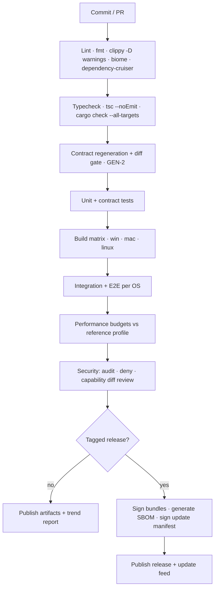

### 22.2 Build Rules

**BR-1.** `cargo clippy -- -D warnings` and `tsc --noEmit` are blocking. Warnings are errors; a tolerated warning stream hides the one that matters.
**BR-2.** Release builds use LTO, `codegen-units = 1`, `panic = "abort"`, and symbol stripping (with symbols archived for crash symbolication).
**BR-3.** The generated contract **MUST** be regenerated and diffed in CI (GEN-2).
**BR-4.** Toolchain versions are pinned (`rust-toolchain.toml`, `.nvmrc`). "Latest" is not a version.

### 22.3 Release Artifacts

| Platform | Format | Signing |
| --- | --- | --- |
| Windows | MSI + NSIS | Authenticode |
| macOS | `.app` in DMG | Developer ID + notarization |
| Linux | AppImage + `.deb` | GPG detached |
| Update feed | Tauri updater manifest | minisign, pinned public key |

**BR-5.** Versioning follows [`governance/VERSIONING.md`](../../governance/VERSIONING.md). The **IPC contract version is independent** of the application version (§7.3); both appear in the About surface and every crash report.

---

## 23. Design Decisions

Each decision below is a **seed for a formal ADR** under `docs/adr/`, as required by [`governance/PROJECT_CONSTITUTION.md`](../../governance/PROJECT_CONSTITUTION.md) §4. This document records the decision and rationale; the ADR records the deliberation and the review record.

---

### DD-001 — Rust core is the single source of truth for state

**Context.** Multiple surfaces across multiple monitors, plus plugin observers, all read and write shared state.
**Decision.** All durable and shared state lives in the Rust core. The shell holds a projection synchronized by snapshot + delta (§8).
**Alternatives.** (a) Rich frontend store with backend sync — rejected: two authorities produce a quadratic divergence surface. (b) Stateless frontend re-fetching on demand — rejected: violates B-5 and B-8 under interaction.
**Consequences.** Every mutation is a command round trip; optimistic updates (§8.4) become necessary for direct manipulation. Accepted: bounded complexity in one place, versus unbounded divergence bugs everywhere.
**Target ADR.** Owed — state ownership. Number allocated on decision (§27.3).

---

### DD-002 — Rust crates live in a top-level `crates/` directory

**Context.** The repository structure in `README.md` has no home for shared Rust libraries; only `apps/` (Tauri binary) and `packages/` (TypeScript).
**Decision.** Introduce `crates/` as a peer of `packages/`, containing all reusable Rust libraries. `apps/desktop/src-tauri` holds only the binary crate.
**Alternatives.** (a) Rust crates under `packages/` — rejected: two toolchains sharing a directory breaks tooling assumptions in both ecosystems and makes dependency lint rules ambiguous. (b) All Rust inside `src-tauri` — rejected: violates DR-7 and makes the core untestable without the Tauri harness.
**Consequences.** `README.md` and `.ai/CONTEXT.md` structure blocks must be updated. This is a Level 1 document touching a Level 2 concern; it therefore requires explicit governance sign-off, not a silent edit.
**Ratified by.** [`ADR-0003`](../adr/ADR-0003-repository-layout.md) — repository layout, workspace topology, and folder ownership.

---

### DD-003 — Typed IPC contract is generated, never hand-written

**Context.** Hand-mirrored TypeScript types drift from Rust definitions silently; drift at a trust boundary is a security issue, not just a bug.
**Decision.** `tauri-specta` + `specta` generate `packages/shared/src/generated/contract.ts` and `docs/api/contract.schema.json`. Both are committed and diff-gated (§7.4).
**Alternatives.** (a) Hand-written types — rejected: drift is inevitable and undetectable. (b) OpenAPI/protobuf schema-first — rejected: adds a build stage and a second source of truth for marginal benefit at this boundary.
**Consequences.** Rust command signatures become the definitional API. A codegen step joins the critical build path. AI-assisted workflows (C-5) gain a machine-readable contract, which is a direct benefit.
**Target ADR.** Owed — IPC contract generation. Number allocated on decision (§27.3).

---

### DD-004 — Plugins execute in Web Workers, not in the surface realm

**Context.** Plugin code is untrusted (Trust Zone 2) but must render into a first-party surface.
**Decision.** Plugin logic runs in a Web Worker with no DOM and no ambient IO. Rendering data crosses via structured messages to a first-party renderer (§11.3).
**Alternatives.** (a) `<iframe>` sandbox — rejected: still a document realm, larger attack surface, higher per-surface cost against B-4. (b) WASM sandbox — deferred: stronger isolation but immature ergonomics for UI-adjacent plugin authoring; see §26.3. (c) Direct execution in the surface realm — rejected outright: no isolation whatsoever.
**Consequences.** Plugins cannot manipulate DOM directly; they describe intent, the host renders. This is a real authoring constraint, accepted deliberately — it is also what makes theme-first work, because plugin output is themeable rather than pre-styled.
**Target ADR.** Owed — plugin sandbox model. Number allocated on decision (§27.3).

---

### DD-005 — Themes are data, never code

**Context.** Themes are the lowest-friction distribution vector and therefore the highest-value attack surface (§18.1).
**Decision.** Theme artifacts contain only declarative tokens. No JS, no WASM, no template expression language with side effects (§10.1).
**Alternatives.** (a) Themes with scripting hooks — rejected: converts every theme install into arbitrary code execution. (b) A restricted expression DSL — deferred: a sandboxed pure expression evaluator may be added later (§26.5), but only as an explicitly non-Turing-complete, side-effect-free evaluator.
**Consequences.** Some dynamic theming requires a plugin. Accepted: the plugin path is capability-gated and visible to the user; the theme path is not.
**Target ADR.** Owed — theme data model. Number allocated on decision (§27.3).

---

### DD-006 — Single host process; isolation at the sandbox layer

**Context.** Process-per-surface offers stronger fault isolation at significant cost (§5.3).
**Decision.** One host process. Fault isolation for untrusted code is achieved in the sandbox; the core is protected by a no-panic-on-external-input rule (EM-2).
**Alternatives.** Process-per-surface and process-per-plugin — both rejected against B-3/B-4 at typical configurations (12+ surfaces).
**Consequences.** A core panic ends the session. Mitigated by EM-2, fuzzing (TS-8), crash recovery (§14.4), and Safe Mode (LC-9). Revisitable per §26.2.
**Target ADR.** Owed — process model. Number allocated on decision (§27.3).

---

### DD-007 — Actor-based concurrency; no global lock

**Context.** A single `Arc<Mutex<AppState>>` is the default shape and the default source of contention and deadlock.
**Decision.** State is partitioned across single-owner actors reached by bounded message channels (§16).
**Alternatives.** (a) Global mutex — rejected: serializes unrelated work and deadlocks on display-change paths. (b) Fine-grained per-field locks — rejected: lock-ordering complexity exceeds actor complexity, with worse failure modes.
**Consequences.** All cross-subsystem interaction is asynchronous message passing. Slightly more ceremony per call; deadlocks become structurally difficult rather than merely rare.
**Target ADR.** Owed — concurrency model. Number allocated on decision (§27.3).

---

### DD-008 — First-party surfaces have no privileged path

**Context.** Plugin-first platforms decay when internal code has a shortcut (§11.1).
**Decision.** First-party surfaces use the identical plugin contract, with no bypass.
**Alternatives.** Privileged first-party API — rejected: guarantees third-party second-class status and hides contract deficiencies until they are expensive to fix.
**Consequences.** Early first-party development is slower, because gaps in the contract must be fixed rather than routed around. This is the intended cost.
**Target ADR.** Owed — plugin parity for first-party surfaces. Number allocated on decision (§27.3).

---

### DD-009 — Layout persisted per topology fingerprint

**Context.** Docking, undocking, and monitor reordering silently destroy layouts in most desktop customization tools.
**Decision.** Monitors are identified by display-reported identity carrying a confidence, not by index or by one string; layout is stored per topology fingerprint; unknown topologies resolve deterministically with a one-click restore (§9.3).
**Alternatives.** (a) Index-based identity — rejected: reorders across reboots. (b) Single global layout — rejected: unusable on laptop + dock workflows, which are the common case. (c) Exact-string identity — rejected by ADR-0004 §6.2: no reported signal is both always present and always stable.
**Consequences.** Storage grows with distinct topologies (bounded, small). Signal extraction is platform-specific and implemented per backend; the identity model above it is written once. A display with no conclusive signal degrades to a lower confidence and a user-visible restore rather than to a wrong answer.
**Ratified by.** [`ADR-0004`](../adr/ADR-0004-display-topology-identity-and-transaction-model.md) — display topology identity and transaction model.

---

### DD-010 — Effects are budgeted and degrade automatically

**Context.** `backdrop-filter` is the platform's signature and its dominant GPU cost. Unbounded use makes B-8 unreachable on integrated graphics.
**Decision.** All glass goes through `@devdesk/effects`, which accounts GPU cost per surface and degrades in a defined order, observably (§10.3).
**Alternatives.** (a) Unrestricted `backdrop-filter` — rejected: fails B-8 at realistic surface counts. (b) Fixed global quality setting — rejected: penalizes capable hardware and still fails on weak hardware under load.
**Consequences.** Components and plugins cannot apply `backdrop-filter` directly. Visual output becomes hardware-dependent — made acceptable by making degradation explicit and measurable (TH-8).
**Target ADR.** Owed — effect budgeting and degradation. Number allocated on decision (§27.3).

---

### DD-011 — No network egress without explicit per-action consent

**Context.** Persistent desktop software with full user privilege is a high-value exfiltration target; user trust is the platform's core asset.
**Decision.** No background telemetry, no analytics, no crash upload. Plugin network access is per-origin, granted, and always visible (§18.9).
**Alternatives.** Opt-out telemetry — rejected: incompatible with the trust posture a desktop customization platform requires.
**Consequences.** Field diagnostics rely on user-initiated local reports (§20.3). Accepted; the observability design compensates deliberately.
**Target ADR.** Owed — data egress policy. Number allocated on decision (§27.3).

---

## 24. Anti-Patterns

Each entry is a real, recurring failure mode in this class of system. Each is detectable, and where noted, mechanically enforced.

---

### AP-1 — IPC in the render loop

**Symptom.** Smooth in isolation; stutters with several surfaces. CPU scales with surface count while idle.

```ts
// ❌ 60 round trips per second, per surface
useEffect(() => {
  const id = setInterval(async () => setCpu(await invoke("get_cpu")), 16);
  return () => clearInterval(id);
}, []);

// ✅ core-driven cadence, one subscription, no polling
const cpu = useCoreState(metricsScope, (s) => s.cpu);
```

**Rule.** TR-1, TR-3. **Detection.** `scripts/lint-ipc-hotpath.mjs` flags `invoke` inside `setInterval`, `requestAnimationFrame`, and dependency-free `useEffect`.

---

### AP-2 — Context-provider fan-out for high-churn state

**Symptom.** One value changes; the entire subtree re-renders. React DevTools shows unrelated components highlighting on every tick.

```tsx
// ❌ every consumer of the context re-renders on every metric tick
<MetricsContext.Provider value={{ cpu, mem, gpu, net }}>{children}</MetricsContext.Provider>

// ✅ selector-level subscription; only components reading `cpu` re-render
const cpu = useCoreState(metricsScope, (s) => s.cpu);
```

**Rule.** ST-8. **Detection.** Component-level render-count assertions in `packages/hooks` tests.

---

### AP-3 — Ad-hoc `backdrop-filter`

**Symptom.** GPU utilization climbs with surface count; drags drop frames on integrated graphics; the effect looks subtly different in each place it was reimplemented.

```css
/* ❌ unaccounted, unbudgeted, undegradable */
.my-panel { backdrop-filter: blur(24px) saturate(180%); }
```

```tsx
/* ✅ accounted, budgeted, degrades per TH-7 */
<GlassSurface intent="panel" elevation={2}>{children}</GlassSurface>
```

**Rule.** TH-6, DD-010. **Detection.** Stylelint rule forbidding `backdrop-filter` outside `packages/effects`.

---

### AP-4 — Deep imports across package boundaries

**Symptom.** A refactor inside one package breaks three others. The dependency graph in review does not match the one in `package.json`.

```ts
// ❌ reaches past the public entry point
import { resolveToken } from "@devdesk/theme-engine/src/internal/resolver";

// ✅ published surface only
import { resolveToken } from "@devdesk/theme-engine";
```

**Rule.** DR-5. **Detection.** `dependency-cruiser` + `exports` field enforcement in `package.json`.

---

### AP-5 — Blocking the async runtime

**Symptom.** IPC latency spikes correlate with unrelated activity. p99 on B-5 degrades while p50 stays flat.

```rust
// ❌ blocks a Tokio worker thread; starves every other future on it
#[tauri::command]
async fn load_manifest(path: PathBuf) -> Result<Manifest, IpcError> {
    let raw = std::fs::read_to_string(&path)?;   // synchronous syscall
    Ok(toml::from_str(&raw)?)
}

// ✅ moved to the blocking pool
#[tauri::command]
async fn load_manifest(path: PathBuf) -> Result<Manifest, IpcError> {
    let raw = tokio::task::spawn_blocking(move || std::fs::read_to_string(&path))
        .await
        .map_err(|_| IpcError::Internal { trace_id: TraceId::current() })??;
    Ok(toml::from_str(&raw)?)
}
```

**Rule.** CM-6. **Detection.** `clippy::unused_async` plus a custom lint for `std::fs` inside `async fn`.

---

### AP-6 — Coordinate space confusion

**Symptom.** Correct on a single 100% display; surfaces land off-screen or half-size on mixed-DPI setups. The classic "works on my monitor" report.

```rust
// ❌ mixes physical monitor position with logical window size, and assumes a global scale
let x = monitor.position().x + (window_width_logical / 2);

// ✅ explicit space, explicit monitor
let center = monitor.logical_bounds().center();
let pos = LogicalPoint { x: center.x - size.w / 2.0, y: center.y - size.h / 2.0 };
```

**Rule.** WD-1, WD-2. **Detection.** Newtype-tagged geometry makes the mixed case a compile error.

---

### AP-7 — The god lock

**Symptom.** Contention under load; occasional deadlock during display changes; `await_holding_lock` warnings suppressed rather than fixed.

```rust
// ❌ one lock for everything; a slow storage write stalls window placement
struct AppState { inner: Arc<Mutex<Everything>> }

// ✅ partitioned ownership, message-passing boundaries
struct Kernel { display: ActorHandle<DisplayMsg>, layout: ActorHandle<LayoutMsg>, /* … */ }
```

**Rule.** CM-1, DD-007. **Detection.** Review; `clippy::await_holding_lock` at deny level.

---

### AP-8 — Hardcoded visual values

**Symptom.** Theme switching leaves visual islands. High-contrast mode is unreadable in specific components.

```tsx
// ❌ invisible to the theme engine
<div style={{ background: "rgba(255,255,255,0.08)", borderRadius: 12 }} />

// ✅ participates in the cascade, responds to a11y overrides
<div className="surface-panel" />  /* background: var(--surface-glass-tint); border-radius: var(--radius-panel); */
```

**Rule.** TH-2. **Detection.** Stylelint + an ESLint rule forbidding colour literals in `style` props outside `packages/effects`.

---

### AP-9 — Over-broad capabilities

**Symptom.** A plugin requests filesystem access and receives the user's home directory. The grant prompt is unanswerable because the scope is unbounded.

```jsonc
// ❌ unbounded scope; the user cannot make an informed decision
{ "id": "fs.read", "scope": "$HOME/**" }

// ✅ narrow, specific, explicable
{ "id": "fs.read", "scope": "$APPDATA/devdesk/plugins/acme.notes/data/**",
  "reason": "Read note files created by this plugin" }
```

**Rule.** PL-9, SEC-8. **Detection.** Manifest validator warns on scopes above a configured breadth threshold; broad scopes require an explicit review annotation.

---

### AP-10 — Cross-surface DOM access

**Symptom.** Layout changes in one surface break another. Styles leak between plugins by different authors.

```ts
// ❌ ignores every isolation boundary in the design
document.querySelectorAll(".widget-root").forEach((el) => el.classList.add("compact"));

// ✅ state-driven; the engine applies it per surface
await commands.surfaceSetDensity(surfaceId, "compact");
```

**Rule.** WR-2. **Detection.** Shadow-root isolation makes it structurally fail; CSP and lint catch attempts.

---

### AP-11 — Unbounded event fan-out

**Symptom.** Memory grows over hours. The webview main thread saturates with listener callbacks. Symptoms present as "a leak" but the cause is queue growth.

```rust
// ❌ unbounded; a slow consumer becomes unbounded memory
tx.send(update)?;

// ✅ bounded with a declared policy; drops are counted
sub.offer(update, OverflowPolicy::LatestWins);
```

**Rule.** BP-1, BP-2, BP-4, CM-2. **Detection.** `devdesk_ipc_event_dropped_total` metric; nightly soak test.

---

### AP-12 — Eager plugin activation

**Symptom.** B-1 degrades linearly with installed plugin count. Users blame "bloat" after installing three plugins.

```jsonc
// ❌ every plugin runs at startup regardless of visibility
{ "activation": ["onStartup"] }

// ✅ activation tied to actual need
{ "activation": ["onSurfaceVisible:cpu-panel", "onCommand:acme.refresh"] }
```

**Rule.** PL-11, LC-1. **Detection.** Manifest validator rejects `onStartup` when capabilities are requested; B-1 harness runs with a synthetic 20-plugin fixture.

---

### AP-13 — Hand-written contract mirrors

**Symptom.** A field is renamed in Rust; TypeScript still compiles; runtime returns `undefined`; the failure appears far from the change.

```ts
// ❌ a second source of truth that nothing keeps honest
export interface MonitorDescriptor { id: string; width: number; height: number }

// ✅ generated, diff-gated, single source of truth
import type { MonitorDescriptor } from "@devdesk/shared/generated/contract";
```

**Rule.** GEN-1, DD-003. **Detection.** CI regenerates and fails on diff.

---

### AP-14 — Trusting client-supplied identity

**Symptom.** A capability check passes for a plugin that should not have the capability, because the plugin named itself something else.

```rust
// ❌ the caller declares who it is
let plugin_id = payload.plugin_id;
if grants.contains(&plugin_id, &cap) { /* … */ }

// ✅ identity comes from the trusted window label the core assigned
let plugin_id = ctx.caller_identity()?;   // derived from window label, not payload
if grants.contains(&plugin_id, &cap) { /* … */ }
```

**Rule.** SEC-3. **Detection.** `tests/security/` includes an impersonation suite; lint flags `payload.plugin_id` reads inside the capability gate.

---

### AP-15 — Silent platform no-ops

**Symptom.** A feature "does nothing" on macOS. No error, no log, no UI difference. Reproduces only on the OS the developer does not use.

```rust
// ❌ silently absent
#[cfg(target_os = "windows")]
fn attach_to_wallpaper(&self, w: WindowHandle) { /* … */ }
#[cfg(not(target_os = "windows"))]
fn attach_to_wallpaper(&self, _w: WindowHandle) {}

// ✅ explicit and introspectable
fn attach_to_layer(&self, w: WindowHandle, layer: SurfaceLayer) -> Result<(), PlatformError> {
    Err(PlatformError::Unsupported { feature: "wallpaper-layer", reason: "GNOME Wayland has no layer-shell" })
}
```

**Rule.** XP-3, DR-6. **Detection.** Platform contract tests (XP-5) assert an explicit `Support` value for every feature on every backend.

---

## 25. Implementation Guidelines

### 25.1 Implementation Order

Subsystems have hard dependencies. This order minimizes rework and keeps every stage independently verifiable.

```mermaid
flowchart TB
    S0["Stage 0 — Foundation<br/>crates/ layout · workspace · CI skeleton<br/>devdesk-telemetry · @devdesk/shared<br/>⚠ BLOCKED ON ADR-0003"] --> S1
    S1["Stage 1 — Contract<br/>devdesk-ipc · specta codegen · error envelope<br/>contract diff gate · contract tests"] --> S2
    S2["Stage 2 — Platform + Display<br/>PlatformBackend trait · 3 backends<br/>topology fingerprinting · coordinate types"] --> S3
    S3["Stage 3 — Kernel + Storage<br/>actors · event bus · bounded subscriptions<br/>SQLite + migrations · layered config"] --> S4
    S4["Stage 4 — Window + Shell<br/>window creation · layers · cold start path<br/>React shell · hooks · snapshot/delta client"] --> S5
    S5["Stage 5 — Theme + Effects<br/>token pipeline · CSS var emission<br/>glass primitives · budget accounting"] --> S6
    S6["Stage 6 — Widget Runtime<br/>surface lifecycle · layout solving<br/>drag/resize · native gesture path"] --> S7
    S7["Stage 7 — Plugin Host + SDK<br/>manifest · signatures · capability gate<br/>sandbox · supervisor · plugin-sdk"] --> S8
    S8["Stage 8 — Hardening<br/>fuzzing · security suite · soak tests<br/>Safe Mode · crash recovery · perf gates"]
```

**IG-1.** Each stage lands with its tests and its budget harness. A stage without its harness is not complete.
**IG-2.** Stage 0 is blocked on ADR-0003 (DD-002), because it establishes directory structure that later stages assume.
**IG-3.** Stage 1 precedes all feature work. Every later stage consumes the generated contract; building features first guarantees a migration.

### 25.2 Rust Guidelines

| # | Rule |
| --- | --- |
| RS-1 | Crate lints: `#![deny(clippy::unwrap_used, clippy::expect_used, clippy::panic, clippy::await_holding_lock)]` |
| RS-2 | Public items carry doc comments including error conditions and platform caveats |
| RS-3 | Newtypes for every domain ID (`PluginId`, `SurfaceId`, `MonitorId`). Bare `String` IDs are prohibited |
| RS-4 | Errors via `thiserror` in libraries; `anyhow` only in the binary crate |
| RS-5 | Parse at the boundary into validated types; never pass raw external input inward (SEC-2) |
| RS-6 | Every `pub async fn` documents whether it is cancellation-safe |
| RS-7 | No `unsafe` outside `devdesk-platform`, and there only with a `// SAFETY:` comment stating the upheld invariant |
| RS-8 | Commands are thin adapters: validate, delegate to core, map error. No business logic in `#[tauri::command]` bodies |

### 25.3 TypeScript Guidelines

| # | Rule |
| --- | --- |
| TSG-1 | `strict: true`, `noUncheckedIndexedAccess: true`, `exactOptionalPropertyTypes: true` |
| TSG-2 | `any` is prohibited. `unknown` plus a narrowing guard is the required pattern |
| TSG-3 | Branded types for IDs, imported from the generated contract |
| TSG-4 | No default exports — they defeat rename refactors and make the dependency graph harder to read |
| TSG-5 | Components are function components with explicit prop interfaces; no `React.FC` |
| TSG-6 | Every `useEffect` has an explicit dependency array and a cleanup where it subscribes |
| TSG-7 | Async state flows through the store, not through component-local `useState` + `await` |
| TSG-8 | No direct `invoke` in feature code — go through `@devdesk/storage` or generated command wrappers |

### 25.4 Definition of Done

A change is not done until all apply:

- [ ] Behaviour matches the relevant subsystem specification; deviations landed as an ADR.
- [ ] Unit + contract tests added, including at least one failure path.
- [ ] Budgets in §3.3 unaffected, or the regression is explained and accepted.
- [ ] No new dependency without §18.10 justification.
- [ ] No new `#[cfg(target_os)]` outside `devdesk-platform`.
- [ ] Public API changes reflected in the generated contract and diff-reviewed.
- [ ] Capability or CSP changes reviewed by a security owner (SEC-10).
- [ ] Errors are typed, actionable, and free of sensitive detail (ERR-1, EM-6).
- [ ] `tracing` spans added for any new IPC command or lifecycle transition.
- [ ] Anti-patterns in §24 checked against the diff.
- [ ] `.ai/SESSION.md` updated when an AI agent participated (per `.ai/IMPLEMENTATION_RULES.md` §5).

### 25.5 Automated Enforcement Summary

| Rule Class | Tool | Stage | Blocking |
| --- | --- | --- | --- |
| Dependency layering (DR-1…DR-5) | `dependency-cruiser`, ESLint | Pre-commit + CI | Yes |
| Platform `cfg` (DR-6) | `scripts/lint-cfg-usage.mjs` | CI | Yes |
| IPC hot path (TR-3) | `scripts/lint-ipc-hotpath.mjs` | CI | Yes |
| Contract drift (GEN-1, GEN-2) | codegen + diff | CI | Yes |
| Rust safety (EM-1, CM-3) | `clippy -D warnings` | Pre-commit + CI | Yes |
| Effects isolation (TH-6) | Stylelint | CI | Yes |
| Hardcoded visuals (TH-2) | Stylelint + ESLint | CI | Yes |
| Capability breadth (PL-9) | Manifest validator | Runtime + CI | Warn → review |
| Budgets (§3.3) | `tests/perf/` | CI | Per §3.3 |
| Security (§18.10) | `cargo audit`, `cargo deny`, `pnpm audit` | CI | Yes |

### 25.6 AI-Assisted Development

Per C-5, AI agents are first-class contributors and are bound by the same contracts.

**AI-1.** Agents consume `docs/api/contract.schema.json` as the authoritative API surface, not prose in this document.
**AI-2.** Agents **MUST NOT** edit `packages/shared/src/generated/**` (GEN-1) or any file under `capabilities/` without explicit human security review (SEC-10).
**AI-3.** Agent-authored changes carry the same Definition of Done (§25.4), including the `.ai/SESSION.md` entry.
**AI-4.** When an agent finds this document ambiguous, the correct action is to raise an `ARCHITECTURE_CHANGE` issue — not to choose an interpretation and implement it. Ambiguity here is a defect in this document.

---

## 26. Future Extension Points

Each is a deliberate seam. They are **designed for, not built** — the constraint each imposes today is listed, because that constraint is the actual cost of keeping the seam open.

### 26.1 Additional Surface Backends
Surfaces are currently webview-backed. The `SurfaceBackend` boundary is defined such that a native (GPU-composited, non-webview) backend could serve high-frequency surfaces — audio visualizers, system monitors at high refresh — without changing the plugin contract.
**Constraint imposed today.** Surface rendering **MUST NOT** assume DOM availability in the *contract* layer. Plugin output is a description, not markup (DD-004).

### 26.2 Process-per-Surface Isolation
DD-006 chose a single host process. The actor topology (§16) and message boundaries are process-transparent by construction, so promoting an actor across a process boundary is a transport change, not a redesign.
**Constraint imposed today.** Actor messages **MUST** be serializable. Passing `Rc`, raw pointers, or non-`Send` values between actors is prohibited even though it would currently compile.

### 26.3 WASM Plugin Runtime
A WASM component-model runtime would offer stronger isolation and language plurality than Web Workers.
**Constraint imposed today.** The host API (§11.5) **MUST** remain expressible as a flat, serializable, capability-scoped interface. Callbacks holding JS closures across the boundary are prohibited, because they do not survive translation to a WASM component interface.

### 26.4 Compatibility Layers
Importers for other customization tools' widget or theme formats.
**Constraint imposed today.** Such layers are **plugins**, never core. Core **MUST NOT** acquire format-specific knowledge. If a format needs something the plugin contract lacks, the contract is extended generically or the format is not supported.

### 26.5 Theme Expression Evaluator
A pure, side-effect-free, non-Turing-complete evaluator for derived tokens (`accent.hover = lighten(accent, 8%)`).
**Constraint imposed today.** The token resolver (§10.2) **MUST** keep resolution and evaluation as distinct phases, so an evaluator can be inserted between them without restructuring the cascade. Resolution must remain total and cycle-detecting.

### 26.6 Optional Configuration Sync
Cross-machine sync of layouts and preferences.
**Constraint imposed today.** All syncable state **MUST** be serializable, revision-tagged (ST-5), and free of machine-local absolute paths. Storing a machine-specific path in a syncable record is prohibited today for this reason.

### 26.7 Scriptable Automation Surface
A local automation API for power users (composed layouts, conditional surfaces, scheduled transitions).
**Constraint imposed today.** Every user-reachable action **MUST** be expressible as an IPC command (§7). UI-only paths with no command equivalent are prohibited — they are the thing that makes automation retrofits impossible.

### 26.8 Plugin Marketplace
Signed distribution with reviews and update channels.
**Constraint imposed today.** Bundle signing (§11.2) and capability declaration (§11.5) are built now, not retrofitted. Retrofitting a trust model onto an installed base is not achievable without breaking it.

---

## 27. Related Documents

### 27.1 Governance — Level 1

| Document | Relationship |
| --- | --- |
| [`governance/PROJECT_CONSTITUTION.md`](../../governance/PROJECT_CONSTITUTION.md) | Parent authority; mandates ADRs and the modular-first principle this document implements |
| [`governance/ARCHITECTURE_PRINCIPLES.md`](../../governance/ARCHITECTURE_PRINCIPLES.md) | Defines the abstraction levels that scope this document; §6.3 implements its "Strict Decoupling" pillar |
| [`governance/DECISION_PROCESS.md`](../../governance/DECISION_PROCESS.md) | The lifecycle by which §23 decisions become ADRs |
| [`governance/VERSIONING.md`](../../governance/VERSIONING.md) | Application versioning; §7.3 defines the independent contract versioning that complements it |

### 27.2 Architecture — Level 2 (children of this document)

| Document | Status | Refines |
| --- | --- | --- |
| `docs/architecture/WINDOW_AND_DISPLAY.md` | Planned | §9 |
| `docs/architecture/PLUGIN_ARCHITECTURE.md` | Planned | §11 |
| `docs/architecture/THEME_ARCHITECTURE.md` | Planned | §10 |
| `docs/architecture/WIDGET_RUNTIME.md` | Planned | §12 |
| `docs/architecture/STORAGE_ARCHITECTURE.md` | Planned | §13 |
| `docs/architecture/SECURITY_MODEL.md` | Planned | §18 |
| `docs/api/IPC_CONTRACT.md` | Planned | §7 — wire catalogue |
| `docs/sdk/PLUGIN_SDK.md` | Planned | §11.5, §26.3 |

### 27.3 ADRs Seeded by This Document

**This table is superseded as a register.** [`ADR-0001`](../adr/ADR-0001-system-architecture.md) §3.5 `D-10` is authoritative for what is owed and what it blocks; it is not restated here. Numbers are allocated in **decision order** ([`ADR-0004`](../adr/ADR-0004-display-topology-identity-and-transaction-model.md) `REG-1`), so a number pre-assigned to an unwritten ADR reserves nothing.

What follows is retained only as the map from this document's design decisions to the ADRs that ratify them.

**Decided.** These exist and are binding.

| ADR | Title | Ratifies |
| --- | --- | --- |
| [`ADR-0001`](../adr/ADR-0001-system-architecture.md) | Adopt the DevDesk system architecture | This document |
| [`ADR-0002`](../adr/ADR-0002-performance-budgets.md) | Performance budgets and measurement methodology | §3.3, §17.6 |
| [`ADR-0003`](../adr/ADR-0003-repository-layout.md) | Repository layout, workspace topology, folder ownership | DD-002, Appendix A |
| [`ADR-0004`](../adr/ADR-0004-display-topology-identity-and-transaction-model.md) | Display topology identity and transaction model | DD-009, §9.3, §9.5, §19.1 |

**Seeded, number unassigned.** Each is owed by a design decision above; the number is allocated when the decision is taken.

| Source | Subject | Blocking |
| --- | --- | --- |
| DD-001 | State ownership and the snapshot/delta protocol | Stage 3 |
| DD-003 | Generated IPC contract | Stage 1 |
| DD-004 | Plugin sandbox model | Stage 7 |
| DD-005 | Theme data model | Stage 5 |
| DD-006 | Process model | Stage 0 |
| DD-007 | Concurrency model | Stage 3 |
| DD-008 | Plugin parity for first-party surfaces | Stage 7 |
| DD-010 | Effect budgeting and degradation | Stage 5 |
| DD-011 | Data egress policy | Stage 0 |

### 27.4 Knowledge Base — Research Inputs

Findings that validate or challenge this architecture belong in `knowledge/`, never inline here.

| Area | Path | Expected Content |
| --- | --- | --- |
| Tauri | `knowledge/tauri/` | IPC transport benchmarks, capability system behaviour, updater findings |
| Rust | `knowledge/rust/` | Actor framework evaluation, async runtime tuning |
| Rendering | `knowledge/rendering/` | Compositor behaviour per webview, layer promotion thresholds |
| Glass | `knowledge/glass/` | `backdrop-filter` cost curves per GPU class — the empirical basis for TH-7 |
| Performance | `knowledge/performance/` | Budget baselines, reference profile definition, trend history |
| Windows | `knowledge/windows/` | `WorkerW` behaviour, DPI edge cases, DWM interactions |
| Plugins | `knowledge/plugins/` | Sandbox escape research, worker overhead measurements |
| React | `knowledge/react/` | Concurrent-rendering findings, `useSyncExternalStore` behaviour under load |

### 27.5 AI Agent Context

| Document | Relationship |
| --- | --- |
| [`.ai/CONTEXT.md`](../../.ai/CONTEXT.md) | Repository philosophy; requires update for DD-002 |
| [`.ai/IMPLEMENTATION_RULES.md`](../../.ai/IMPLEMENTATION_RULES.md) | Agent rules; §25.6 extends them for this architecture |
| [`.ai/CODE_REVIEW.md`](../../.ai/CODE_REVIEW.md) | Review criteria; should incorporate §24 and §25.4 |
| [`.ai/DECISION_LOG.md`](../../.ai/DECISION_LOG.md) | Running log; §23 decisions are recorded on ADR acceptance |

---

## 28. Glossary

| Term | Definition |
| --- | --- |
| **Actor** | A single-owner async task holding exclusive state, reachable only by bounded message channel (§16). |
| **Anchor** | A placement mode binding a surface to a monitor edge or corner rather than an absolute coordinate, so it survives resolution changes (WR-4). |
| **Blast radius** | The maximum extent of impact from a component's failure (EM-3). |
| **Budget** | A contractual, CI-gated performance threshold (§3.3). Distinct from a target. |
| **Capability** | A named, scoped permission a plugin declares and a user grants; the unit of authorization (§11.5). |
| **Capability gate** | The Rust-side enforcement point; the system's only authorization boundary (SEC-1). |
| **Coalescing** | Merging queued messages by key, retaining only the newest per key, to protect the webview main thread (BP-3). |
| **Cold start** | Process launch to interactive; governed by B-1/B-2 (§14.1). |
| **Contract version** | The IPC compatibility version, evolving independently of the application version (§7.3). |
| **Degradation tier** | Full / Reduced / Minimal — the declared quality levels the system may occupy (EM-4). |
| **Delta** | An incremental state patch carrying `from` and `to` revisions (§8.2). |
| **DIP** | Device-independent pixel; the logical coordinate unit (§9.2). |
| **Display graph** | The immutable spatial index over one arrangement: adjacency, containment, virtual bounds. Rebuilt, never mutated (WD-11). |
| **Fingerprint (topology)** | A stable identifier for a monitor arrangement, derived from display identity rather than enumeration order (WD-3). Repeats when the user returns to a known desk, which is what makes it a layout key (WD-4). |
| **Generation (topology)** | A monotonic counter of topology publications. Answers *how recent*, where a fingerprint answers *which* (WD-12). |
| **Identity confidence** | How strongly two monitor identities are believed to describe the same physical display — `Exact`, `Strong`, `Probable`, `Weak`, `None`. Reattaching a saved layout without asking requires `Strong` or better (ADR-0004 `MI-2`, `MI-6`). |
| **Grant** | A persisted, revocable user authorization of a capability to a specific plugin (PL-10). |
| **Host API** | The capability-scoped, generated proxy through which a plugin reaches the platform (PL-3). |
| **Isolation pattern** | Tauri's sandboxed interception frame between the webview and the IPC bridge (SEC-6). |
| **Layer** | A z-order band a surface occupies: Wallpaper, Desktop, Normal, Overlay, System (§9.4). |
| **Projection** | The shell's read-only replica of core-owned state; never authoritative (ST-1). |
| **Quarantine** | The sticky disabled state a repeatedly failing plugin enters (PL-7). |
| **Revision** | A monotonic `u64` per state scope, used for gap detection and reconciliation (ST-5). |
| **Safe Mode** | A boot path with default theme, no plugins, minimal surfaces; the guaranteed escape hatch (LC-9). |
| **Sandbox** | The Web Worker realm in which plugin logic executes, without DOM or ambient IO (§11.3). |
| **Scope (state)** | A bounded slice of core state that a surface subscribes to independently (ST-7). |
| **Scope (capability)** | The narrowed extent — path, origin, quota — of a granted capability (PL-9). |
| **Shell** | The first-party React application composing surfaces and settings (Trust Zone 1). |
| **Snapshot** | A complete, revision-tagged state scope sent on subscribe or gap recovery (§8.2). |
| **Surface** | The unit of composition: a bounded, positioned, themed region backed by a plugin (§12). |
| **Token (theme)** | A named declarative style value in the base → semantic → component graph (§10.2). |
| **Topology** | The complete monitor arrangement: count, sizes, positions, scale factors (§9.3). |
| **Topology transaction** | One atomic topology change, carrying the generation, both arrangements, and the computed difference. The only way a change becomes visible (WD-10). |
| **Trust zone** | A boundary defining what may be assumed about code or data crossing it (§18.2). |
| **Widget** | User-facing vocabulary for a surface. Internal code uses *surface* exclusively (§12). |

---

## 29. Appendices

### Appendix A — Directory Contract

```text
devdesk/
├── apps/
│   └── desktop/
│       ├── src/                   # React shell (Level 3)
│       └── src-tauri/             # devdesk-app binary crate — thin composition root (DR-7)
│           ├── capabilities/      # Tauri capability files — CODEOWNERS protected (SEC-10)
│           └── tauri.conf.json    # CSP, isolation pattern, asset scope (§18.5)
├── crates/                        # Rust libraries — REQUIRES ADR-0003 (DD-002)
│   ├── devdesk-core/
│   ├── devdesk-ipc/
│   ├── devdesk-platform/
│   ├── devdesk-display/
│   ├── devdesk-plugin-host/
│   ├── devdesk-storage/
│   └── devdesk-telemetry/
├── packages/                      # TypeScript packages (§6.2.2)
│   ├── shared/                    # includes src/generated/** — DO NOT EDIT (GEN-1)
│   ├── storage/  theme-engine/  effects/  animation/  hooks/  ui/
│   ├── widget-engine/
│   └── plugin-sdk/                # public contract; depends only on shared (DR-4)
├── plugins/                       # first-party plugins — same contract, no privilege (DD-008)
├── themes/                        # first-party themes — data only (TH-1)
├── widgets/                       # user-facing surface bundles
├── configs/                       # shared tool configuration — CODEOWNERS protected
├── docs/                          # Level 2 specifications (this document's home)
├── knowledge/                     # research inputs (§27.4)
├── .ai/                           # agent context (§27.5)
├── playground/                    # experimental spikes — never imported by production code
├── scripts/                       # build, codegen, lint automation
├── tools/                         # internal developer utilities
└── tests/                         # integration, e2e, perf, security, contract suites
```

### Appendix B — Compatibility Matrix

| Component | Versioned By | Compatibility Rule |
| --- | --- | --- |
| Application | SemVer, `governance/VERSIONING.md` | User-facing releases |
| IPC contract | Independent SemVer (§7.3) | Plugins declare a range; core negotiates or rejects with a precise diagnostic |
| Plugin SDK | Independent SemVer | MAJOR tracks the contract MAJOR |
| Theme schema | Schema version integer | Forward-compatible: unknown tokens ignored with a warning |
| State DB | Migration number | Forward-only, transactional, backed up (PR-9, PR-10) |
| Config schema | Schema version integer | Forward-migrating; unknown keys preserved (PR-7) |

### Appendix C — Requirements Traceability

| Driver | Sections | Verification |
| --- | --- | --- |
| QA-1 Idle efficiency | §8.2, §14.2, §17.3 | B-3, B-4 harnesses |
| QA-2 Interaction fluidity | §8.4, §17.4, §17.5 | B-8 harness |
| QA-3 Startup latency | §14.1 | B-1, B-2 harnesses |
| QA-4 Plugin extensibility | §11, §26 | Plugin conformance suite |
| QA-5 Theme extensibility | §10 | B-7 harness + theme conformance suite |
| QA-6 Capability enforcement | §18.4, §18.6 | `tests/security/` bypass suite |
| QA-7 Fault isolation | §11.4, §15 | Chaos suite: induced worker faults |
| QA-8 Topology resilience | §9.3, §14.4 | Virtual topology harness (TS-5) |
| QA-9 Portability | §19 | Platform contract tests (XP-5) |
| QA-10 Maintainability | §6.3, §25 | Dependency lint, zero exemptions |
| QA-11 Observability | §20 | Ring-buffer dump reconstructs a seeded stall |
| QA-12 Upgradability | §7.3, §11.5 | Contract negotiation matrix tests |

### Appendix D — Open Questions

Tracked, owned, and resolved by ADR. Listed here so they are not rediscovered.

| # | Question | Impacts | Owner | Resolve By |
| --- | --- | --- | --- | --- |
| OQ-1 | Actor framework: hand-rolled Tokio actors vs. an existing crate | §16, DD-007 | Core | Before Stage 3 |
| OQ-2 | SQLite access: `rusqlite` + blocking pool vs. `sqlx` async | §13, ADR-0002 | Core | Before Stage 3 |
| OQ-3 | Wayland layer-shell fallback where the compositor lacks the protocol | §9.4, XP-6 | Platform | Before Stage 2 exit |
| OQ-4 | Signature scheme and key custody for plugin bundles | §11.2, T-7 | Security | Before Stage 7 |
| OQ-5 | Whether Layer 0 (wallpaper) ships in v1 given Wayland gaps | §9.4, product scope | Architecture + Product | Before Stage 4 |
| OQ-6 | Default `PRIVATE_STATE` quota and its enforcement UX | PR-8 | Core | Before Stage 7 |
| OQ-7 | Reference machine profile definition for CI budget gating | §3.3 | Infrastructure | Before Stage 1 exit |

---

**End of document.**

*Changes to this document require an ADR under `docs/adr/` and an `ARCHITECTURE_CHANGE` issue, per [`governance/PROJECT_CONSTITUTION.md`](../../governance/PROJECT_CONSTITUTION.md) §4.*
