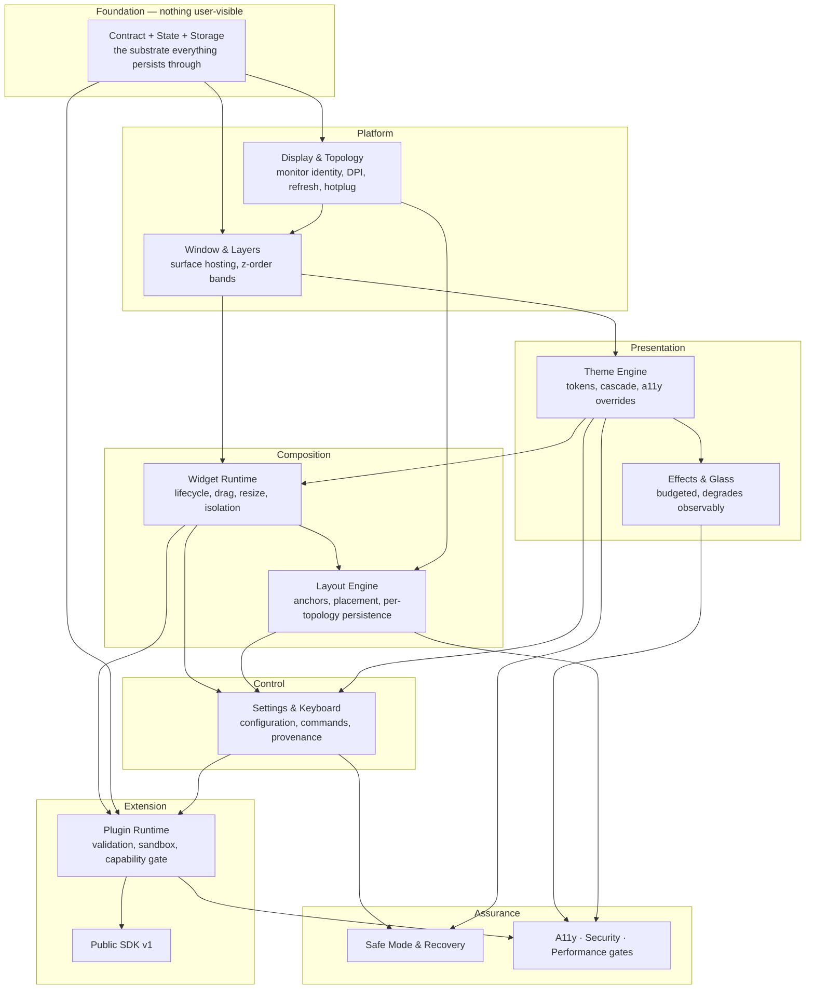

# DevDesk V1 — Product Requirements Document

> **Abstraction Level:** 📙 **Level 2 — Architecture/Specification** (per [`governance/ARCHITECTURE_PRINCIPLES.md`](../../governance/ARCHITECTURE_PRINCIPLES.md))
> **Source of Truth:** `docs/` — Specifications (*what the system should do*)
> **Parent:** [`PROJECT_CONTEXT.md`](../../PROJECT_CONTEXT.md) 🔒 **frozen at `1.3.0`**

---

## Document Control

| Field | Value |
| --- | --- |
| **Document ID** | `PRD-0001` |
| **Title** | DevDesk V1 Product Requirements |
| **Status** | `PROPOSED` — becomes `ACCEPTED` on merge |
| **Version** | `1.1.0` — adds `FR-OFF-4` (§22.3, previously an unowned criterion block) and Appendix C (feature dependency graph) |
| **Owner** | Chief Product Architect |
| **Reviewers** | Lead Architect, Core Engineering, Design, Security |
| **Parent Document** | [`PROJECT_CONTEXT.md`](../../PROJECT_CONTEXT.md) — this PRD MUST NOT contradict it (§0.6) |
| **Governs** | Everything shipped in DevDesk V1. Product source of truth for V1. |
| **Status** | 🔒 **FROZEN at `1.1.0`.** No feature is added to V1 without a PRD amendment or an ADR |
| **Change Policy** | See "Freeze" below |

### Freeze

**As of `1.1.0`, this PRD is frozen.** From this point the V1 feature set is fixed, and implementation proceeds against it.

> **No feature additions without an ADR or a PRD amendment.**

| Change | Mechanism |
| --- | --- |
| Add a requirement or an acceptance criterion | **PRD amendment** — `ARCHITECTURE_CHANGE` issue, Product + Lead Architect review, version bump |
| Reword a requirement in a way that changes what must be built | **PRD amendment** |
| Remove a requirement or criterion | **PRD amendment**, and the [`MVP_ACCEPTANCE_MATRIX.md`](./MVP_ACCEPTANCE_MATRIX.md) reconciliation is updated in the same change |
| Anything altering `PROJECT_CONTEXT.md` §7.1 or §7.2 | **ADR** — the V1 boundary is frozen at Level 1 (§0.6) |
| Reclassify a criterion's priority | Matrix only — no PRD change (matrix §8) |
| Fix a typo, a broken link, or a wrong cross-reference | Editorial — no amendment |

**Why now.** The PRD is complete, classified, and sequenced into a sprint. Every further addition made without this gate would arrive as an untracked increment against a plan that has already been costed — which is precisely how a 45-criterion sprint becomes a 60-criterion one without anyone deciding that it should.

A rejected addition is not lost. It becomes a V1.5 or V2 candidate in §25, where it is a scheduled decision rather than an unplanned one.

### Filename Note

`PROJECT_CONTEXT.md` §30.3 and [`ADR-0003`](../adr/ADR-0003-repository-layout.md) §5.4 anticipate this document under the working name `PRODUCT_SPEC.md`. **This document — `docs/product/PRD.md` — is that document.** Two follow-ups are recorded in §25.3: ADR-0003 §5.4's parent-document name is amended by ADR, and `PROJECT_CONTEXT.md` §30.3's filename reference is corrected editorially (§31.4 permits correcting a cross-reference that points at the wrong target; it changes no meaning).

### What This Document Is Not

Per `PROJECT_CONTEXT.md` §25.5 and §0.3, this PRD **MUST NOT** contain:

- **Implementation mechanism.** No IPC transports, state protocols, process topology, storage engines, rendering internals, or crate/package design. Those belong to [`SYSTEM_ARCHITECTURE.md`](../architecture/SYSTEM_ARCHITECTURE.md). This document states *observable behaviour*.
- **Performance thresholds as independent claims.** Every number here cites an [`ADR-0002`](../adr/ADR-0002-performance-budgets.md) budget ID. If a number here and the budget disagree, **ADR-0002 wins and this document is the defect** (`PROJECT_CONTEXT.md` §0.4).
- **Vision, positioning, or scope rationale.** Owned by `PROJECT_CONTEXT.md`. This document *implements* §7's scope; it does not re-argue it.
- **Visual specification.** Colour, type, spacing, and specific glass treatments belong to `docs/design/DESIGN_SYSTEM.md`. This document states behavioural and structural requirements only.

### Requirement Identifiers

| Prefix | Meaning |
| --- | --- |
| `FR-<AREA>-<n>` | Functional requirement — user-observable behaviour |
| `NFR-<AREA>-<n>` | Non-functional requirement — quality attribute |
| `AC-<AREA>-<n>.<m>` | Acceptance criterion — a single statement a test can be written from |

Areas: `FRE` first run · `THM` theme · `WGT` widget · `LAY` layout · `MON` multi-monitor · `SET` settings · `KBD` keyboard · `PLG` plugin · `A11Y` accessibility · `PERF` performance · `SEC` security · `ERR` errors · `OFF` offline · `DAT` persistence · `REL` release.

**Every functional requirement in this document has at least one acceptance criterion. A requirement without one is not a requirement — it is an intention, and it does not ship.**

---

## 1. Product Overview

DevDesk V1 is the first shippable release of a **desktop experience platform for Windows** (`PROJECT_CONTEXT.md` §1): a native host that lets a person compose their own desktop out of surfaces, themes, and layouts, without modifying the operating system.

V1 delivers the complete customization loop and the platform contract underneath it:

| Capability | What the user can do |
| --- | --- |
| **Desktop Runtime** | Run DevDesk continuously alongside Windows; surfaces occupy declared layers; the desktop survives reboot, dock, and update |
| **Theme Engine** | Restyle the entire desktop — including third-party surfaces — by selecting a theme, with no code and no reload |
| **Widget Runtime** | Add, place, resize, configure, and remove widgets by direct manipulation |
| **Layout Engine** | Build named arrangements that are bound to a monitor topology and restored automatically on return to it |
| **Plugin System** | Install third-party extensions that declare what they need and receive only what the user granted |
| **Plugin SDK v1** | Author a surface against a public, versioned contract with no privileged first-party path |
| **Safe Mode** | Always get back to a working desktop |

V1 ships **five first-party surfaces** (§11.2). They exist as reference implementations of the plugin contract, not as the product (`PROJECT_CONTEXT.md` §1, §4 non-goal 1). Every one of them is loaded through the same gate as any third-party bundle.

**V1 is Windows-only in general availability.** macOS and Linux remain first-class targets under active maintenance and do not ship (`PROJECT_CONTEXT.md` §7.2 X-7, §12.4).

---

## 2. Problem Statement

The problem is stated in full in `PROJECT_CONTEXT.md` §5 and is not re-argued here. It is restated as **five concrete failures**, because §5 designates them the project's acceptance test and this PRD is where they become testable.

| # | Origin failure | What V1 must make true |
| --- | --- | --- |
| **PS-1** | Widgets from different authors do not compose visually; making them look like one system means editing each by hand | Selecting one theme restyles every surface — first-party and third-party — coherently, with no per-surface editing |
| **PS-2** | Configuration is archaeology: finding which value to paste where | Every routine change is made by direct manipulation on the desktop; no user needs to open a file to accomplish an everyday task |
| **PS-3** | Multi-monitor is broken: surfaces land on the wrong display, monitors disagree, target selection does not take effect | Each monitor arrangement has its own arrangement of surfaces, restored automatically and correctly on return to it |
| **PS-4** | Content is cut off and mis-scaled on mixed-DPI setups | Every surface renders correctly at every scale factor, on every monitor, in every arrangement |
| **PS-5** | Third-party skins reach as far as they like, and arranging things feels fragile | Extensions receive only what the user granted; arranging feels solid, is reversible, and is never silently lost |

**These five are release-gating.** §24 makes them the first V1 release criterion, and a V1 candidate that fails any one of them is not a V1 candidate regardless of what else it does.

---

## 3. Product Goals

Goals are ordered. Where two conflict, the lower-numbered goal wins.

| # | Goal | Fails if |
| --- | --- | --- |
| **G-1** | **A person can build a desktop that is theirs, and keep it.** | Any routine action can destroy an arrangement without recovery |
| **G-2** | **It is coherent by default and unbounded after.** DevDesk is good-looking and useful before the user changes anything (`PROJECT_CONTEXT.md` §10.2). | The first run looks unfinished, or customization hits a ceiling |
| **G-3** | **Multi-monitor is correct, not merely supported.** | Anything works on one uniform display and misbehaves on three mixed ones |
| **G-4** | **Extensions are safe to install.** A user can install something from a stranger without auditing it. | Any extension can reach anything the user did not knowingly grant |
| **G-5** | **It is invisible when idle.** Running all day is not perceptible in machine responsiveness. | Idle cost is measurable by the user |
| **G-6** | **A third-party author is a first-class citizen on day one.** | Any first-party surface uses a capability, manifest field, or build path unavailable to third parties |
| **G-7** | **Nothing leaves the machine.** | Any byte is transmitted that the user did not explicitly authorize |

---

## 4. Success Metrics

The product-level metrics are `PROJECT_CONTEXT.md` §27 (`S-1`…`S-15`) and are **not restated**. This section makes them measurable for V1 by naming the evaluation method for each.

| Metric | V1 evaluation method | Threshold |
| --- | --- | --- |
| `S-1` builds a desktop without documentation | Moderated usability test, 8 participants matching §8.1, no documentation access, task: "make this desktop yours" | ≥ 6 of 8 complete without asking for help |
| `S-2` layout intact across dock/undock/resolution/update | Automated topology-cycle suite (§13) plus a manual update-across-versions pass | 100% of cycles restore the arrangement exactly |
| `S-3` zero silently lost arrangements | Defect classification: any report of an arrangement changing without a user action or a visible notice | **Zero.** Release-blocking at any count above zero |
| `S-4` "what is running and what can it access?" in < 30 s | Timed task in usability test, from any starting point in the product | ≥ 7 of 8 participants under 30 s |
| `S-5` all-day operation imperceptible | 8-hour soak on the ADR-0002 reference machine plus subjective A/B on machine responsiveness | Budgets in §19 met; no participant identifies which session had DevDesk running |
| `S-6` every core action reachable from the keyboard | Automated command-coverage audit (§16) plus a keyboard-only task pass | 100% command coverage; ≥ 6 of 8 complete keyboard-only |
| `S-7` theme author writes no code | An external theme author produces a complete theme using only published documentation | Theme applies with zero code and zero support contact |
| `S-8` surface shipped in under an hour | Timed exercise, external developer, public documentation only | ≥ 2 of 3 developers under 60 minutes |
| `S-9` third-party visually indistinguishable | Blind review: reviewers identify which surfaces are first-party under three themes | Identification rate ≤ chance |
| `S-10` first-party uses nothing unavailable | Static audit of every first-party manifest against the public capability set | Exactly zero exceptions. Release-blocking |
| `S-11` permission meaning is self-evident | Usability test: participants explain in their own words what a grant prompt would allow | ≥ 7 of 8 explain correctly without help |
| `S-12` zero unauthorized bytes | Network capture across a full 8-hour session with default settings | Exactly zero outbound packets. Release-blocking |
| `S-13` uninstall restores the machine | Automated install/uninstall/verify on a clean image | Zero residual system changes; user data removal offered |
| `S-14` never stuck without a way back | Fault-injection suite (§21) covering every failure in §21.4 | Safe Mode reachable from 100% of induced failure states |
| `S-15` every failure names what/why/next | Audit of every user-visible error string against the §21.2 template | 100% conformance. No exceptions |

---

## 5. V1 Scope

V1 scope is fixed by `PROJECT_CONTEXT.md` §7.1, which is frozen. This section maps each frozen scope item to the PRD sections that specify it. **It adds nothing to the scope.**

| Frozen scope item | Specified in |
| --- | --- |
| `V1-1` Desktop Runtime | §9 (first run), §13 (multi-monitor), §22 (offline), §23 (persistence) |
| `V1-2` Theme Engine | §10 |
| `V1-3` Widget Runtime | §11 |
| `V1-4` Layout Engine + persistence | §12, §23 |
| `V1-5` Multi-monitor layouts | §13 |
| `V1-6` Settings | §14 |
| `V1-7` Plugin loading | §17, §20 |
| `V1-8` Public Plugin SDK v1 | §17.6 (product requirements only; the contract itself is `docs/sdk/PLUGIN_SDK.md`) |
| `V1-9` Glass and effects with observable degradation | §10.4, §21.3 |
| `V1-10` Safe Mode and crash recovery | §21.4, §21.5 |
| `V1-11` Keyboard operability | §16 |
| `V1-12` Windows GA quality | §24.4 |

### 5.1 What This PRD Decides That the Frozen Scope Did Not

`PROJECT_CONTEXT.md` §30.2 records that the exact first-party surface set and the concrete UI for settings, library, and onboarding were **not recoverable** from the project's history, and §30.3 assigns closing that gap to this document. This PRD therefore decides:

| # | Decision | Section |
| --- | --- | --- |
| **D-1** | The five first-party surfaces shipped in V1 | §11.2 |
| **D-2** | The first-run experience and its default desktop | §9 |
| **D-3** | The settings information architecture | §14.2 |
| **D-4** | The widget library and its interaction model | §11.1 |
| **D-5** | The keyboard model and shortcut set | §16 |
| **D-6** | The plugin install, grant, and management flows | §17 |
| **D-7** | The update-check consent model | §22.3 |

These are product decisions within the frozen scope, not amendments to it. **`D-7` required resolving an apparent conflict between `V1-12` (updater) and §19.3 (no background network); the resolution and its reasoning are in §22.3.**

---

## 6. V1 Non-Goals

`PROJECT_CONTEXT.md` §7.2 (`X-1`…`X-10`) is frozen and binding: marketplace, cloud sync, mobile companion, AI theme generation, community sharing, Studio, macOS/Linux GA, automation API, WASM runtime, and compatibility importers are all out of V1. They are **not restated** here.

This section adds the **product-level non-goals** that follow from V1's specified behaviour and would otherwise be assumed present.

| # | Not in V1 | Why | Earliest |
| --- | --- | --- | --- |
| **NG-1** | **Per-monitor themes.** One theme applies to the whole desktop. | Per-monitor theming multiplies the token-resolution surface and the settings model for a use case no §8 persona has stated | V1.5, if requested |
| **NG-2** | **Layout and theme export/import as shareable files.** | Config is already hand-editable and copyable (§23.3), so the capability exists; making it a discoverable *feature* is one step from sharing, and sharing is `X-5` | V1.5 (§26.1) |
| **NG-3** | **A launcher or app-shortcut surface in the first-party set.** | Launching applications is adjacent to process management (`PROJECT_CONTEXT.md` §3) and introduces a security-sensitive capability class V1 does not otherwise need. It is a legitimate *plugin* (§3.3) | V1.5, or third-party at V1 |
| **NG-4** | **Rebinding in-application shortcuts.** Global shortcuts are rebindable (§16.4); in-app ones are fixed. | Global shortcuts must be rebindable because they collide with other applications. In-app collisions do not exist, so rebinding adds a conflict-resolution model for no V1 benefit | V1.5 |
| **NG-5** | **Multi-select and group operations on surfaces.** | The everyday loop (`PROJECT_CONTEXT.md` §11.3) is single-surface. Group operations need a selection model, group anchoring semantics, and group undo | V1.5 |
| **NG-6** | **Surface-to-surface data sharing of any kind.** | `B-11`. This is not a scheduling decision — it is an architectural boundary, and it does not arrive in V1.5 or ever without an ADR | — |
| **NG-7** | **Any first-party surface that requires a capability unavailable to third parties.** | `G-6`, `S-10`, `P-7`. Permanent | — |
| **NG-8** | **Telemetry, analytics, or crash upload in any form, including opt-in.** | §19.3 is unconditional. An opt-in toggle is still the feature existing | — |

---

## 7. User Personas

Personas are derived from `PROJECT_CONTEXT.md` §8 and given the operational detail a specification needs. **§8 remains authoritative on who DevDesk is for; this section is how those users behave.**

### 7.1 P1 — The Customizer *(primary; the centre of gravity)*

**Who.** Has already tried to personalize their desktop and hit the wall — Rainmeter, a Linux rig, a weekend setup that broke. Technically confident, not looking for a programming project.

**Setup.** Laptop plus one or two external monitors, at least one non-100% scale factor. Docks and undocks daily.

**Behaviour.** Explores by clicking and dragging. Reads documentation only after something fails. Will spend hours on appearance and zero minutes on configuration syntax. Judges the product in the first ninety seconds.

**Needs from V1.** A good-looking desktop immediately; drag-to-arrange that feels solid; themes that change everything at once; an arrangement that survives every dock cycle.

**Fails DevDesk if.** The first run looks unfinished; a dock cycle scrambles the layout; a change cannot be undone.

**Primary metrics.** `S-1`, `S-2`, `S-3`.

### 7.2 P2 — The Developer / Power User *(primary)*

**Who.** Lives on the machine eight hours a day. Wants information and controls at a glance. Will write a surface if the contract is good.

**Setup.** Two to four monitors, mixed DPI and mixed refresh, high uptime, frequently on battery.

**Behaviour.** Keyboard-first. Reads the settings screen fully. Wants to know exactly what is running and what it can reach. Notices idle CPU.

**Needs from V1.** Keyboard operability of everything; a settings surface that answers questions rather than hiding them; visible capability grants; imperceptible idle cost; an SDK worth building against.

**Fails DevDesk if.** A core action is mouse-only; idle cost is measurable; the grant model is vague.

**Primary metrics.** `S-4`, `S-5`, `S-6`, `S-8`.

### 7.3 P3 — The Author *(secondary in V1; primary for the platform's ceiling)*

**Who.** Builds themes or surfaces for other people.

**Behaviour.** Reads the SDK documentation before writing anything. Will abandon the platform if the contract is unstable, under-documented, or visibly second-class relative to first-party code.

**Needs from V1.** A published, versioned contract; a theme format requiring no code; visual parity with first-party surfaces; a sideload path for testing.

**Fails DevDesk if.** Any first-party surface does something a third-party one cannot (`S-10`).

**Primary metrics.** `S-7`, `S-8`, `S-9`, `S-10`, `S-11`.

### 7.4 Not Targeted in V1

Enterprise fleet deployment, kiosk and digital signage, and users who want a single-click preset with no customization (`PROJECT_CONTEXT.md` §8.4). **No V1 requirement is written to serve these**, and a requirement that only serves them is out of scope.

---

## 8. User Journeys

Each journey is end-to-end and traceable to the requirements that deliver it. Journeys are the integration-test inventory for V1.

### J-1 — First run to a desktop I like *(P1)*

Install → launch → a populated, good-looking desktop is already present → three-step onboarding (appearance, displays, startup) → skip or complete → done.
**Delivers:** `PS-1`, `PS-2`, `G-2`, `S-1`. **Requirements:** §9.

### J-2 — Add and place a widget *(P1)*

Open the widget library → pick a widget → it appears on the active monitor → drag it into place, snapping to an edge → drag a corner to resize → open its settings and configure it → it stays exactly there across a restart.
**Delivers:** `PS-2`, `PS-5`. **Requirements:** §11, §12.

### J-3 — Change how everything looks *(P1)*

Open appearance settings → preview a theme → apply → every surface restyles in place with no reload and no flash → dislike it → revert to the previous theme in one action.
**Delivers:** `PS-1`, `G-2`, `S-7`. **Requirements:** §10.

### J-4 — Dock and undock *(P1, P2)*

Working docked with three monitors → undock → surfaces reflow to the laptop display with anchors preserved and nothing lost → work → re-dock → the three-monitor arrangement returns exactly as it was.
**Delivers:** `PS-3`, `PS-4`, `G-1`, `G-3`, `S-2`, `S-3`. **Requirements:** §13.

### J-5 — Install a third-party plugin *(P1, P2)*

Obtain a bundle → install it from Settings → validation runs and reports a clear result → the plugin requests capabilities with a plain-language reason for each → grant or refuse → the widget becomes available in the library → later, revoke one capability and see the surface degrade honestly rather than break silently.
**Delivers:** `PS-5`, `G-4`, `S-4`, `S-11`. **Requirements:** §17, §20.

### J-6 — Something breaks, and I recover *(P1, P2)*

A plugin crashes → only its surface shows an error placeholder, in its own bounds → the message says what failed and what to do → it crashes repeatedly → it is quarantined with the reason recorded → the rest of the desktop is untouched throughout → if the desktop were unusable, Safe Mode is one action away.
**Delivers:** `PS-5`, `G-1`, `S-14`, `S-15`. **Requirements:** §21.

### J-7 — Build a second workspace *(P2)*

Create a named workspace → arrange a different set of widgets for it → switch between workspaces from the keyboard → each workspace remembers its own arrangement per monitor topology.
**Delivers:** `G-1`, `S-6`. **Requirements:** §12.3, §16.

### J-8 — Keyboard-only operation *(P2)*

Without touching the mouse: open the widget library, add a widget, move it to another monitor, resize it, switch workspace, change theme, open settings, revoke a grant.
**Delivers:** `S-6`, `F-5`, `B-12`. **Requirements:** §16.

### J-9 — Author ships a surface *(P3)*

Read the public SDK documentation → scaffold a surface → declare capabilities and reasons in the manifest → sideload it → it appears in the library, is themed by the active theme with no extra work, and is visually indistinguishable from first-party surfaces.
**Delivers:** `G-6`, `S-8`, `S-9`, `S-10`. **Requirements:** §17.6.

### J-10 — Uninstall *(P1)*

Uninstall from Windows → offered a clear choice to keep or remove personal data → the desktop returns to its original state immediately, with no repair step and no leftover surfaces.
**Delivers:** `S-13`. **Requirements:** §24.4, §23.6.

---

## 9. First-Run Experience

The first ninety seconds decide whether P1 continues. `PROJECT_CONTEXT.md` §10.2 requires DevDesk to be *beautiful and useful before the user changes anything*; this section is where that becomes a specification.

### 9.1 Principles Applied

- The desktop is **already populated and already attractive** when onboarding begins. Onboarding decorates a working desktop; it does not gate one.
- Onboarding is **skippable in one action** at every step, and skipping produces a fully working configuration.
- **No account. No sign-in. No network.**
- **No capability prompt.** The default desktop uses only capability-free surfaces, so a user's first experience of the grant model is one they initiated (§17.3).

### 9.2 Requirements

---

**FR-FRE-1 — A populated desktop exists at first paint**

On first launch after installation, the desktop is already composed with the default arrangement (§9.3). The user never sees an empty desktop or a "get started" placeholder.

| AC | Criterion |
| --- | --- |
| `AC-FRE-1.1` | On first launch, at least two widgets are visible and rendering real content within `PB-S3` |
| `AC-FRE-1.2` | No empty state, placeholder card, or "add your first widget" prompt appears at any point during first run |
| `AC-FRE-1.3` | The default arrangement is placed on the OS primary monitor and is fully within its visible bounds at every scale factor from 100% to 250% |
| `AC-FRE-1.4` | First run completes with **zero** capability prompts shown |

---

**FR-FRE-2 — Onboarding is three steps and skippable**

Onboarding presents exactly three steps: **Appearance**, **Displays**, **Startup**. Each is skippable; the whole flow is dismissible in one action.

| AC | Criterion |
| --- | --- |
| `AC-FRE-2.1` | Onboarding presents no more than three steps |
| `AC-FRE-2.2` | A single action dismisses onboarding entirely from any step, leaving a fully working configuration |
| `AC-FRE-2.3` | Reaching a working desktop requires no more than five user interactions from first paint, including dismissal |
| `AC-FRE-2.4` | Onboarding never blocks interaction with the desktop behind it |
| `AC-FRE-2.5` | Onboarding is re-openable from Settings after being dismissed |
| `AC-FRE-2.6` | Every onboarding step is fully operable from the keyboard (§16) |

---

**FR-FRE-3 — Step 1: Appearance**

The user chooses a bundled theme and a mode (Light / Dark / Follow system). Selection previews live on the real desktop behind the onboarding surface.

| AC | Criterion |
| --- | --- |
| `AC-FRE-3.1` | At least two bundled themes are offered, one predominantly light and one predominantly dark |
| `AC-FRE-3.2` | Selecting a theme applies it to the live desktop immediately, within `PB-R4`, with no reload |
| `AC-FRE-3.3` | "Follow system" is the default and tracks the Windows light/dark setting for the remainder of the session without further input |
| `AC-FRE-3.4` | If the OS reports high contrast, reduced transparency, or reduced motion, the corresponding override is already active and is stated in the step (§18.3) |

---

**FR-FRE-4 — Step 2: Displays**

The detected monitor arrangement is shown, and the user confirms which display DevDesk treats as primary for placement.

| AC | Criterion |
| --- | --- |
| `AC-FRE-4.1` | Every connected monitor is shown with its resolution, scale factor, and refresh rate |
| `AC-FRE-4.2` | The arrangement diagram matches the physical arrangement reported by Windows, including relative position and relative size |
| `AC-FRE-4.3` | Changing DevDesk's primary display moves the default arrangement to it within `PB-G7` |
| `AC-FRE-4.4` | If exactly one monitor is connected, the step is skipped automatically and is not counted against `AC-FRE-2.1` |

---

**FR-FRE-5 — Step 3: Startup**

The user sets whether DevDesk starts with Windows, and whether it may check for updates.

| AC | Criterion |
| --- | --- |
| `AC-FRE-5.1` | "Start DevDesk when I sign in" is presented as a visible toggle, **default on**, changeable in one action here and in Settings |
| `AC-FRE-5.2` | "Check for updates automatically" is presented as a visible toggle, **default off** (§22.3) |
| `AC-FRE-5.3` | The update toggle states in plain language exactly what is sent and to where, before the user enables it |
| `AC-FRE-5.4` | With the update toggle off, no outbound network request originates from DevDesk under any circumstance (`AC-OFF-2.1`) |

---

### 9.3 The Default Arrangement

**FR-FRE-6 — Default arrangement composition**

The default desktop consists of the **Clock** and **System Monitor** surfaces, anchored to the top-right corner of DevDesk's primary display, stacked vertically.

Both are capability-free by design — this is what makes `AC-FRE-1.4` achievable and gives the user a desktop before it asks for anything.

| AC | Criterion |
| --- | --- |
| `AC-FRE-6.1` | The default arrangement requests zero capabilities |
| `AC-FRE-6.2` | Both default surfaces use corner anchoring, so the arrangement survives a resolution change without repositioning |
| `AC-FRE-6.3` | The default arrangement is restorable in one action from Settings at any later time |
| `AC-FRE-6.4` | The default arrangement renders identically in structure at 100%, 150%, and 200% scale, differing only in physical size |

---

## 10. Theme Management

Themes are DevDesk's answer to `PS-1` and its zero-code customization tier (`PROJECT_CONTEXT.md` §11.1).

### 10.1 Selecting and Applying

---

**FR-THM-1 — Theme library**

Settings presents every installed theme with a name, author, and preview.

| AC | Criterion |
| --- | --- |
| `AC-THM-1.1` | Bundled and user-installed themes appear in one list, distinguished by origin but not ranked by it |
| `AC-THM-1.2` | Each entry shows a preview that reflects the theme's actual token values, not a static author-supplied image |
| `AC-THM-1.3` | The list is fully keyboard-navigable and screen-reader labelled |

---

**FR-THM-2 — Live preview before commitment**

Focusing a theme in the list previews it on the live desktop. Moving away restores the current theme.

| AC | Criterion |
| --- | --- |
| `AC-THM-2.1` | Focusing an entry applies the preview to all visible surfaces within `PB-R4` |
| `AC-THM-2.2` | Leaving the entry without applying restores the previous theme completely, with no residual token values |
| `AC-THM-2.3` | Preview is non-destructive: closing Settings during a preview restores the applied theme, not the previewed one |

---

**FR-THM-3 — Apply without reload**

Applying a theme restyles the entire desktop in place.

| AC | Criterion |
| --- | --- |
| `AC-THM-3.1` | Applying a theme restyles every visible surface, first-party and third-party alike, with no surface unmounting, losing state, or flashing |
| `AC-THM-3.2` | Surface content, scroll position, and input focus are preserved across a theme change |
| `AC-THM-3.3` | The complete change is visible within `PB-R4` |
| `AC-THM-3.4` | A third-party surface that authored no theme-specific code is restyled to the same degree as a first-party one (`S-9`) |

---

**FR-THM-4 — Revert**

The previously applied theme is restorable in one action.

| AC | Criterion |
| --- | --- |
| `AC-THM-4.1` | A single action restores the previously applied theme and mode |
| `AC-THM-4.2` | A single action restores the default bundled theme from any state, including from a broken third-party theme |

---

### 10.2 Modes and Overrides

---

**FR-THM-5 — Light, dark, and system**

Each theme supports Light and Dark; the user selects one or follows the system.

| AC | Criterion |
| --- | --- |
| `AC-THM-5.1` | "Follow system" changes mode within `PB-R4` of the Windows setting changing, with no restart and no user action |
| `AC-THM-5.2` | A theme that does not define one mode falls back to a legible default for that mode and states so in the theme's detail view |

---

**FR-THM-6 — Accessibility overrides are unconditional and visible**

Reduced motion, reduced transparency, high contrast, and increased contrast override theme values regardless of what the theme specifies.

| AC | Criterion |
| --- | --- |
| `AC-THM-6.1` | With any OS accessibility preference active, no theme — bundled or third-party — can restore the overridden behaviour |
| `AC-THM-6.2` | Active overrides are listed in appearance settings with their source stated as the operating system |
| `AC-THM-6.3` | A theme declaring values that conflict with an active override applies without error, and the override still wins |

---

### 10.3 Installing Third-Party Themes

---

**FR-THM-7 — Sideload install**

A user installs a theme from a local file or folder through Settings. There is no marketplace in V1 (`X-1`).

| AC | Criterion |
| --- | --- |
| `AC-THM-7.1` | Installing a valid theme makes it available in the library without a restart |
| `AC-THM-7.2` | A theme containing executable content of any kind is rejected, and the rejection names the offending file (`PROJECT_CONTEXT.md` §11.1) |
| `AC-THM-7.3` | A theme with malformed or missing tokens is rejected before it can be applied, and the message names the first failing token |
| `AC-THM-7.4` | No rejected theme is ever partially applied |
| `AC-THM-7.5` | Uninstalling a theme that is currently applied reverts to the default theme and states that it did so |

---

### 10.4 Effects and Degradation

---

**FR-THM-8 — Effect quality control**

The user chooses an effects quality level: **Full**, **Reduced**, or **Minimal**.

| AC | Criterion |
| --- | --- |
| `AC-THM-8.1` | The default is Full, and automatic degradation is enabled by default |
| `AC-THM-8.2` | Selecting Minimal disables translucency and blur entirely and is honoured by every surface including third-party ones |
| `AC-THM-8.3` | Changing quality takes effect within `PB-R4` with no reload |

---

**FR-THM-9 — Degradation is observable**

When DevDesk reduces effect quality automatically, the user can find out that it happened and why.

| AC | Criterion |
| --- | --- |
| `AC-THM-9.1` | The current effective tier is shown in appearance settings whenever it differs from the selected tier |
| `AC-THM-9.2` | The reason for automatic degradation is stated in plain language, naming the triggering condition |
| `AC-THM-9.3` | Degradation and recovery are recorded in the local diagnostic report (§21.6) |
| `AC-THM-9.4` | Automatic degradation never changes the *selected* tier — only the effective one — so the user's choice is never silently overwritten |

---

## 11. Widget Management

The everyday customization loop (`PROJECT_CONTEXT.md` §11.3). It must be fast, forgiving, and reversible.

> **Vocabulary.** The user-facing term is **widget**; the internal term is **surface** (`PROJECT_CONTEXT.md` §28.1). All product copy specified in this document says *widget*.

### 11.1 The Widget Library

---

**FR-WGT-1 — Browse available widgets**

The library lists every widget type provided by every enabled plugin.

| AC | Criterion |
| --- | --- |
| `AC-WGT-1.1` | Each entry shows the widget name, its providing plugin, and a preview |
| `AC-WGT-1.2` | First-party and third-party widgets appear in the same list with the same affordances, distinguished only by a stated publisher (`S-9`) |
| `AC-WGT-1.3` | The library opens from the keyboard and is fully keyboard-navigable |
| `AC-WGT-1.4` | Entries whose plugin requires an ungranted capability are shown with the capability stated, not hidden |
| `AC-WGT-1.5` | The library is filterable by name |

---

**FR-WGT-2 — Add a widget**

Adding places the widget on the active monitor at a position that is visible and not overlapping an existing widget where space allows.

| AC | Criterion |
| --- | --- |
| `AC-WGT-2.1` | An added widget is fully within the visible bounds of its target monitor |
| `AC-WGT-2.2` | An added widget does not fully occlude an existing widget when free space is available on the target monitor |
| `AC-WGT-2.3` | The added widget is focused after placement, so the next keyboard action targets it |
| `AC-WGT-2.4` | Adding a widget whose plugin requires an ungranted capability triggers the grant flow (§17.3) before placement, and refusing leaves the desktop unchanged |
| `AC-WGT-2.5` | The widget renders real content, not a skeleton, within `PB-P1` of placement |

---

### 11.2 The First-Party Widget Set

**FR-WGT-3 — V1 ships five first-party widgets**

Each is a reference implementation of one capability class. Together they demonstrate the entire V1 capability surface to third-party authors.

| Widget | Provides | Capability class demonstrated | Default state |
| --- | --- | --- | --- |
| **Clock** | Time and date, configurable format | None | **Active by default** |
| **System Monitor** | CPU and memory utilization | Local system metrics (read-only) | **Active by default** |
| **Weather** | Current conditions and forecast for a chosen location | Network, single allow-listed origin | Available, not active |
| **Media** | Now-playing information and transport controls | System media session | Available, not active |
| **Notes** | A plain-text scratch pad | Plugin-private storage | Available, not active |

| AC | Criterion |
| --- | --- |
| `AC-WGT-3.1` | Every first-party widget is loaded through the same validation, sandbox, and capability gate as a third-party bundle, with no exception (`S-10`, `P-7`) |
| `AC-WGT-3.2` | Every capability any first-party widget uses is declared in its manifest and is available to third-party authors on identical terms |
| `AC-WGT-3.3` | Removing every first-party plugin leaves DevDesk running and usable, with an empty desktop and a working library |
| `AC-WGT-3.4` | Clock and System Monitor request zero capabilities |
| `AC-WGT-3.5` | Weather is fully functional offline in a stated degraded form: last-known data with its age shown, never a blank or broken surface (`AC-OFF-3.2`) |

---

### 11.3 Direct Manipulation

---

**FR-WGT-4 — Move**

Dragging a widget moves it. Movement follows the pointer at the display's refresh rate.

| AC | Criterion |
| --- | --- |
| `AC-WGT-4.1` | The widget begins following the pointer within `PB-G3` of the drag starting |
| `AC-WGT-4.2` | Frame timing during a drag meets `PB-R1` on the monitor the pointer is over, including on a 144 Hz display |
| `AC-WGT-4.3` | Dragging across a monitor boundary transfers the widget to the target monitor and re-renders it at that monitor's scale factor without visual distortion |
| `AC-WGT-4.4` | Releasing a drag persists the new position; it survives a restart |
| `AC-WGT-4.5` | A widget cannot be dropped fully outside all visible monitor bounds; it is constrained to remain at least partially reachable |
| `AC-WGT-4.6` | Pressing Escape during a drag cancels it and returns the widget to its original position |

---

**FR-WGT-5 — Snap**

Widgets snap to monitor edges, monitor centre lines, and the edges of other widgets. A modifier suppresses snapping.

| AC | Criterion |
| --- | --- |
| `AC-WGT-5.1` | Snapping engages within a consistent distance measured in logical pixels, so its feel is identical at every scale factor |
| `AC-WGT-5.2` | Holding the suppression modifier disables all snapping for the duration of the drag |
| `AC-WGT-5.3` | Snap targets are visually indicated during the drag and disappear on release |
| `AC-WGT-5.4` | Snapping never moves a widget to a position the user did not drag toward |

---

**FR-WGT-6 — Resize**

Dragging an edge or corner resizes the widget within the bounds its plugin declared.

| AC | Criterion |
| --- | --- |
| `AC-WGT-6.1` | Resizing respects the minimum and maximum size declared by the widget and cannot be forced past either |
| `AC-WGT-6.2` | Content reflows during the resize; there is no post-release re-layout jump |
| `AC-WGT-6.3` | Each resize step meets `PB-G4` |
| `AC-WGT-6.4` | A widget declaring a fixed aspect ratio preserves it, and this is visible in the resize affordance |
| `AC-WGT-6.5` | Resize handles meet the minimum target size in `AC-A11Y-5.1` |

---

**FR-WGT-7 — Z-order**

The user brings a widget forward or sends it back within its layer.

| AC | Criterion |
| --- | --- |
| `AC-WGT-7.1` | Z-order changes apply only within the widget's own layer and never promote it to another layer |
| `AC-WGT-7.2` | Z-order persists across restart |
| `AC-WGT-7.3` | Z-order actions are available from the keyboard |

---

### 11.4 Lifecycle Operations

---

**FR-WGT-8 — Configure**

Each widget exposes its own settings, reached from the widget itself.

| AC | Criterion |
| --- | --- |
| `AC-WGT-8.1` | Configuration is reachable directly from the widget without going through Settings |
| `AC-WGT-8.2` | Changes apply live, without removing and re-adding the widget |
| `AC-WGT-8.3` | Configuration is per-widget-instance: two instances of the same widget hold independent settings |
| `AC-WGT-8.4` | Configuration is fully keyboard-operable and screen-reader labelled |

---

**FR-WGT-9 — Remove, with undo**

Removing a widget is reversible for the remainder of the session.

| AC | Criterion |
| --- | --- |
| `AC-WGT-9.1` | Removal is undoable in one action, restoring position, size, z-order, and configuration exactly |
| `AC-WGT-9.2` | Undo availability is stated at the moment of removal |
| `AC-WGT-9.3` | Removal never requires a confirmation dialog — undo replaces confirmation (`P-1` satisfied by reversibility, not by friction) |
| `AC-WGT-9.4` | Removing the last widget on a monitor leaves the desktop usable and the library reachable |

---

**FR-WGT-10 — Duplicate**

A widget is duplicated with its configuration intact.

| AC | Criterion |
| --- | --- |
| `AC-WGT-10.1` | The duplicate carries the source's configuration and size, offset in position so both are visible |
| `AC-WGT-10.2` | Subsequent changes to either instance do not affect the other |

---

**FR-WGT-11 — Lock and hide**

A widget is lockable against accidental movement and hideable without removal.

| AC | Criterion |
| --- | --- |
| `AC-WGT-11.1` | A locked widget cannot be moved or resized by dragging, and indicates its locked state on hover |
| `AC-WGT-11.2` | A hidden widget stops rendering and consumes no measurable idle cost (`PB-C3`) |
| `AC-WGT-11.3` | Hidden widgets are listed in Settings and restorable in one action |
| `AC-WGT-11.4` | Lock and hide state persist across restart |

---

## 12. Layout Management

A layout is where widgets sit for **one** monitor topology (`PROJECT_CONTEXT.md` §28.2). A workspace is a named, switchable set of layouts.

### 12.1 Persistence Model

---

**FR-LAY-1 — Layouts save themselves**

There is no save action. Every arrangement change is persisted automatically.

| AC | Criterion |
| --- | --- |
| `AC-LAY-1.1` | No save, apply, or commit control exists anywhere in the layout experience |
| `AC-LAY-1.2` | An arrangement change survives an immediate forced process termination |
| `AC-LAY-1.3` | An arrangement change survives an immediate power loss without producing a partially-written or unreadable arrangement |
| `AC-LAY-1.4` | Persisting an arrangement change is not perceptible to the user in interaction latency |

---

**FR-LAY-2 — Anchored by default**

New widgets are anchored to the nearest monitor edge or corner. Absolute positioning is available for users who choose it.

| AC | Criterion |
| --- | --- |
| `AC-LAY-2.1` | A newly added widget is anchored, not absolutely positioned |
| `AC-LAY-2.2` | An anchored widget maintains its distance from its anchor when the monitor's resolution or scale factor changes |
| `AC-LAY-2.3` | The placement mode is visible and changeable per widget |
| `AC-LAY-2.4` | Switching an absolutely-positioned widget to anchored selects the nearest anchor and does not move the widget at the moment of switching |

---

### 12.2 Layout Operations

---

**FR-LAY-3 — Reset a layout**

The arrangement for the current topology is resettable to the default without affecting other topologies.

| AC | Criterion |
| --- | --- |
| `AC-LAY-3.1` | Reset affects only the current topology's layout |
| `AC-LAY-3.2` | Reset is undoable in one action for the remainder of the session |
| `AC-LAY-3.3` | Reset states exactly what will be affected before it runs |

---

### 12.3 Workspaces

---

**FR-LAY-4 — Named workspaces**

Users create, rename, duplicate, delete, and switch between named workspaces.

| AC | Criterion |
| --- | --- |
| `AC-LAY-4.1` | A default workspace exists and cannot be deleted, so a user can never end up with none |
| `AC-LAY-4.2` | Each workspace holds independent layouts for every topology it has been used with |
| `AC-LAY-4.3` | Duplicating a workspace copies every topology layout and every widget configuration within it |
| `AC-LAY-4.4` | Deleting a workspace is undoable in one action for the remainder of the session |
| `AC-LAY-4.5` | Workspace switching is available from the keyboard (§16.3) |

---

**FR-LAY-5 — Switching is fast and lossless**

Switching workspaces replaces the visible arrangement without losing the state of either.

| AC | Criterion |
| --- | --- |
| `AC-LAY-5.1` | The complete visual change is finished within `PB-G7` |
| `AC-LAY-5.2` | Widget configuration is preserved on both sides of a switch |
| `AC-LAY-5.3` | Widgets present in both workspaces are not torn down and rebuilt across the switch |
| `AC-LAY-5.4` | Switching away and back returns to a visually identical arrangement |

---

## 13. Multi-Monitor Experience

The primary differentiator (`PROJECT_CONTEXT.md` §13) and the origin failure that produced the project. Multi-monitor is the **baseline** case in V1, not an advanced one.

### 13.1 Topology Identity

---

**FR-MON-1 — Monitors are identified by identity, not by index**

DevDesk recognizes a monitor arrangement it has seen before, regardless of enumeration order.

| AC | Criterion |
| --- | --- |
| `AC-MON-1.1` | Disconnecting and reconnecting the same monitors in a different order restores the same arrangement |
| `AC-MON-1.2` | Two identical monitor models attached simultaneously are distinguished from each other and do not exchange arrangements |
| `AC-MON-1.3` | Rebooting with the same physical setup restores the same arrangement, with no user action |
| `AC-MON-1.4` | Changing a monitor's resolution or refresh rate does not create a new arrangement identity |

---

**FR-MON-2 — Layouts are bound to arrangements**

Each distinct monitor arrangement has its own layout, restored automatically.

| AC | Criterion |
| --- | --- |
| `AC-MON-2.1` | A laptop-only arrangement and a laptop-plus-dock arrangement hold independent layouts |
| `AC-MON-2.2` | Returning to a previously used arrangement restores its layout exactly — position, size, z-order, and configuration |
| `AC-MON-2.3` | Editing the layout for one arrangement never modifies another |
| `AC-MON-2.4` | The number of remembered arrangements is not artificially capped below 20 |

---

### 13.2 Change Handling

---

**FR-MON-3 — Hotplug is handled predictably**

Connecting or disconnecting a monitor reapplies the correct layout without user action.

| AC | Criterion |
| --- | --- |
| `AC-MON-3.1` | The complete reflow finishes within `PB-G7`, measured from when the change settles |
| `AC-MON-3.2` | Rapid connect/disconnect sequences produce exactly one reflow, not one per event |
| `AC-MON-3.3` | No widget is left rendering on a monitor that no longer exists |
| `AC-MON-3.4` | No widget is destroyed by a topology change under any circumstance (`S-3`) |
| `AC-MON-3.5` | A topology change during an active drag completes without leaving the dragged widget in an invalid position |

---

**FR-MON-4 — Disconnected monitors preserve their widgets**

Widgets on a disconnected monitor are preserved and reflowed, never deleted.

| AC | Criterion |
| --- | --- |
| `AC-MON-4.1` | Widgets from a disconnected monitor are reflowed to the primary display with anchors preserved |
| `AC-MON-4.2` | Reconnecting restores them to their original monitor, position, and size |
| `AC-MON-4.3` | The reflow is announced non-modally, stating how many widgets moved and from where |
| `AC-MON-4.4` | The user can dismiss the announcement without losing the ability to review what happened in Settings |

---

**FR-MON-5 — Unknown arrangements resolve safely**

An arrangement DevDesk has not seen produces a sensible layout and an explicit restore offer.

| AC | Criterion |
| --- | --- |
| `AC-MON-5.1` | Every widget from the closest known arrangement is placed on the new arrangement, fully visible, with anchors preserved |
| `AC-MON-5.2` | The user is offered, in one action, to restore the arrangement from a specific previously known topology, named recognizably |
| `AC-MON-5.3` | The unknown arrangement's layout is saved as its own layout, so subsequent visits are no longer unknown |
| `AC-MON-5.4` | No previously known layout is modified by the arrival of an unknown arrangement |

---

### 13.3 Mixed DPI and Mixed Refresh

---

**FR-MON-6 — Correct at every scale factor**

Widgets render correctly on displays of differing scale, simultaneously.

| AC | Criterion |
| --- | --- |
| `AC-MON-6.1` | A widget rendered on a 100% display and a 150% display simultaneously is visually identical apart from physical size |
| `AC-MON-6.2` | Text, borders, and effect radii scale correctly, with no blurring from bitmap upscaling |
| `AC-MON-6.3` | No widget is clipped by a monitor edge at any scale factor from 100% to 250% |
| `AC-MON-6.4` | Changing a monitor's scale factor while DevDesk is running reflows its widgets correctly with no restart |
| `AC-MON-6.5` | Dragging a widget between displays of different scale produces no size discontinuity beyond the intended physical-size change |

---

**FR-MON-7 — Smooth at each display's own refresh rate**

Interaction smoothness is defined per monitor.

| AC | Criterion |
| --- | --- |
| `AC-MON-7.1` | Dragging on a 144 Hz display meets `PB-R1` at that display's refresh interval |
| `AC-MON-7.2` | Dragging on a 60 Hz display meets `PB-R1` at 16.6 ms, and is not artificially limited below its capability |
| `AC-MON-7.3` | Widgets on different displays animate at their own display's rate concurrently |

---

**FR-MON-8 — Assign a widget to a monitor**

A widget is movable to a specific monitor without dragging.

| AC | Criterion |
| --- | --- |
| `AC-MON-8.1` | A widget can be sent to any connected monitor from the keyboard and from its own menu |
| `AC-MON-8.2` | The widget arrives fully visible on the target monitor, at that monitor's scale factor |
| `AC-MON-8.3` | Monitors are identified in the UI by a name the user can match to physical hardware, not by index alone |

---

## 14. Settings Experience

Settings exists for what has no spatial representation (`PROJECT_CONTEXT.md` §10.1). It is not the primary interface, and it is where P2 answers questions.

### 14.1 Principles Applied

- Settings **answers questions rather than hiding them**. `S-4` — "what is running and what can it access?" in under thirty seconds — is a settings requirement.
- Every setting states **where its current value came from**. This eliminates the largest class of "why is this not applying" confusion.
- Settings is a **surface like any other** in its theming and accessibility obligations.

### 14.2 Information Architecture

**FR-SET-1 — Nine sections, fixed**

| Section | Contains |
| --- | --- |
| **Appearance** | Theme library, mode, effects quality, active accessibility overrides |
| **Widgets** | Library, active widget inventory, hidden widgets, per-widget configuration |
| **Layouts** | Workspaces, current topology's layout, reset, restore default arrangement |
| **Displays** | Detected monitors, DevDesk primary, known arrangements, restore-from-arrangement |
| **Plugins** | Installed plugins, install, enable/disable, uninstall, quarantine status |
| **Permissions** | Every grant by plugin and by capability; network destinations; revoke |
| **Keyboard** | Complete command and shortcut reference; global shortcut rebinding |
| **Startup & Updates** | Autostart, update-check consent, manual update check |
| **Diagnostics & About** | Effective configuration with provenance, local report export, Safe Mode entry, versions |

| AC | Criterion |
| --- | --- |
| `AC-SET-1.1` | Every V1 setting lives in exactly one of these nine sections |
| `AC-SET-1.2` | Every section is reachable from the keyboard in one action from anywhere in Settings |
| `AC-SET-1.3` | Settings opens within `PB-R6` |
| `AC-SET-1.4` | Settings is searchable by setting name across all sections |

---

**FR-SET-2 — Permissions answers `S-4` directly**

The Permissions section lists every plugin, every capability it holds, and every network destination it may reach.

| AC | Criterion |
| --- | --- |
| `AC-SET-2.1` | From a cold start of the application, a user reaches a complete answer to "what is running and what can it access?" in under 30 seconds |
| `AC-SET-2.2` | Every granted capability shows the plugin, the scope, the verbatim reason given at grant time, and the grant date |
| `AC-SET-2.3` | Every plugin with network capability lists its allow-listed destinations explicitly; "any" is never a valid displayed scope |
| `AC-SET-2.4` | Revoking a grant takes effect immediately, with no restart (§20.4) |
| `AC-SET-2.5` | A plugin holding zero capabilities is shown as holding zero, not omitted from the list |

---

**FR-SET-3 — Effective configuration with provenance**

For any setting, the user can see which source supplied its current value.

| AC | Criterion |
| --- | --- |
| `AC-SET-3.1` | Every setting's current value is attributable to a named source: default, user setting, active profile, or OS accessibility override |
| `AC-SET-3.2` | A setting overridden by an OS accessibility preference states so at the point of the setting, not only in Appearance |
| `AC-SET-3.3` | The complete effective configuration is exportable as a human-readable file for support purposes |

---

**FR-SET-4 — Restore points**

Every destructive settings action states its scope and is reversible.

| AC | Criterion |
| --- | --- |
| `AC-SET-4.1` | Every action that removes or resets user data states exactly what will be affected before it runs |
| `AC-SET-4.2` | Every such action is undoable in one action for the remainder of the session, or requires explicit confirmation where undo is impossible |
| `AC-SET-4.3` | No settings action can leave DevDesk in a state from which Safe Mode is unreachable |

---

## 15. *(reserved — see §16)*

*This document numbers Keyboard as §16 to match the requested section order. No content is omitted.*

---

## 16. Keyboard-Driven Workflow

`V1-11` and `F-5`: **every user-reachable action is operable from the keyboard.** This is enforced structurally — `B-12` states that an action which cannot be expressed as a command does not ship.

### 16.1 The Coverage Rule

---

**FR-KBD-1 — Complete command coverage**

Every action a user can take through the interface exists as a named command.

| AC | Criterion |
| --- | --- |
| `AC-KBD-1.1` | An automated audit enumerates every interactive control in the shell and asserts each maps to a named command. Zero unmapped controls |
| `AC-KBD-1.2` | The audit runs in CI and blocks merge on any unmapped control |
| `AC-KBD-1.3` | Every command has a human-readable name and description suitable for display |
| `AC-KBD-1.4` | Adding a UI control without a corresponding command fails CI, not review |

---

**FR-KBD-2 — Keyboard-only operation of every journey**

`J-8` is executable end to end without a pointing device.

| AC | Criterion |
| --- | --- |
| `AC-KBD-2.1` | Open library, add widget, move to another monitor, resize, switch workspace, change theme, open settings, and revoke a grant are all completable using only the keyboard |
| `AC-KBD-2.2` | Focus is visible at all times during keyboard operation, on every surface and in every dialog |
| `AC-KBD-2.3` | Focus order follows visual order in every part of the shell |
| `AC-KBD-2.4` | No keyboard trap exists anywhere: focus can always leave any component using the keyboard alone |

---

### 16.2 Widget Navigation Mode

---

**FR-KBD-3 — Move and resize widgets from the keyboard**

A dedicated mode makes widgets navigable and manipulable without a pointer.

| AC | Criterion |
| --- | --- |
| `AC-KBD-3.1` | A single shortcut enters widget navigation mode, and the mode is visually unmistakable |
| `AC-KBD-3.2` | Directional keys move focus between widgets in a spatially predictable order, including across monitors |
| `AC-KBD-3.3` | A modifier plus directional keys moves the focused widget; a different modifier resizes it |
| `AC-KBD-3.4` | Keyboard movement snaps to the same targets as pointer movement (`FR-WGT-5`) |
| `AC-KBD-3.5` | Escape exits the mode without applying an in-progress move |
| `AC-KBD-3.6` | The mode is announced to screen readers on entry and exit |

---

### 16.3 Global Shortcuts

---

**FR-KBD-4 — A minimal global shortcut set**

DevDesk registers a small number of system-wide shortcuts.

| Action | Rationale for being global |
| --- | --- |
| Show / hide all widgets | Needed while another application is focused |
| Open Settings | The entry point when no DevDesk surface is focused |
| Enter widget navigation mode | Otherwise unreachable without a pointer |
| Switch to next / previous workspace | The primary `J-7` action |

| AC | Criterion |
| --- | --- |
| `AC-KBD-4.1` | DevDesk registers no more than six system-wide shortcuts by default |
| `AC-KBD-4.2` | A shortcut that fails to register because another application holds it is reported to the user with the conflict named, not silently dropped |
| `AC-KBD-4.3` | All global shortcuts are disableable individually |
| `AC-KBD-4.4` | Global shortcuts are released completely when DevDesk exits |

---

### 16.4 Discoverability and Rebinding

---

**FR-KBD-5 — Every shortcut is discoverable**

The complete command and shortcut reference is in Settings.

| AC | Criterion |
| --- | --- |
| `AC-KBD-5.1` | Settings → Keyboard lists every command, its description, and its shortcut if it has one |
| `AC-KBD-5.2` | The list is searchable by command name and by description |
| `AC-KBD-5.3` | Commands without a default shortcut are listed, not hidden |
| `AC-KBD-5.4` | Where a menu item has a shortcut, the menu displays it |

---

**FR-KBD-6 — Global shortcuts are rebindable**

| AC | Criterion |
| --- | --- |
| `AC-KBD-6.1` | Every global shortcut is rebindable to a user-chosen combination |
| `AC-KBD-6.2` | A binding that conflicts with another DevDesk binding is rejected with both bindings named |
| `AC-KBD-6.3` | A binding that the operating system refuses is reported immediately, at bind time |
| `AC-KBD-6.4` | Defaults are restorable in one action |

*In-application shortcuts are not rebindable in V1 (`NG-4`).*

---

### 16.5 Command Palette — Conditional on `Q-2`

`PROJECT_CONTEXT.md` §7.3 `Q-2` — whether V1 includes a command palette — is **open and frozen**, resolvable only by ADR (§0.6).

**This PRD recommends including it, and specifies it conditionally.** The reasoning is that `S-6` requires every core action to be reachable from the keyboard *without consulting documentation*. Memorized shortcuts cannot satisfy "without consulting documentation" beyond a handful of commands; a searchable palette over the command registry can. The registry itself is already mandatory under `B-12`, so the incremental cost is a filtered list, not a new subsystem.

**If `Q-2` resolves to include it:**

---

**FR-KBD-7 — Command palette** *(conditional)*

| AC | Criterion |
| --- | --- |
| `AC-KBD-7.1` | One shortcut opens a searchable list of every available command |
| `AC-KBD-7.2` | Commands unavailable in the current context are shown as unavailable with the reason, not omitted |
| `AC-KBD-7.3` | Selecting a command executes it and closes the palette |
| `AC-KBD-7.4` | The palette displays each command's shortcut, so it teaches the shortcut rather than replacing it |
| `AC-KBD-7.5` | The palette opens within `PB-R6` and filters without perceptible latency |

**If `Q-2` resolves to exclude it,** `FR-KBD-5` carries the full discoverability burden, and `S-6`'s usability evaluation (§4) becomes the release-gating check on whether that is sufficient.

---

## 17. Plugin Experience

The extension model everything runs on (`PROJECT_CONTEXT.md` §11.4). V1 has **no marketplace** (`X-1`); plugins are installed from local bundles.

### 17.1 Install

---

**FR-PLG-1 — Sideload install**

A user installs a plugin from a local bundle through Settings.

| AC | Criterion |
| --- | --- |
| `AC-PLG-1.1` | A valid plugin is installed and its widgets appear in the library without a restart |
| `AC-PLG-1.2` | Installation completes or fails atomically — a failed install leaves no partial plugin |
| `AC-PLG-1.3` | Installing a plugin already present offers upgrade, downgrade, or cancel, naming both versions |
| `AC-PLG-1.4` | An upgrade preserves the plugin's existing grants and private state |
| `AC-PLG-1.5` | An upgrade that requests capabilities beyond those already granted triggers a grant flow for the new capabilities only |

---

**FR-PLG-2 — Validation reports specifically**

Every rejection names the reason in terms the user can act on.

| Rejection | User-facing message must state |
| --- | --- |
| Malformed manifest | Which field, and what was expected |
| Incompatible contract version | The plugin's required version and DevDesk's version |
| Signature invalid or missing | That it is unsigned or tampered, and what the risk is |
| Capability policy violation | Which capability, and why it is not permitted |
| Illegal dependency | That the bundle depends on something outside the public SDK |

| AC | Criterion |
| --- | --- |
| `AC-PLG-2.1` | Every rejection names its specific cause; no generic failure message exists in the install path |
| `AC-PLG-2.2` | A rejected plugin is never partially registered and never appears in the library |
| `AC-PLG-2.3` | Validation of a malformed or hostile bundle never crashes DevDesk (§20.5) |
| `AC-PLG-2.4` | An unsigned plugin may be installed only after an explicit, separate acknowledgement that states the risk in plain language |

---

### 17.2 Manage

---

**FR-PLG-3 — Enable, disable, uninstall**

| AC | Criterion |
| --- | --- |
| `AC-PLG-3.1` | Disabling a plugin stops its widgets and releases its resources without removing its configuration or grants |
| `AC-PLG-3.2` | Re-enabling restores its widgets to their previous positions and configuration |
| `AC-PLG-3.3` | Uninstalling states exactly what will be removed — widgets, grants, and private data — before proceeding |
| `AC-PLG-3.4` | Uninstalling revokes all grants and removes all private state for that plugin |
| `AC-PLG-3.5` | Uninstalling a plugin whose widgets are placed removes those widgets and states how many were removed |

---

### 17.3 Grant Flow

---

**FR-PLG-4 — Capability grant prompt**

A plugin's capability request is presented for an explicit decision.

| AC | Criterion |
| --- | --- |
| `AC-PLG-4.1` | The prompt shows the plugin's verified publisher, version, and signature status — never a self-declared display name alone |
| `AC-PLG-4.2` | Each capability is listed with its exact scope and the plugin author's verbatim reason |
| `AC-PLG-4.3` | The prompt has no default-affirmative action and cannot be dismissed into a granted state by any single keypress |
| `AC-PLG-4.4` | Dismissing the prompt without deciding is equivalent to refusal |
| `AC-PLG-4.5` | Refusing leaves the desktop exactly as it was |
| `AC-PLG-4.6` | The prompt is fully keyboard-operable and screen-reader labelled |
| `AC-PLG-4.7` | In usability testing, ≥ 7 of 8 participants correctly explain what a prompt would allow, in their own words (`S-11`) |

---

**FR-PLG-5 — Grants are narrow and stated**

| AC | Criterion |
| --- | --- |
| `AC-PLG-5.1` | A filesystem capability names a specific directory; a whole drive or user profile is never a grantable scope |
| `AC-PLG-5.2` | A network capability names specific destinations; unrestricted network access is never a grantable scope |
| `AC-PLG-5.3` | A manifest requesting a capability without a reason fails validation (`AC-PLG-2.1`) |
| `AC-PLG-5.4` | Capabilities are grantable individually where a plugin requests several — an all-or-nothing prompt is not permitted |

---

### 17.4 Failure Visibility

---

**FR-PLG-6 — Plugin failure is contained and visible**

| AC | Criterion |
| --- | --- |
| `AC-PLG-6.1` | A failing plugin affects only its own widgets; every other widget continues rendering and interacting normally |
| `AC-PLG-6.2` | A failed widget shows an error placeholder within its own bounds — never a blank region, never a collapsed layout |
| `AC-PLG-6.3` | The placeholder names what failed and offers a retry action |
| `AC-PLG-6.4` | A plugin failing repeatedly is quarantined, and its Settings entry states the reason and the failure count |
| `AC-PLG-6.5` | Quarantine survives restart and is cleared only by an explicit user action |
| `AC-PLG-6.6` | A plugin cannot prevent its own disabling, uninstalling, or quarantining |

---

### 17.5 Trust Primitives

**FR-PLG-7 — Signing and capability declaration ship in V1**

Per `X-1`, the marketplace does not ship in V1 but its trust primitives do, because they cannot be retrofitted onto an installed base.

| AC | Criterion |
| --- | --- |
| `AC-PLG-7.1` | Every bundle carries a capability declaration; a bundle without one cannot install |
| `AC-PLG-7.2` | Signature verification runs on every install and every load, and its result is shown in Settings |
| `AC-PLG-7.3` | A plugin's signature status is visible wherever the plugin is shown, not only at install time |

---

### 17.6 Author Experience

---

**FR-PLG-8 — A third-party author is a first-class citizen**

| AC | Criterion |
| --- | --- |
| `AC-PLG-8.1` | A static audit of every first-party manifest finds zero capabilities, manifest fields, or build paths unavailable to third parties (`S-10`) — release-blocking |
| `AC-PLG-8.2` | A third-party surface authoring no theme-specific code is restyled by any theme to the same degree as a first-party surface (`S-9`) |
| `AC-PLG-8.3` | Three external developers, using only published documentation, each produce a working surface; at least two complete in under 60 minutes (`S-8`) |
| `AC-PLG-8.4` | The SDK version and the contract version are both displayed in Settings → Diagnostics & About |
| `AC-PLG-8.5` | A plugin built against an incompatible contract version refuses to load with a message naming both versions — it never loads partially |

*The contract itself is specified in `docs/sdk/PLUGIN_SDK.md` and `docs/api/IPC_CONTRACT.md`. This section states only the product requirements placed on it.*

---

## 18. Accessibility Requirements

Accessibility is not a theme setting (`PROJECT_CONTEXT.md` §15.5). **V1 targets WCAG 2.2 Level AA for all DevDesk-authored interface surfaces** — shell, Settings, library, prompts, onboarding, and the five first-party widgets.

### 18.1 Scope

| Surface | V1 obligation |
| --- | --- |
| Shell, Settings, library, prompts, onboarding | Full WCAG 2.2 AA conformance |
| First-party widgets | Full WCAG 2.2 AA conformance |
| Third-party widgets | Author's responsibility; the SDK must make conformance achievable and the theme system must not obstruct it |

---

**FR-A11Y-1 — Keyboard**

| AC | Criterion |
| --- | --- |
| `AC-A11Y-1.1` | Every interactive element is reachable and operable by keyboard (§16) |
| `AC-A11Y-1.2` | No keyboard trap exists anywhere |
| `AC-A11Y-1.3` | Focus indicators are visible on every focusable element and cannot be suppressed by any theme |
| `AC-A11Y-1.4` | Focus order matches visual order throughout |

---

**FR-A11Y-2 — Screen reader**

| AC | Criterion |
| --- | --- |
| `AC-A11Y-2.1` | Every control in DevDesk-authored surfaces has an accessible name and role |
| `AC-A11Y-2.2` | State changes that matter — theme applied, grant revoked, widget added, topology changed — are announced |
| `AC-A11Y-2.3` | Widget navigation mode announces entry, exit, and the currently focused widget |
| `AC-A11Y-2.4` | Grant prompts are announced on appearance, including the plugin identity and the capabilities requested |
| `AC-A11Y-2.5` | Verified with Narrator and with NVDA |

---

**FR-A11Y-3 — System preferences honoured**

| AC | Criterion |
| --- | --- |
| `AC-A11Y-3.1` | Reduced motion disables non-essential animation across the entire product, including third-party widgets |
| `AC-A11Y-3.2` | Reduced transparency disables translucency and blur across the entire product |
| `AC-A11Y-3.3` | High contrast produces a legible, fully usable interface under every bundled theme |
| `AC-A11Y-3.4` | Windows text scaling from 100% to 225% is honoured with no clipping and no overlap |
| `AC-A11Y-3.5` | Each of the above takes effect without restart, within `PB-R4` of the OS setting changing |
| `AC-A11Y-3.6` | No theme — bundled or third-party — can override any of the above |

---

**FR-A11Y-4 — Contrast and colour**

| AC | Criterion |
| --- | --- |
| `AC-A11Y-4.1` | Text meets 4.5:1 contrast; large text and interface components meet 3:1, under every bundled theme in both modes |
| `AC-A11Y-4.2` | Contrast is measured against the actual composited result, including translucency over a worst-case backdrop |
| `AC-A11Y-4.3` | No information is conveyed by colour alone; every colour-coded state carries a text or shape indicator |
| `AC-A11Y-4.4` | Bundled themes are contrast-audited in CI, and a failure blocks merge |

---

**FR-A11Y-5 — Target size and motion safety**

| AC | Criterion |
| --- | --- |
| `AC-A11Y-5.1` | Every interactive target, including drag and resize handles, is at least 24×24 logical pixels |
| `AC-A11Y-5.2` | No content flashes more than three times per second |
| `AC-A11Y-5.3` | Any animation longer than five seconds is pausable |

---

## 19. Performance Requirements

Every threshold is owned by [`ADR-0002`](../adr/ADR-0002-performance-budgets.md). **This section states the user-observable requirement and cites the budget; it does not restate the number, the workload, or the measurement method.** Where this document and ADR-0002 disagree, ADR-0002 wins.

Unless stated otherwise, requirements are evaluated at ADR-0002's **W2 reference workload** on its reference machine.

---

**NFR-PERF-1 — The desktop is ready quickly**

| AC | Criterion |
| --- | --- |
| `AC-PERF-1.1` | First widget painted meets `PB-S1` |
| `AC-PERF-1.2` | Fully interactive meets `PB-S2` |
| `AC-PERF-1.3` | Fully hydrated with real content in every widget meets `PB-S3` |
| `AC-PERF-1.4` | Safe Mode start meets `PB-S5` |
| `AC-PERF-1.5` | No window is shown before it has content to display — no white flash occurs at any point during startup |

---

**NFR-PERF-2 — Installing plugins never slows startup**

| AC | Criterion |
| --- | --- |
| `AC-PERF-2.1` | Startup with 20 installed, non-activated plugins is indistinguishable from startup with none, per `PB-P9` — release-blocking, structural, not a tolerance |

---

**NFR-PERF-3 — Idle is imperceptible**

| AC | Criterion |
| --- | --- |
| `AC-PERF-3.1` | Idle CPU meets `PB-C1` |
| `AC-PERF-3.2` | Zero repaints occur over 60 seconds of idle, per `PB-R3` |
| `AC-PERF-3.3` | Memory meets `PB-M3`; Safe Mode meets `PB-M4` |
| `AC-PERF-3.4` | An 8-hour session shows no growth beyond `PB-M7` |
| `AC-PERF-3.5` | On battery, idle cost meets `PB-C9` without user action |
| `AC-PERF-3.6` | A hidden or fully occluded widget contributes no measurable idle cost |

---

**NFR-PERF-4 — Interaction is smooth**

| AC | Criterion |
| --- | --- |
| `AC-PERF-4.1` | Dragging meets `PB-R1` at the target monitor's refresh rate and `PB-R2` for dropped frames |
| `AC-PERF-4.2` | Drag start latency meets `PB-G3`; resize meets `PB-G4` |
| `AC-PERF-4.3` | No main-thread task exceeds the limit in `PB-R7` during steady-state interaction |

---

**NFR-PERF-5 — Changes are immediate**

| AC | Criterion |
| --- | --- |
| `AC-PERF-5.1` | Theme application meets `PB-R4` |
| `AC-PERF-5.2` | Adding a widget meets `PB-P1` |
| `AC-PERF-5.3` | Topology change reflow and workspace switching meet `PB-G7` |
| `AC-PERF-5.4` | Settings and library open within `PB-R6` |

---

**NFR-PERF-6 — Quitting is immediate and lossless**

| AC | Criterion |
| --- | --- |
| `AC-PERF-6.1` | Normal-case exit meets `PB-D1` |
| `AC-PERF-6.2` | Worst-case exit is bounded by `PB-D2`; no plugin can delay exit beyond it |
| `AC-PERF-6.3` | Every pending arrangement change is persisted before exit completes |

---

**NFR-PERF-7 — Budgets are met on the reference machine, not on a developer machine**

| AC | Criterion |
| --- | --- |
| `AC-PERF-7.1` | Every budget cited in this section is measured on ADR-0002's reference machine under its stated workload |
| `AC-PERF-7.2` | Any budget not met at release either blocks release or carries an accepted ADR-0002 amendment recording why the estimate was wrong (`PROJECT_CONTEXT.md` §7.4 condition 3) |

---

## 20. Security Requirements

DevDesk owns the security of **its own extension boundary**, completely — and owns nothing about the machine's security posture (`PROJECT_CONTEXT.md` §3.2, §19.6). V1 must never present itself as protecting the user from anything other than DevDesk's own extensions.

---

**FR-SEC-1 — Authorization is never assumed**

| AC | Criterion |
| --- | --- |
| `AC-SEC-1.1` | A plugin attempting an operation it was not granted is denied, and the denial is recorded |
| `AC-SEC-1.2` | Denial produces a typed error the plugin can handle — never a crash, never silence |
| `AC-SEC-1.3` | Repeated denials from one plugin are surfaced to the user as a signal worth acting on |
| `AC-SEC-1.4` | A plugin cannot obtain a capability by claiming a different identity — verified by an impersonation test suite |
| `AC-SEC-1.5` | A capability bypass demonstrated by any test is release-blocking |

---

**FR-SEC-2 — Grant prompt integrity**

| AC | Criterion |
| --- | --- |
| `AC-SEC-2.1` | A grant prompt cannot be visually spoofed by any widget, first-party or third-party |
| `AC-SEC-2.2` | While a prompt is shown, input to everything beneath it is blocked and that region is visibly de-emphasised |
| `AC-SEC-2.3` | No plugin can render in the region reserved for prompts |
| `AC-SEC-2.4` | An automated attempt to construct a convincing fake prompt from within a widget is included in the security suite and must fail |

---

**FR-SEC-3 — Revocation is immediate**

| AC | Criterion |
| --- | --- |
| `AC-SEC-3.1` | Revoking a grant takes effect on the next operation attempt, with no restart |
| `AC-SEC-3.2` | A widget whose capability was revoked degrades to a stated, designed state — never a crash, never a blank region |
| `AC-SEC-3.3` | Revocation persists across restart |
| `AC-SEC-3.4` | Revoking every grant from every plugin leaves DevDesk fully usable |

---

**FR-SEC-4 — No egress**

| AC | Criterion |
| --- | --- |
| `AC-SEC-4.1` | With default settings, an 8-hour network capture shows zero outbound packets originating from DevDesk (`S-12`) — release-blocking |
| `AC-SEC-4.2` | No telemetry, analytics, or crash-reporting capability exists in the product, including behind a disabled flag (`NG-8`) |
| `AC-SEC-4.3` | Plugin network traffic reaches only allow-listed destinations for granted plugins; all other destinations are blocked and the attempt is recorded |
| `AC-SEC-4.4` | The update check, when enabled, transmits only the current version and reaches only the stated update endpoint (§22.3) |

---

**FR-SEC-5 — Themes cannot execute**

| AC | Criterion |
| --- | --- |
| `AC-SEC-5.1` | No theme artifact can cause code execution; verified by a fuzzing corpus of malformed and hostile theme files |
| `AC-SEC-5.2` | A hostile theme file produces a clear rejection, never a crash |

---

**FR-SEC-6 — Errors disclose nothing**

| AC | Criterion |
| --- | --- |
| `AC-SEC-6.1` | No user-visible error contains a filesystem path, username, hostname, or stack trace |
| `AC-SEC-6.2` | Local diagnostic reports redact user paths before writing |
| `AC-SEC-6.3` | A diagnostic report is reviewable by the user before it leaves the machine by any means, including manual sharing |

---

**FR-SEC-7 — The machine is unmodified**

| AC | Criterion |
| --- | --- |
| `AC-SEC-7.1` | DevDesk writes nothing outside its own per-user data location and its own installation directory, except the single autostart registration Windows provides for that purpose |
| `AC-SEC-7.2` | DevDesk does not inject into, hook, or modify any other process |
| `AC-SEC-7.3` | DevDesk does not modify Explorer, the taskbar, the Start menu, or any system-wide display or shell setting |
| `AC-SEC-7.4` | Verified by a before/after system-state diff on a clean image across install, use, and uninstall |

---

## 21. Error Handling Philosophy

`PROJECT_CONTEXT.md` §10.4: failure is **visible, local, and explicable**. `S-15` makes this measurable and admits no exceptions.

### 21.1 The Three Obligations

Every failure must satisfy all three:

1. **Local** — it stays inside the thing that failed.
2. **Visible** — the user can tell it happened.
3. **Explicable** — the message says what broke, why, and what to do next.

### 21.2 Message Template

**FR-ERR-1 — Every user-visible error follows the template**

Every error names **what failed**, **why**, and **the next action**.

| AC | Criterion |
| --- | --- |
| `AC-ERR-1.1` | An audit of every user-visible error string finds 100% conformance to the template — release-blocking (`S-15`) |
| `AC-ERR-1.2` | No error message consists only of a code, only of a generic statement, or only of a technical description |
| `AC-ERR-1.3` | Where the next action is "nothing, this recovered itself," the message says so explicitly |
| `AC-ERR-1.4` | Every error offers the specific action it names, in place, where one exists |

---

### 21.3 Blast Radius

**FR-ERR-2 — Failures stay contained**

| Failing thing | Maximum visible impact |
| --- | --- |
| One widget | That widget's own bounds |
| One plugin | Only its own widgets |
| One theme token | That value falls back; the theme still applies |
| One monitor's layout | That monitor only |
| Cache | Nothing — its loss is invisible to the user |

| AC | Criterion |
| --- | --- |
| `AC-ERR-2.1` | A fault-injection suite induces each failure above and asserts that impact does not exceed the stated radius |
| `AC-ERR-2.2` | No single widget or plugin failure can make the desktop unusable |
| `AC-ERR-2.3` | Deleting the entire cache while DevDesk is running has no user-visible effect beyond transient re-rendering |

---

### 21.4 Recovery

**FR-ERR-3 — Every failure has a defined recovery**

| Failure | Recovery | User sees |
| --- | --- | --- |
| Plugin crash | Restart with backoff; quarantine after repeated failure | Error placeholder in that widget, with a retry action |
| Widget rendering failure | Recreate and restore from the last persisted state | The widget briefly blanks and returns |
| Configuration file unparseable | The previous good copy is used; the bad file is preserved for inspection | A non-modal notice naming the preserved file |
| Stored data corrupted | Restore from the most recent backup; if none, start clean with an explicit prompt | Arrangement restored, or an explicit warning that it was reset |
| Topology change during operation | Debounce, re-query, reapply | A brief reflow |
| Application crash | Restart once; on repeat, start in Safe Mode | A restart, then Safe Mode with the reason stated |

| AC | Criterion |
| --- | --- |
| `AC-ERR-3.1` | Every row is exercised by the fault-injection suite and produces the stated recovery and the stated user-visible result |
| `AC-ERR-3.2` | No recovery path discards user data without an explicit, acknowledged prompt (`S-3`) |
| `AC-ERR-3.3` | Every recovery is recorded in the local diagnostic report |

---

### 21.5 Safe Mode

**FR-ERR-4 — Safe Mode is always reachable**

Safe Mode runs with the default theme, no plugins, and a minimal arrangement.

| AC | Criterion |
| --- | --- |
| `AC-ERR-4.1` | Safe Mode is reachable from 100% of induced failure states in the fault-injection suite (`S-14`) |
| `AC-ERR-4.2` | Safe Mode is enterable manually from Settings, from a command-line switch, and from a modifier held during launch |
| `AC-ERR-4.3` | Safe Mode engages automatically after repeated startup failures, and states why on entry |
| `AC-ERR-4.4` | Safe Mode never modifies or discards the user's arrangement, themes, plugins, or grants |
| `AC-ERR-4.5` | Exiting Safe Mode restores the full configuration exactly |
| `AC-ERR-4.6` | Safe Mode start meets `PB-S5` |
| `AC-ERR-4.7` | Safe Mode makes plugin disabling and theme reset available, so the cause can be removed from within it |

---

### 21.6 Local Diagnostics

Because nothing is transmitted (§20), local diagnostics carry the entire field-support burden and must be unusually good.

**FR-ERR-5 — Exportable local report**

| AC | Criterion |
| --- | --- |
| `AC-ERR-5.1` | A user exports a diagnostic report in one action from Settings → Diagnostics |
| `AC-ERR-5.2` | The report includes versions, effective configuration with provenance, monitor topology, installed plugins and grants, recent errors, recent degradation events, and recent performance measurements |
| `AC-ERR-5.3` | The report contains no filesystem paths, usernames, hostnames, or widget content |
| `AC-ERR-5.4` | The report is human-readable and reviewable before the user shares it |
| `AC-ERR-5.5` | The report is never transmitted by DevDesk under any circumstance |

---

## 22. Offline Behaviour

DevDesk is **fully functional offline, permanently** (`PROJECT_CONTEXT.md` §4 non-goal 6). Offline is the assumed state, not a degraded one.

---

**FR-OFF-1 — Every core capability works offline**

| AC | Criterion |
| --- | --- |
| `AC-OFF-1.1` | Install, first run, and complete onboarding succeed on a machine with no network adapter |
| `AC-OFF-1.2` | Every requirement in §9–§17 is satisfiable with no network, except those explicitly dependent on a granted network capability |
| `AC-OFF-1.3` | No feature is disabled, hidden, or degraded by the absence of a network connection, other than `FR-WGT-3`'s Weather widget and the optional update check |
| `AC-OFF-1.4` | No startup path waits on a network operation, including with the update check enabled |

---

**FR-OFF-2 — Network activity is exhaustively enumerable**

V1 makes network requests in exactly two circumstances, and no others.

| # | Circumstance | Consent |
| --- | --- | --- |
| 1 | A plugin with a granted network capability reaches an allow-listed destination | Per-plugin, per-destination user grant |
| 2 | The update check, when the user has enabled it or invoked it manually | Explicit opt-in, default off |

| AC | Criterion |
| --- | --- |
| `AC-OFF-2.1` | With default settings and no plugin network grants, zero outbound requests originate from DevDesk (`S-12`) |
| `AC-OFF-2.2` | Every outbound request is attributable in the diagnostic report to one of the two circumstances above |
| `AC-OFF-2.3` | No third circumstance exists in the shipped product |

---

**FR-OFF-3 — Network-dependent widgets degrade honestly**

| AC | Criterion |
| --- | --- |
| `AC-OFF-3.1` | A widget that cannot reach its data source states that clearly and names the reason |
| `AC-OFF-3.2` | Where cached data exists, it is shown with its age stated — never presented as current |
| `AC-OFF-3.3` | A network-dependent widget never shows a blank region, an error dialog, or a crash placeholder for the ordinary offline case |
| `AC-OFF-3.4` | Recovery is automatic when connectivity returns, with no user action |

---

### 22.3 Decision `D-7` — The Update-Check Consent Model

**The conflict.** `V1-12` requires an updater. `PROJECT_CONTEXT.md` §19.3 states *"no background network activity of any kind"*, and `P-8` requires *explicit per-action consent* for anything leaving the machine. An update check that runs on a schedule is background network activity.

**The resolution.** Automatic update checking is **opt-in and off by default**. A manual "Check for updates" action is always available and is itself the per-action consent when used.

---

**FR-OFF-4 — Update-check consent**

| AC | Criterion |
| --- | --- |
| `AC-OFF-4.1` | Automatic update checking is off by default, in a fresh install and after any upgrade |
| `AC-OFF-4.2` | The consent control states, before it is enabled, exactly what is transmitted and to which destination |
| `AC-OFF-4.3` | A manual check is always available regardless of the automatic setting |
| `AC-OFF-4.4` | An update check transmits only the current version and reaches only the stated endpoint — no identifier, no configuration, no usage data |
| `AC-OFF-4.5` | An update is never downloaded or installed without a separate, explicit user action |
| `AC-OFF-4.6` | With automatic checking off, DevDesk never contacts the update endpoint |

**Why not default-on with disclosure.** A default-on network behaviour is exactly what `S-12` measures as zero, and a product whose trust claim is "nothing leaves the machine" cannot ship with an exception enabled out of the box. The cost — slower update adoption — is accepted, and is the reason the manual check is prominent rather than buried.

---

## 23. Data Persistence

`P-1`: the user's arrangement is their work. `S-3` — zero silently lost arrangements — has no acceptable nonzero value, and this section is where that is enforced.

### 23.1 What Is Stored

| Category | Contents | Loss impact |
| --- | --- | --- |
| **Preferences** | Theme, mode, effects quality, autostart, update consent, shortcuts | Reverts to defaults |
| **Arrangements** | Layouts per topology, workspaces, widget positions and sizes | **Unacceptable** — this is the user's work |
| **Widget configuration** | Per-instance settings | Unacceptable |
| **Grants** | Capabilities granted per plugin, with reason and date | Re-prompting required; never silently re-granted |
| **Plugin private state** | Data a plugin stores for itself, quota-limited | Plugin-defined; the plugin is told, never truncated silently |
| **Cache** | Rendered previews, resolved theme data, recent measurements | **None** — fully reconstructible |

---

**FR-DAT-1 — Arrangements are never silently lost**

| AC | Criterion |
| --- | --- |
| `AC-DAT-1.1` | No sequence of supported user actions results in an arrangement changing without either a user action or a visible notice (`S-3`) — release-blocking |
| `AC-DAT-1.2` | Forced process termination at any point loses at most the single in-flight change |
| `AC-DAT-1.3` | Power loss during a write never produces an unreadable or partially-written arrangement |
| `AC-DAT-1.4` | An upgrade preserves every arrangement, workspace, grant, and widget configuration |
| `AC-DAT-1.5` | A downgrade to the previous version does not destroy data written by the newer one |

---

**FR-DAT-2 — Cache is genuinely disposable**

| AC | Criterion |
| --- | --- |
| `AC-DAT-2.1` | Deleting the cache while DevDesk is stopped has no effect on any user-visible state |
| `AC-DAT-2.2` | Deleting the cache while DevDesk is running produces no error and no user-visible effect beyond transient re-rendering |
| `AC-DAT-2.3` | Nothing that is not reconstructible from preferences and arrangements is stored in the cache |

---

### 23.2 Location and Ownership

**FR-DAT-3 — Per-user, no system-wide writes**

| AC | Criterion |
| --- | --- |
| `AC-DAT-3.1` | All user data is stored under the current user's application data location |
| `AC-DAT-3.2` | DevDesk writes nothing to system-wide locations except the single autostart registration (`AC-SEC-7.1`) |
| `AC-DAT-3.3` | Two Windows users on one machine hold completely independent configurations |
| `AC-DAT-3.4` | The data location is shown in Settings → Diagnostics and is openable in one action |

---

### 23.3 Hand-Editability

**FR-DAT-4 — Configuration is human-readable and hand-recoverable**

Config is a fallback and a recovery path, never the primary interface (`PROJECT_CONTEXT.md` §10.1).

| AC | Criterion |
| --- | --- |
| `AC-DAT-4.1` | Preferences and arrangements are stored in a human-readable text format |
| `AC-DAT-4.2` | A user who breaks the file in a text editor can fix it in a text editor, guided by the error message |
| `AC-DAT-4.3` | An unparseable file causes the previous good copy to be used and the broken one to be preserved under a distinct name |
| `AC-DAT-4.4` | Keys DevDesk does not recognize are preserved on rewrite, not discarded — so downgrading and re-upgrading loses nothing |
| `AC-DAT-4.5` | No everyday task requires editing a file (`PS-2`) |

---

### 23.4 Migration

**FR-DAT-5 — Upgrades migrate safely**

| AC | Criterion |
| --- | --- |
| `AC-DAT-5.1` | A backup is taken before any data migration and retained across at least the three most recent migrations |
| `AC-DAT-5.2` | A failed migration rolls back completely and starts the previous version's data read-only, with a message stating what happened |
| `AC-DAT-5.3` | A half-migrated state is never left on disk |
| `AC-DAT-5.4` | Every migration is verified against a fixture of the prior version's real data |

---

### 23.5 Plugin Storage

**FR-DAT-6 — Plugin data is isolated and bounded**

| AC | Criterion |
| --- | --- |
| `AC-DAT-6.1` | No plugin can read or write another plugin's stored data |
| `AC-DAT-6.2` | Exceeding the storage quota returns a clear error to the plugin; data is never silently truncated |
| `AC-DAT-6.3` | Per-plugin storage usage is visible in Settings → Plugins |
| `AC-DAT-6.4` | Uninstalling a plugin removes its stored data entirely, after stating that it will |

---

### 23.6 Uninstall

**FR-DAT-7 — Uninstall is complete and optional about data**

| AC | Criterion |
| --- | --- |
| `AC-DAT-7.1` | Uninstall offers an explicit choice to keep or remove personal data, defaulting to keep |
| `AC-DAT-7.2` | Choosing to remove deletes all DevDesk data including plugin data and grants |
| `AC-DAT-7.3` | Choosing to keep leaves data intact and reusable by a later reinstall |
| `AC-DAT-7.4` | After uninstall, the desktop is unmodified and no repair step is required (`S-13`) |
| `AC-DAT-7.5` | Autostart registration is removed on uninstall in all cases |

---

## 24. V1 Release Criteria

`PROJECT_CONTEXT.md` §7.4 defines four conditions for "V1 is done." That definition is frozen and binding. This section makes each condition **verifiable**, and adds nothing to it.

### 24.1 Condition 1 — All five origin frustrations are solved

| Gate | Verification | Blocking |
| --- | --- | --- |
| `PS-1` visual coherence | `AC-THM-3.4`, `AC-PLG-8.2`, `S-9` blind review at chance rate | **Yes** |
| `PS-2` no archaeology | `AC-DAT-4.5`, `S-1` usability test ≥ 6 of 8 | **Yes** |
| `PS-3` multi-monitor correct | Full `FR-MON-1`…`FR-MON-5` suite; `S-2` at 100% | **Yes** |
| `PS-4` mixed-DPI correct | Full `FR-MON-6` suite at 100%/150%/200%/250% | **Yes** |
| `PS-5` bounded extensions, solid arranging | `FR-SEC-1`…`FR-SEC-3`; `S-3` at zero | **Yes** |

### 24.2 Condition 2 — A third-party author can ship a surface

| Gate | Verification | Blocking |
| --- | --- | --- |
| No privileged path | `AC-PLG-8.1` static audit finds zero exceptions | **Yes** |
| Public documentation is sufficient | `AC-PLG-8.3` — three external developers, two under 60 minutes | **Yes** |
| Contract is published and versioned | `docs/sdk/PLUGIN_SDK.md` and `docs/api/IPC_CONTRACT.md` published; `AC-PLG-8.4` | **Yes** |

### 24.3 Condition 3 — Every V1 budget is measured and met

| Gate | Verification | Blocking |
| --- | --- | --- |
| All §19 budgets measured on the reference machine | ADR-0002 harness suite, reference runner | **Yes** |
| Any unmet budget carries an accepted amendment | ADR-0002 §13.2 amendment on record | **Yes** |
| No budget still gated `off` at release | ADR-0002 §10.2 schedule complete through Stage 8 | **Yes** |

### 24.4 Condition 4 — Uninstall restores the machine

| Gate | Verification | Blocking |
| --- | --- | --- |
| No system modification | `AC-SEC-7.4` before/after diff on a clean image | **Yes** |
| Complete uninstall | `AC-DAT-7.1`…`AC-DAT-7.5` | **Yes** |
| Installer and updater quality | Signed installer; upgrade preserves data (`AC-DAT-1.4`); silent uninstall supported | **Yes** |

### 24.5 Additional Release Gates

Not in §7.4, and required because V1 is a public release.

| Gate | Verification | Blocking |
| --- | --- | --- |
| Accessibility | WCAG 2.2 AA conformance across §18 scope; Narrator and NVDA verified | **Yes** |
| Security | Capability-bypass, impersonation, and prompt-spoofing suites all pass; parser fuzzing shows no crash | **Yes** |
| Zero egress | `AC-SEC-4.1` 8-hour capture shows zero packets | **Yes** |
| Error conformance | `AC-ERR-1.1` audit at 100% | **Yes** |
| Recovery | `AC-ERR-4.1` — Safe Mode reachable from 100% of induced failure states | **Yes** |
| Keyboard coverage | `AC-KBD-1.1` at 100%, enforced in CI | **Yes** |
| Open questions resolved | `Q-1` and `Q-2` closed by accepted ADR (§25.2) | **Yes** |

### 24.6 Explicitly Not Release Gates

Stated so they are not argued at the release meeting: number of first-party widgets beyond the five in `FR-WGT-3`; third-party plugin availability; macOS or Linux status; visual polish beyond the accessibility and coherence gates above.

---

## 25. Future Versions

Horizons are `PROJECT_CONTEXT.md` §26 and are not restated. This section allocates the §7.2 exclusions to releases. **Nothing here weakens a V1 exclusion; each is scheduled, not reopened.**

### 25.1 V1.5 — Depth and Reach

Everything that makes V1 more useful without changing what V1 is.

| Item | Source | Why V1.5 |
| --- | --- | --- |
| Layout and theme export/import as shareable files | `NG-2` | The capability exists; V1.5 makes it discoverable. Deliberately arrives before any sharing infrastructure |
| Additional first-party widgets, including a launcher | `NG-3` | Each proves another capability class for authors; the launcher's capability model needs its own review |
| In-application shortcut rebinding | `NG-4` | Requires a conflict-resolution model that V1 does not need |
| Multi-select and group operations | `NG-5` | Requires selection, group anchoring, and group undo semantics |
| Per-monitor theme overrides | `NG-1` | Only if a real user need appears; not built speculatively |
| macOS technical preview | `X-7`, Horizon 6 | The platform abstraction is maintained from V1; a preview validates it before GA |
| Wallpaper layer, if `Q-1` deferred it | `Q-1` | See §25.2 |

### 25.2 The Two Open Questions

Both are frozen in `PROJECT_CONTEXT.md` §7.3 and resolvable **only by ADR** (§0.6). This PRD recommends; it does not decide.

| # | Question | PRD recommendation | Reasoning |
| --- | --- | --- | --- |
| `Q-1` | Wallpaper layer in V1? | **Defer to V1.5** | It is the least portable capability (`X-7` keeps macOS/Linux compiling, and the Linux compositor situation has no universal answer), and V1's identity does not depend on it — DevDesk is explicitly not a Wallpaper Engine clone (`PROJECT_CONTEXT.md` §2). Deferring removes the largest cross-platform unknown from the V1 critical path without touching any of `PS-1`…`PS-5`. |
| `Q-2` | Command palette in V1? | **Include in V1** | `S-6` requires every core action to be keyboard-reachable *without consulting documentation*. Memorized shortcuts cannot satisfy that past a handful of commands; a searchable list over the command registry can. The registry is already mandatory under `B-12`, so the increment is a filtered list rather than a subsystem. Specified conditionally in `FR-KBD-7`. |

**Both require an accepted ADR before the affected stage begins.** `Q-1` before the window subsystem; `Q-2` before the shell is specified. §24.5 makes their resolution release-gating.

### 25.3 V2 — The Ecosystem

| Item | Source | Depends on |
| --- | --- | --- |
| **Studio** — authoring surfaces, themes, and layouts inside DevDesk | `X-6`, Horizon 4 | A stable V1 contract to author against |
| **Marketplace** — signed distribution, reviews, update channels | `X-1`, Horizon 5 | V1's trust primitives (`FR-PLG-7`), already shipped |
| **Community sharing and discovery** | `X-5` | Marketplace |
| **Automation / scripting API** | `X-8`, `PROJECT_CONTEXT.md` §26 Beyond | V1's command registry (`FR-KBD-1`), already complete — V2 exposes it publicly rather than building it |
| **macOS and Linux general availability** | `X-7`, Horizon 6 | The V1.5 preview |

### 25.4 Not Scheduled

`X-2` cloud sync, `X-3` mobile companion, `X-4` AI theme generation, `X-9` WASM runtime, and `X-10` compatibility importers remain unscheduled. Each is a designed-for seam whose enabling constraint is already being paid in V1 (`PROJECT_CONTEXT.md` §7.2), and each requires a product case that does not exist yet.

`NG-6` surface-to-surface communication and `NG-7` privileged first-party paths are **not scheduled at any version.** They are architectural boundaries, not backlog items.

---

## Appendix A — Reconciliation Against the Architecture

`PROJECT_CONTEXT.md` §31.3 and [`ADR-0001`](../adr/ADR-0001-system-architecture.md) `R-1`/`T-9` require that the architecture's quality-attribute scenarios be checked against the product specification before Wave 1 closes. **This appendix performs that check.**

### A.1 Quality Attribute Scenarios

| Architecture scenario | PRD position | Status |
| --- | --- | --- |
| `QA-1` 12 surfaces, 3 monitors, idle | Consistent with P2's stated setup (§7.2) and ADR-0002's W2 workload | ✅ Aligned |
| `QA-2` drag on a 144 Hz monitor | `FR-MON-7`, `AC-PERF-4.1` — traceable to the origin hardware (`PS-4`) | ✅ Aligned |
| `QA-3` cold launch, mid-range laptop | `NFR-PERF-1`; matches P1's stated hardware | ✅ Aligned |
| `QA-4` third-party surface, zero core changes | `FR-PLG-8`, `AC-PLG-8.1` | ✅ Aligned |
| `QA-5` theme author, zero JS | `FR-THM-3`, `S-7` | ✅ Aligned |
| `QA-6` malicious plugin denied at the gate | `FR-SEC-1` | ✅ Aligned |
| `QA-7` plugin panics, host survives | `FR-PLG-6`, `FR-ERR-2` | ✅ Aligned |
| `QA-8` monitor unplugged | `FR-MON-4` | ✅ Aligned |
| `QA-9` feature added on Windows compiles elsewhere | Consistent with `X-7`; V1 ships Windows only | ✅ Aligned |
| `QA-10` new engineer, no cross-layer import | Architecture-internal; no product position | — |
| `QA-11` "it stutters sometimes" | `FR-ERR-5` — local report carries the field-support burden | ✅ Aligned |
| `QA-12` breaking contract change | `AC-PLG-8.5` | ✅ Aligned |

**No divergence found.** The architecture's assumed workload, hardware, and interaction model match this PRD's personas and requirements.

### A.2 Product Requirements Needing Architectural Confirmation

Not divergences — product requirements whose architectural home should be confirmed before implementation.

| # | Requirement | Needs confirmation |
| --- | --- | --- |
| `A-1` | `FR-KBD-1` command-coverage audit blocking CI | `SYSTEM_ARCHITECTURE.md` §25.5 lists enforcement tooling; this audit belongs in that matrix |
| `A-2` | `FR-SET-3` effective-configuration provenance | Architecturally supported; confirm it is exposed to the shell, not only internal |
| `A-3` | `FR-WGT-9` session-scoped undo for removal | No architectural home stated; undo scope and lifetime need one |
| `A-4` | `FR-MON-2` ≥ 20 remembered arrangements | Confirm no lower bound is implied by the storage design |
| `A-5` | `AC-SEC-4.3` blocked-destination recording | Confirm plugin network denial is observable, not merely blocked |

### A.3 Stage Alignment

`PROJECT_CONTEXT.md` §31.3 requires that the architecture's implementation stages and the V1 boundary agree on what ships.

| Stage | Delivers PRD sections | V1? |
| --- | --- | --- |
| 0 Foundation · 1 Contract | Nothing user-visible; `FR-PLG-8`'s contract basis | Yes |
| 2 Platform + Display | §13 | Yes |
| 3 Kernel + Storage | §23 | Yes |
| 4 Window + Shell | §9, §14, §16 | Yes |
| 5 Theme + Effects | §10 | Yes |
| 6 Widget Runtime | §11, §12 | Yes |
| 7 Plugin Host + SDK | §17, §20 | Yes |
| 8 Hardening | §21, §24.5 | Yes |

**Every stage serves V1, and every V1 capability has a stage.** No architectural work serves only a §7.2 exclusion, and no §7.1 capability lacks a home.

---

## Appendix B — Open Decisions

| # | Decision | Owner | Mechanism | Needed by |
| --- | --- | --- | --- | --- |
| `OD-1` | `Q-1` — wallpaper layer in V1 | Architecture + Product | **ADR** (frozen question) | Before Stage 2 |
| `OD-2` | `Q-2` — command palette in V1 | Product | **ADR** (frozen question) | Before Stage 4 |
| `OD-3` | Ratify `D-7`, the update-consent model (§22.3) | Product + Security | PRD acceptance | Before Stage 8 |
| `OD-4` | Confirm `A-1`…`A-5` architectural homes | Lead Architect | `ARCHITECTURE_CHANGE` issues | Before their stage |
| `OD-5` | Bundled theme count and identity beyond the two required by `AC-FRE-3.1` | Design | `DESIGN_SYSTEM.md` | Before Stage 5 |

---

## Appendix C — Feature Dependency Graph

Implementation order is not a preference — it is forced by what each capability requires to exist first. This graph is the derivation. **A capability built before its dependencies is rework, not progress.**

### D.1 The Graph



### D.2 The Non-Obvious Edges

Three dependencies are easy to get wrong, and each one costs a rebuild rather than a refactor.

| Edge | Why it is not optional |
| --- | --- |
| **Display → Layout** | A layout is bound to a monitor topology (`FR-MON-2`). Building layout persistence before topology identity exists produces a layout model keyed on something unstable, and every stored arrangement has to be migrated when identity arrives. This is `PS-3` — the origin failure — reintroduced at the schema level. |
| **Theme → Widget Runtime** | Every visual value is a token (`P-4`, `D-4`). A widget built before the token system exists will hardcode values, and `AC-THM-3.4` (third-party parity) then requires rewriting every surface rather than restyling it. |
| **Widget Runtime → Plugin Runtime** | First-party surfaces are plugins with no privileged path (`AC-WGT-3.1`). If the plugin contract is designed after the surfaces exist, the surfaces will have been built against internal affordances and the contract will be reverse-engineered from them — which is exactly how the privileged path `S-10` forbids gets created. |

### D.3 What This Corrects

A natural reading of the subsystem list is `Theme → Widget → Layout → Settings → Plugin`. That order is right in its second half and **incomplete at the front**: it omits Display, and Display must precede Layout.

The corrected order is:

```text
Contract + Storage → Display → Window → Theme → Widget Runtime → Layout → Settings → Plugin Runtime → Hardening
```

### D.4 Alignment With Implementation Stages

The graph reproduces the architecture's stage order (`SYSTEM_ARCHITECTURE.md` §25.1) rather than competing with it, which is the expected result — both are derived from the same dependencies.

| Graph layer | Architecture stage |
| --- | --- |
| Foundation | Stage 0–1, Stage 3 |
| Platform | Stage 2, Stage 4 |
| Presentation | Stage 5 |
| Composition | Stage 6 |
| Control | Stage 4 (shell), populated through Stage 6 |
| Extension | Stage 7 |
| Assurance | Stage 8 |

**Sequencing of acceptance criteria against this graph is owned by [`MVP_ACCEPTANCE_MATRIX.md`](./MVP_ACCEPTANCE_MATRIX.md) §7**, and is not duplicated here.

---

## Appendix D — Amendments This PRD Requires

This PRD modifies no other file. These belong in the Wave 1 amendment pass.

| Document | Amendment |
| --- | --- |
| [`ADR-0003`](../adr/ADR-0003-repository-layout.md) §5.4 | Change the `docs/product/` parent-document name from `PRODUCT_SPEC.md` to `PRD.md` (Document Control, Filename Note) |
| [`PROJECT_CONTEXT.md`](../../PROJECT_CONTEXT.md) §30.3 | Editorial correction of the filename reference from `PRODUCT_SPEC.md` to `docs/product/PRD.md`. Permitted by §31.4's editorial list — it corrects a reference target and changes no meaning |
| [`SYSTEM_ARCHITECTURE.md`](../architecture/SYSTEM_ARCHITECTURE.md) §25.5 | Add the `FR-KBD-1` command-coverage audit to the enforcement matrix (`A-1`) |
| [`ADR-0001`](../adr/ADR-0001-system-architecture.md) `R-1` | Record that Appendix A discharges the reconciliation obligation, with no divergence found |
| `docs/design/DESIGN_SYSTEM.md` *(planned)* | Owns the visual specification this PRD deliberately excludes, and `OD-5` |

---

## Related Documents

| Document | Relationship |
| --- | --- |
| [`PROJECT_CONTEXT.md`](../../PROJECT_CONTEXT.md) 🔒 | **Parent.** Authoritative on vision, scope, boundaries, and vocabulary. This PRD implements §7.1 and MUST NOT contradict it |
| [`SYSTEM_ARCHITECTURE.md`](../architecture/SYSTEM_ARCHITECTURE.md) | Owns every mechanism by which these requirements are met. Reconciled in Appendix A |
| [`ADR-0002`](../adr/ADR-0002-performance-budgets.md) | Owns every performance threshold cited in §19 |
| [`ADR-0003`](../adr/ADR-0003-repository-layout.md) | Owns this document's location and naming |
| `docs/design/DESIGN_SYSTEM.md` *(planned)* | Owns the visual specification |
| `docs/sdk/PLUGIN_SDK.md` *(planned)* | Owns the author-facing contract §17.6 places requirements on |
| `docs/api/IPC_CONTRACT.md` *(planned)* | Owns the command catalogue `FR-KBD-1` audits against |

---

**Every requirement in this document is testable. Every feature has acceptance criteria. A requirement that cannot be verified is not a requirement — it is an intention, and it does not ship.**
